# THE MOORE EXECUTION PROGRAM
### Deep per-persona execution plan + master critical path for the Moore Playbook

**Author:** COO (orchestrated 9 persona deep-dives + synthesis) · **Date:** 2026-06-30 · **Status:** v1 execution build
> Internal strategy/execution doc. Not investor material, not an offer, not legal/financial advice. INND content is framework-level + MNPI-internal (counsel-gated). Illustrative figures are planning assumptions, not promises. PSAP = never a hearing-aid/medical claim.

> Built by putting each seat's hands on its own lane: Execution=COO, Compliance=CCO, Finance=CFO, Retention=CRO/Lifecycle, Tech=CTO, Capital=IR, Competitive=Growth, Ops-Risk=COO, Completeness=Strategy. Every gap below was adversarially verified against the source docs (27 confirmed of 45 raw).

---
## Executive Summary

Honest bottom line: the Moore machine is ~90 percent BUILT and 100 percent DORMANT. Cash in bank ~$2.41, $0 revenue in 90 days, ~$50K/mo burn, ~0 runway. The store is PROVEN ($227K all-time, 1,484 orders) but asleep, and 66,224 warm mailable contacts are decaying. The entire engine sits behind a tiny set of human/physical gates that have not moved in ~20 days. Two facts reframe everything the docs label LIVE: (1) Stripe can take charges but payouts_enabled=FALSE with NO bank linked, so even a successful order leaves cash TRAPPED in Stripe and refunds may be unfundable; (2) the claims_check compliance gate that the whole Medvi-vs-Medvi moat rests on is gateway PR #24, UNMERGED, running on a branch image, so a routine redeploy from main silently DROPS the moat. Layered on top: checkout has never been proven with a real full-price unrefunded order, the 60-day guarantee + reachable-CS claims are not operationally true (the #1 historical complaint and an FTC exposure), the 28-credential ops leak is un-rotated (hard-blocks every public/INND action), and there is no recurring SKU live (the load-bearing valuation lever is vapor). THE SINGLE CRITICAL PATH TO FIRST CASH is four gates cleared in one motion this week: connect the Stripe payout bank (Matt), place ONE real full-price PAIR99 order and verify it end-to-end paid+unrefunded+settling (Matt+CTO), merge+deploy+verify claims_check so the moat exists, and make refunds+CS operationally true (COO/CS+CCO). Only with all four GREEN does Matt give the email-only send-go to the 66,224, fired in a seeded wave with a live revenue heartbeat. THEN the flywheel: a consumables Shopify-native subscription as the first recurring SKU attached at post-purchase, instrumented unit economics replacing the broken all-time gate tracker, the daily contribution P&L, and a forcing GATE-STATE cadence. Cash to the $25K gate unlocks OTC-line prep (gated on a NAMED human clinical reviewer, not the AI-CPO or the retired LHAD), which in turn lets Capital, on retained securities counsel and closed key-rotation, run the INND flywheel prepare-and-flag stack. Everything stays cost-neutral on grants until Matt authorizes spend; INND is MNPI/framework-level only.

> **THE TWO OPEN GATES (the whole game).** (1) Prove the TReO checkout with one real full-price order. (2) Stripe `payouts_enabled = FALSE` -> no payout bank linked, so even a successful order leaves cash TRAPPED in Stripe and never reaches the bank. Both are Matt-only, ~15 minutes total, and must happen in the same motion. Everything else is downstream.

---
## Master Critical Path

| # | Phase | Gate | Owner | Key steps |
|---|---|---|---|---|
| 1 | Phase 0 — Unblock the cash-out rail (this week, Days 1-3) | Matt (Stripe bank); none for CTO verify | Matt + CTO + COO | COO delivers a one-screen GO PACKET into the 4:30-6:30pm PT cash block: live otchealthmart.com TReO Complete Pair URL + code PAIR99 ($99), Stripe deep-link to Settings>Payouts>add bank, and a 3-line checklist · Matt connects/enables the Stripe payout bank on acct_1SQyXZAwjS2xuomw so payouts_enabled flips TRUE · CTO verifies via stripe-read skill (SM stripe-secret-key): payouts_enabled=true, no requirements due · CFO fixes revenue-tracker.mjs to add REIGNITION_START_DATE so the $25K gate measures NEW revenue from today, not the false ~100 percent off the $227K all-time total |
| 2 | Phase 1 — Prove checkout end-to-end (Days 1-3, parallel) | Matt (real card, ~10 min) | Matt (order) + CTO (verify) | Matt places ONE real, full-price, non-refunded TReO Complete Pair order with PAIR99 on a real card; reports the Shopify order number · CTO verifies CHECKOUT-PROOF=PASS: Shopify financial_status=paid + fulfillment, Stripe charge succeeded + NOT refunded, payouts_enabled=true — posts to coo+cro feed · If it fails, CTO runs the diagnose ladder (CTA href to live product, PAIR99 active, Stripe is the live rail, inventory, charge created), names+fixes the single failing layer, re-runs · CFO trues-up the unit-econ model with the real order's actual Stripe fee, shipping, tax |
| 3 | Phase 2 — Make the moat real + brand-health true (Days 2-5, parallel) | CTO self-merge (or Matt if branch-protection blocks); CCO sign-off | CTO + CCO + COO/CS | CTO merges gateway PR #24 (claims_check) + #25/#26 (Shopify R/W) into main, rebuilds :latest from main, redeploys so deployed image == main (tool count before==after) · CCO runs the 12-string acceptance test (8 bad BLOCKED incl. an INND share-price line, 4 good PASS), each with a persisted audit-log id; until PASS nothing sends · COO/CS publishes the refund SOP (named owner, 7-business-day SLA) and CS reachability SOP; CCO verifies one end-to-end test refund + timed phone (1-800-864-4337) and email contact -> BRAND-HEALTH=READY · CCO clears draft-141 + funnel copy through the live gate (CAN-SPAM: Roseville address, wired unsubscribe, honest subject) and files dated substantiation for the comparative price claims · CTO starts the 28-credential ops-leak rotation (Azure AD/Graph first) until secret-scan CI is GREEN; CTO repoints default inference off the throttled aoai-4701 to otchealth-foundry to clear the Datadog alert |
| 4 | Phase 3 — Reignition send to 66,224 (Days 5-10) | Matt (send-go, email-only per CAN-SPAM/TCPA) | COO (presents) + CRO (sends) + Matt (approves) | CRO stages draft-141 in Customer.io (ws 193366) against the LOCKED 66,224 segment, claims_check-clean, scheduled-and-held · COO presents the single yes/no send-go to Matt with three preconditions GREEN: CHECKOUT-PROOF=PASS, BRAND-HEALTH=READY, draft-141 staged+cleared; records it as a TYPE: DECISION · CRO de-risks with a ~2,000-contact (3 percent) seed wave; measures bounce <3 percent, spam-complaint <0.1 percent, clicks landing on the proven checkout · On a clean seed, CRO releases the full 66,224; first reignition orders appear; CFO confirms the first Stripe payout settles to Mercury and seeds the real $25K tracker · CRO A/B tests a friction/AirPods-rebuttal variant against the price-anchor control to start fixing the no-why-not-AirPods gap |
| 5 | Phase 4 — Stand up the recurring engine + the forcing cadence (Weeks 2-5) | Matt (send-go on lifecycle drips); CCO (subscription copy) | CRO/lifecycle + CTO + CFO | CRO creates a Shopify NATIVE Selling Plan Group (consumables, 30/60/90-day, ~10-15 percent off) on the same Stripe rail, bound to domes/tubes/batteries/cleaning/dehumidifier · CRO builds the post-purchase attach flow (order-status upsell + Customer.io day-0 fallback) and instruments attach/renew/churn events in a non-PHI PostHog project · CTO stands up the daily cash/contribution heartbeat (Azure Container Apps Job) posting orders/gross/net/returns-reserve/cumulative-vs-$25K to the feed automatically · COO converts the morning brief to a forcing GATE-STATE cadence (checkout-proof/payout-bank/send-go each green/red + heartbeat number + one owned action; 2-red auto-escalates to Matt) · CRO builds day-14/45 churn-save drips; wires AWARE (RevenueCat live) as the second recurring SKU; CareNow stays BLOCKED (Securities Act 17(b)); digital-products ships the zero-gate Gumroad SOP lane in parallel |
| 6 | Phase 5 — Integration spine + $25K gate -> OTC ascension (Weeks 4-10) | Matt (ratifies artifacts, spend triggers); named human clinical reviewer (engage = Matt) | COO + CFO + CPO + Matt | COO merges MEASUREMENT-SPINE (9 stages each a numeric KPI+kill rule), CASH-BRIDGE (dollar-trigger ladder $0->$25K->FDA $10K), RISK-REGISTER (5 killers owned+triggered), RACI (one Accountable per stage, hard-gate column), CLINICAL-SIGNOFF (human reviewer chain) and gets Matt to ratify them as the operating contract · CFO publishes PAID-SPEND GUARDRAILS (max cost-per-initiated-checkout + CAC ceiling + 48-72h kill) so paid scale has a defensible kill rule before any dollar · On cumulative $25K NEW reignition revenue, SOP-7 alerts Matt; CPO drafts OTC-line copy/FDA wording -> NAMED human clinical reviewer signs -> CCO claims_check -> Matt; FDA ~$10K authorized only at the CASH-BRIDGE trigger · Commerce sources the 10,298-unit refurb/3PL partner (per-unit cost + throughput) via a 3-vendor RFQ + 100-unit pilot to monetize inventory and route returns |
| 7 | Phase 6 — Capital flywheel (counsel-gated, prepare-and-flag only; Weeks 8-24) | Securities counsel retained (Matt) + key-rotation GREEN (hard gate) | Capital/IR + Matt + counsel | Capital drafts the Engage Securities Counsel brief (the master unlock) and assembles the prepare-and-flag bundle: Reg D 506(c) data-room INDEX (no values), accredited-verification method memo + Rule 506(d) questionnaire, Reg CF TTW reservation funnel off the owned list (no money), reverse-split/FINRA-6490 prerequisites, the securities-firewall pre-publish checklist + disclosure-controls calendar — every artifact flagged ATTORNEY REVIEW REQUIRED · NO investor/public/INND step proceeds until the 28-cred + GCP SA + PostHog key rotation is done and secret-scan CI is GREEN · On counsel retention + real disclosable traction, hand the entire bundle over in one move; counsel selects vehicle, structure, accredited-verification method, sequence, and all filings · Activate the shareholder base only with a Reg-FD-safe, counsel-reviewed, Matt-approved investor-update template (no share counts/prices); roll-up landscape stays framework-level/MNPI-internal |

### Master flowchart — $0 to the flywheel
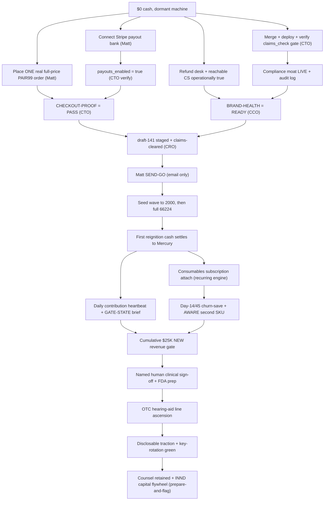

### 6-month phase Gantt
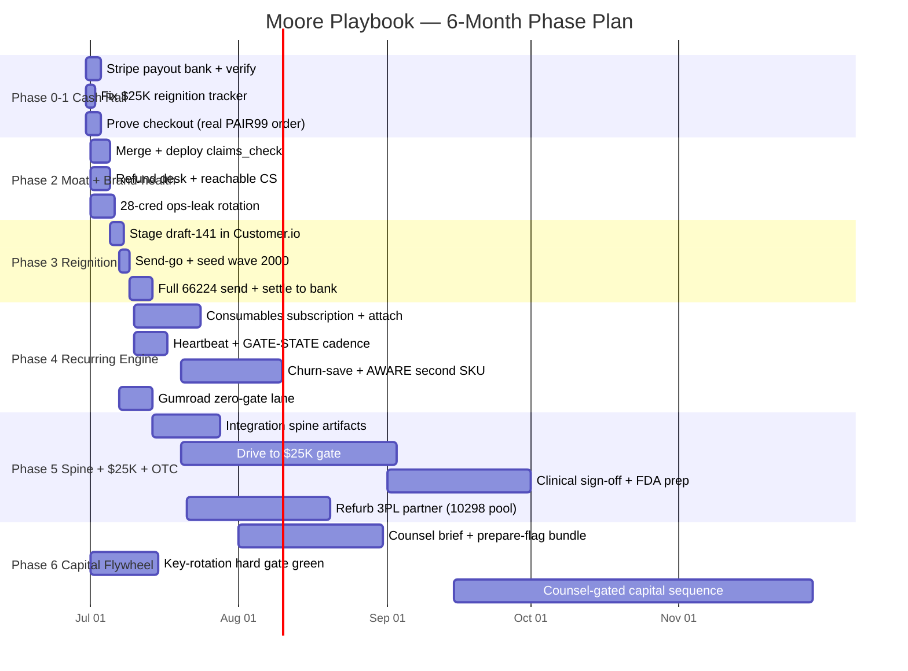

---
## Top 10 Highest-Leverage Actions (ranked)

| Rank | Action | Owner | Why now |
|---|---|---|---|
| 1 | Matt connects the Stripe payout bank account (payouts_enabled FALSE -> TRUE) on acct_1SQyXZAwjS2xuomw | Matt | Charges work but no bank is linked, so any order leaves cash trapped in Stripe and refunds may be unfundable; this is a dashboard-only action that gates first usable cash AND the brand-health guarantee |
| 2 | Matt places ONE real, full-price, non-refunded PAIR99 TReO Complete Pair order; CTO verifies CHECKOUT-PROOF=PASS end-to-end | Matt + CTO | The only charge ever was a refunded owner test; a correct reignition link into a silently-broken checkout produces $0 from 66,224 warm contacts and burns the one reactivation shot — this is the rank-1 lever that unlocks everything |
| 3 | CTO merges + deploys + verifies the claims_check gate (gateway PR #24/#25/#26), pins deployed image == main | CTO | The compliance moat the whole thesis rests on is asserted-LIVE but actually unmerged on a branch image; a routine redeploy silently drops it, and nothing should send into 66,224 inboxes without an enforced, logged FTC/FDA gate |
| 4 | COO/CS stand up the refund desk (named owner, 7-day SLA) + reachable CS; CCO clears the 60-day-guarantee claim -> BRAND-HEALTH=READY | COO/CS + CCO | The #1 BBB/Trustpilot complaint is unreachable CS + unprocessed refunds; firing the warm list into a guarantee we cannot honor is an FTC Mail-or-Telephone-Order-Rule exposure and the exact Medvi brand-health own-goal |
| 5 | CTO rotates the 28-credential ops leak (Azure AD/Graph first) until secret-scan CI is GREEN | CTO | The leak hard-blocks every public/investor/INND action and is an active breach surface on a keys-to-the-kingdom gateway for a public-company operator; it must close before any send/ad/IR step |
| 6 | CFO fixes revenue-tracker.mjs with REIGNITION_START_DATE so the $25K gate measures NEW revenue from today | CFO | As written it sums the $227K all-time total against the $25K gate and prints a false ~100 percent on first run — the single instrument that would authorize FDA spend is currently broken and would green-light spend on phantom revenue |
| 7 | COO presents the single yes/no SEND-GO to Matt with three preconditions green, then CRO fires draft-141 in a seeded wave | COO + Matt + CRO | The highest-cash lever (days-to-first-cash) is armed but held; ~20 days of warm-list decay with zero sends — a seeded wave de-risks deliverability before releasing the full 66,224 |
| 8 | CRO stands up the consumables Shopify-native subscription + post-purchase attach as the first recurring SKU | CRO/lifecycle | Recurring is the load-bearing valuation lever (~half the billion-dollar base) yet zero recurring product is live; the cheapest acquisition is attaching at checkout to an already-converted TReO buyer on the same Stripe rail with no new gate |
| 9 | CTO stands up the daily contribution heartbeat job + COO converts the brief to a forcing GATE-STATE cadence | CTO + COO | The morning brief has informed but not forced action for ~20 days; a standing gate-state header + real revenue number + one owned action + a 2-red auto-escalation turns the cadence into a closing mechanism |
| 10 | Capital drafts the Engage Securities Counsel brief + the prepare-and-flag bundle (counsel-gated, no solicitation) | Capital/IR | Counsel is the master unlock for the entire INND flywheel and nothing can fire without it; assembling the data-room index + verification memo + TTW funnel + firewall checklist now means the whole stack hands over in one move the instant Matt retains counsel and key-rotation is green |

## Cross-dimension dependencies

- **CTO -> CRO:** Stripe payouts_enabled=true + CHECKOUT-PROOF=PASS + claims_check merged/deployed gate every reignition send — no send fires until CTO posts all three green
- **Matt -> CTO:** Connecting the Stripe payout bank is a dashboard-only action (not API-fixable) and placing the one real full-price order both gate every downstream cash motion
- **CCO -> CRO:** draft-141 + funnel + all subscription/attach copy must pass the live claims_check and the operationally-true brand-health clearance before any send or recurring launch
- **COO/CS -> CCO:** A live refund desk (named owner, 7-day SLA, Stripe payouts on) + reachable CS are the evidence CCO needs to clear the 60-day-guarantee and help-is-a-call-away claims
- **CTO -> CFO:** CHECKOUT-PROOF + payouts settling to Mercury are the prerequisite for the daily contribution heartbeat and the real $25K reignition tracker
- **CFO -> CRO:** PAID-SPEND GUARDRAILS (max cost-per-initiated-checkout + CAC ceiling + kill rule) must exist before any paid-ad dollar is authorized
- **CRO -> CFO:** The measured seed-wave email->buyer CVR replaces the load-bearing assumed CVR and recomputes days-to-$25K
- **CTO -> Capital:** The 28-credential + GCP SA + PostHog key rotation (secret-scan CI green) is a HARD GATE that blocks every investor/public/INND action
- **Capital -> Matt:** Securities counsel retention is the master unlock; until signed the entire capital lane is drafting/scaffolding only (prepare-and-flag)
- **CFO -> COO:** The fixed reignition-basis $25K tracker + daily contribution P&L feed the forcing GATE-STATE morning brief and the SOP-7 $25K alert
- **CPO -> Matt:** A NAMED human clinical reviewer (not the AI-CPO, not the retired LHAD) must sign device/OTC-tier claims before the $25K gate unlocks the OTC line
- **commerce -> COO/CS:** The 10,298-unit refurb/3PL partner is where TReO returns physically route, so brand-health refund readiness and the inventory lever share the same fulfillment dependency

## Owner map (who owns what, runs without Matt except at gates)

| Owner | Owns |
|---|---|
| Matt | All hard gates: connect Stripe payout bank, place the real proving order, send-go, paid-spend authorization, final pricing, engage securities counsel + human clinical reviewer, any INND/IR action |
| COO | Quarterback: GO PACKET, forcing GATE-STATE morning brief, refund desk + CS reachability SOPs, the integration spine (MEASUREMENT-SPINE/CASH-BRIDGE/RISK-REGISTER/RACI/CLINICAL-SIGNOFF), weekly review cadence |
| CTO | Stripe/checkout verification, merge+deploy+verify claims_check gate, 28-cred rotation + secret-scan CI green, inference throttle fix, daily heartbeat job, gateway source-of-truth + branch protection, VoiceRAG CS resilience |
| CRO | draft-141 staging + seed/full send, consumables Selling Plan Group + post-purchase attach, churn-save drips, AWARE second SKU, the AirPods/friction positioning + A/B variant, abandoned-cart lifecycle |
| CFO | Fix the reignition $25K tracker, the 6-tab unit-econ model (GM-after-returns/CAC/payback/LTV), daily contribution P&L, PAID-SPEND GUARDRAILS, cash bridge, payout reconciliation to Mercury |
| CCO | claims_check acceptance test + enforcement, draft-141/funnel/subscription copy clearance, brand-health substantiation, FTC affiliate/creator SOP, securities-firewall pre-publish gate, TCPA-SMS + 17(b) hard blocks |
| Capital/IR | Engage-counsel brief + the prepare-and-flag bundle (Reg D data-room index, accredited-verification memo, Reg CF TTW funnel, FINRA-6490 prerequisites, disclosure-controls calendar) — all ATTORNEY REVIEW REQUIRED |
| lifecycle | Customer.io execution under CRO: the held draft-141 build, seed-wave mechanics, day-0/day-14/day-45 journeys, abandoned-cart, suppression/unsubscribe wiring |
| commerce/digital-products | Amazon TReO path (post first cash), the 10,298-unit refurb/3PL RFQ + pilot, and the zero-gate Gumroad SOP storefront (parallel cash lane) |
| CPO | Drafts OTC/device-tier and iHEARtest clinical copy for the named human reviewer chain; CareNow stays counsel-blocked |

---
## The 9 Dimensions — deep execution plans

### 1. Execution & the First-Dollar Gate  ·  _COO / Quarterback_

**Situation.** Day ~20 of a fully-built, dormant machine: $0 cash (Mercury ~$2.41), $0 revenue in 90 days, ~$50K/mo burn, ~0 runway (PLAN.md sec 0). The entire Medvi-mirror funnel exists and works (advertorial+quiz+offer live in iheartreo-funnel.html, claims gate LIVE, VoiceRAG live, 66,224 mailable contacts locked, draft-141 reignition email CONDITIONAL-CLEAR by CCO), and sits behind exactly two human actions: one real full-price TReO order to prove checkout, and Matt's send-go to the list (PLAN.md sec 3). The COO has sent the same 3-move morning brief daily with no Matt report-back on Move 1. CRITICAL live diagnosis (cro/cto feed 2026-06-30): the Stripe rail IS live for charges (charges_enabled=true, no verification hold), but payouts_enabled=FALSE with no requirements due — almost certainly NO payout bank account connected, so even a successful order leaves cash trapped in Stripe; only 1 charge ever existed and it was the owner test, refunded. So "prove checkout" and "money actually lands" are TWO separate gates, both currently open.

**Gaps**
- **[P0] Checkout end-to-end has never been proven with a real full-price order** — Per README non-negotiables a $1 owner test is NOT proof; the only charge ever was the owner test and it was refunded (cto feed 2026-06-30). A correct reignition link into a silently-broken checkout produces $0 from 66,224 warm contacts and burns the one reactivation shot. This is THE gate that unlocks everything else (PLAN.md rank 1).
- **[P0] Stripe payout bank account not connected (payouts_enabled=FALSE) — cash would be trapped** — cto decision 2026-06-30: charges work but payouts_enabled=false with no requirements due => no bank linked. A proven checkout that collects money into a Stripe balance with no payout rail is not 'first real cash' — it never reaches Mercury. Fixable only in the Stripe dashboard (Matt), not via API. Must be cleared in the same motion as checkout-proof or the reignition produces orders but no usable bank cash.
- **[P0] Send-go for the 66,224 reignition email is unfired and gated on checkout-proof + brand-health** — draft-141 is CONDITIONAL-CLEAR by CCO (CAN-SPAM elements present, list locked) but blocked on (a) a proven real-customer checkout and (b) reachable CS / refund readiness so the warm list does not hit a dead support line (cco 2026-06-23; PLAN.md sec 5 Q1/Q5). The single highest-cash lever (days-to-first-cash) is armed but held; ~20 days of warm-list decay with zero sends.
- **[P1] Brand-health (reachable CS + refund readiness) unproven before scaling sends** — #1 BBB/Trustpilot complaint is unreachable CS + unprocessed refunds (README, PLAN sec 5 Q5). The funnel advertises a 60-day money-back guarantee and 1-800-864-4337; CCO has GATED the '60-day guarantee'/'help is a call/email away' claims on operationally-true refunds+support (cco 2026-06-23). Firing 66,224 into a funnel whose CS promise is not operationally true is an FTC Mail-or-Telephone-Order-Rule / Magnuson-Moss exposure and a brand-trust own-goal.
- **[P1] No daily cash cadence is actually closing — the brief is sent but the gate never moves** — The COO morning brief has gone out daily (coo 2026-06-29) yet Move 1 has had no report-back for ~20 days. A cadence that informs but does not force a single 10-minute action is not working. Need a forcing function: a standing checkout-proof status line + revenue heartbeat + an explicit owner and a same-day escalation when the gate doesn't move.
- **[P2] Gumroad zero-gate cash lane sits undeployed despite being parallelizable** — 5 SOP PDFs (and now the 'From the Chair' book) are draft/listing-ready with zero medical/securities exposure (PLAN rank 3); cash in days, ~60 min of Matt setup, no dependency on the TReO gate. Leaving it unshipped forfeits the one fully-autonomous-safe cash lane that does not wait on checkout-proof.

**Execution plan**

| # | Action | Owner | Depends on | Gate | ETA | Done when |
|---|---|---|---|---|---|---|
| 1 | COO assembles a single 'GO PACKET' for Matt: one screen with (a) the exact otchealthmart.com TReO Complete Pair URL + code PAIR99 -> $99, (b) the Stripe dashboard deep-link to Settings > Payouts > add/verify external bank account, (c) a 3-line checklist 'place order / confirm it completes / add Stripe bank'. Deliver into the existing 4:30-6:30pm PT cash block, not just email. | COO | none | none | today (2h) | Matt has the one-screen GO PACKET in hand (email + the cash-block calendar item) containing the live checkout URL, the Stripe payout deep-link, and the 3-step checklist. |
| 2 | Matt places ONE real, full-price (non-discounted-to-$0), non-refunded TReO Complete Pair order on otchealthmart.com using a real personal card, completes Stripe payment, and reports the Shopify order number. | Matt | step 1 | Matt (physical: real card, ~10 min) |  | A real order # exists in Shopify with payment status PAID via Stripe and the order is NOT refunded; order # posted to the coo ledger. |
| 3 | CTO verifies the order end-to-end via live reads: Shopify get-order (financial_status=paid, fulfillment created), Stripe charge present + succeeded + NOT refunded (stripe-read skill on SM stripe-secret-key), and confirms payouts_enabled flips to TRUE after Matt links the bank. Post a CHECKOUT-PROOF=PASS line to the coo+cro feed. | CTO | step 2 | none | same day (30 min) | CTO has posted CHECKOUT-PROOF=PASS with: Shopify order paid, Stripe charge succeeded+unrefunded, and payouts_enabled=true (bank linked) — all three green. |
| 4 | IF checkout fails: CTO runs the diagnose ladder in order and posts the failing layer — (a) advertorial CTA href resolves to the correct live product (treo...complete-pair-left-right) not a 404/draft; (b) PAIR99 discount exists+active in Shopify and applies at checkout; (c) Stripe is the live checkout rail on that product (not a disabled gateway); (d) inventory available so checkout isn't blocked; (e) Stripe charge actually created. Fix the single failing layer, then re-run step 2 with a fresh order. | CTO | step 3 | none | same day on failure (1-3h) | The specific failing layer is named in the feed, the fix is shipped, and a subsequent real order reaches financial_status=paid (loop back to step 3). |
| 5 | COO+CS run a BRAND-HEALTH readiness check BEFORE any send: place one live test call to 1-800-864-4337 and confirm it is answered (VoiceRAG/human) within the advertised promise, send one test email to the support inbox and confirm receipt, and get the finance owner to confirm a refund can actually be issued (one test/sandbox refund via Stripe). Post BRAND-HEALTH=READY or the specific gap. | COO | none (parallel with steps 1-4) | CCO sign-off that the 60-day-guarantee / CS claims are now operationally true | 48h | Phone answered + support inbox receiving + one refund demonstrably issuable; CCO clears the 60-day-guarantee and CS-reachability claims; BRAND-HEALTH=READY posted. |
| 6 | CRO finalizes the draft-141 send package against the CONDITIONAL-CLEAR conditions (CAN-SPAM: Roseville postal address, working unsubscribe, honest subject; mailable count LOCKED at 66,224; email-only, NO SMS per TCPA block) and routes the final copy through the claims_check gate one last time. Stage as send-ready in Customer.io workspace 193366, scheduled but NOT sent. | CRO | none (parallel) | CCO claims_check final pass | 48h | draft-141 is built in Customer.io against the 66,224 segment, passes claims_check, has all CAN-SPAM elements verified, and sits in 'scheduled/hold' awaiting only the send-go. |
| 7 | COO presents the SEND-GO decision to Matt as a single yes/no with the three preconditions shown green: CHECKOUT-PROOF=PASS (step 3), BRAND-HEALTH=READY (step 5), draft-141 staged+claims-cleared (step 6). Matt approves the send. | COO | steps 3,5,6 | Matt (send-go, ~5 min) — email-only per CAN-SPAM/TCPA | within 24h of all three green | Matt's explicit send-go is recorded as a TYPE: DECISION in the coo ledger with the three green preconditions cited. |
| 8 | CRO fires draft-141 to the 66,224 (email only). Send in a controlled first wave (e.g. a 5-10k seed batch) to confirm deliverability/open/click and that clicks land on the proven checkout, then release the remainder within hours if the seed is clean. | CRO | step 7 | none (send-go already given in step 7) | send day | First wave delivered with deliverability confirmed (no spam-trap/bounce spike), clicks reaching the live funnel, and the full 66,224 released; first reignition orders appearing in Shopify/Stripe. |
| 9 | CTO/CFO stand up the daily cash heartbeat as an Azure Container Apps Job (SOP-6): cron pulls Stripe + Shopify + PostHog into a one-line daily P&L (orders, gross, refunds, net-to-bank, cumulative-vs-$25K, CAC if spend on) and posts it to the coo feed each morning so the COO brief carries a real number, not a status. | CTO | step 3 | none | 72h | A scheduled job posts a dated revenue heartbeat line (orders/gross/net/cumulative-vs-25K) to the feed automatically for 2 consecutive days with no manual run. |
| 10 | COO converts the morning brief into a FORCING cadence: a standing top-line 'GATE STATE' (checkout-proof / payout-bank / send-go — each green/red) + the revenue heartbeat number + exactly one owner-assigned action; if the same gate is red 2 briefs running, auto-escalate to a direct Matt ping outside the brief. | COO | step 9 | none | 72h (then daily) | Two consecutive morning briefs ship with the GATE-STATE header + heartbeat number + single owned action, and the 2-red-escalation rule has fired at least once if any gate stayed red. |
| 11 | Run the Gumroad zero-gate lane in PARALLEL: digital-products packages the 5 SOP PDFs (dash-clean, no medical/securities claims) into a one-page setup brief; Matt creates the Gumroad account and uploads the PDFs with instant delivery on. | digital-products + Matt | none | Matt (account creation + upload, ~60 min) — no claims/securities gate | this week | Gumroad storefront is live with >=5 SOP products purchasable + auto-delivering; one test purchase completes and delivers the file. |
| 12 | CFO confirms net-to-bank: verify the first reignition Stripe payouts actually settle into Mercury (Mercury MCP getTransactions) and reconcile against Shopify orders, closing the loop from 'order placed' to 'cash in bank' and seeding the cumulative-vs-$25K tracker with real settled dollars. | CFO | step 8 | none | within payout cycle (2-3 biz days post-send) | At least one Stripe payout is confirmed landed in Mercury, reconciled to its Shopify orders, and the $25K tracker shows real settled revenue > $0. |

**KPIs**
| KPI | Target | Kill / scale |
|---|---|---|
| Checkout-proof gate cleared (real paid, unrefunded TReO order + payouts_enabled=true) | PASS within 72h | If not PASS in 72h, STOP all downstream (no send) and escalate to Matt as the single blocking item; do not let the brief recycle the same unmoved gate. |
| First real reignition cash (net settled to Mercury from 66,224 send) | >$0 settled within one payout cycle of the send; >=10 paid orders in first 72h post-send | Scale to remaining waves + plan paid-ads/creative factory if conversion on the seed batch is healthy; if orders ~0 after full send, diagnose funnel/offer (not list) before any paid spend. |
| Brand-health readiness (CS answer rate + refund issuable) | phone answered within advertised promise on test + 1 refund demonstrably issuable, before send | If CS unreachable or refunds not issuable, HOLD the send (do not fire 66,224 into a dead support promise); fix before scaling. |
| Daily revenue heartbeat posted automatically | posted every morning by the scheduled job, 2 consecutive days, zero manual runs | If the job fails to post 2 days running, COO reverts to a manual Stripe/Shopify read until CTO fixes the cron — the cadence must never go dark. |
| Gumroad parallel cash lane live | storefront live + 1 test purchase auto-delivers this week | If Matt cannot stand it up in the 60-min window, COO keeps it on the brief as a zero-gate move until done; it is independent of the TReO gate and should not be dropped. |

**Process diagram**
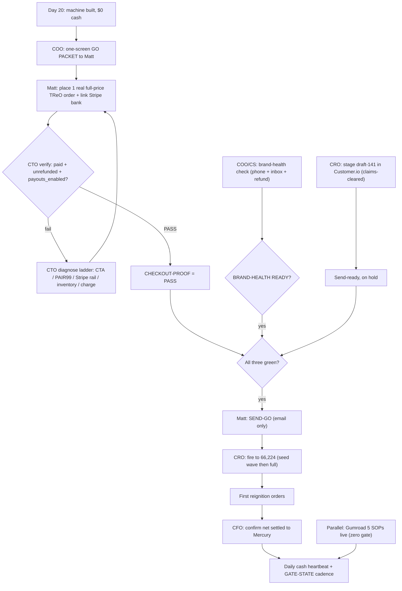

**Risks -> mitigations**
- Correct reignition link fires into a silently-broken checkout (404 product, disabled PAIR99, dead Stripe rail) and burns the one warm-list shot for $0. -> Hard-gate the send on CTO's verified CHECKOUT-PROOF=PASS (real paid+unrefunded order), and on first send do a small seed wave to confirm clicks reach a working checkout before releasing all 66,224.
- Orders convert but cash stays trapped in Stripe (payouts_enabled=false, no bank) — 'first cash' that never reaches the bank. -> Treat payout-bank linkage as a co-equal P0 step in the same Matt motion as checkout-proof (step 1-3); CFO confirms an actual payout settles to Mercury (step 12) before declaring first real cash.
- 66,224 warm contacts hit an unreachable CS line / unprocessed refunds, triggering BBB/Trustpilot/FTC exposure and torching brand trust at the worst moment. -> BRAND-HEALTH=READY (live phone test + refund issuable + CCO clears the guarantee claims) is a precondition of the send-go; CS claims gated until operationally true.
- Gate stays unmoved another ~20 days because the cadence informs but never forces the 10-minute action. -> Convert the brief to a GATE-STATE forcing function with a single owned action and an auto-escalation when a gate is red 2 briefs running; run the zero-gate Gumroad lane in parallel so cash progress is not 100% hostage to the TReO gate.

**First 72 hours**
- Deliver the one-screen GO PACKET to Matt into the 4:30-6:30pm PT cash block today (checkout URL + PAIR99, Stripe payout deep-link, 3-step checklist) and get Move 1 done: one real full-price unrefunded TReO order + Stripe bank linked.
- CTO verifies the order end-to-end (Shopify paid + Stripe charge succeeded/unrefunded + payouts_enabled=true) and posts CHECKOUT-PROOF=PASS; if it fails, run the diagnose ladder and name+fix the failing layer same-day.
- COO/CS run the brand-health readiness check in parallel (live call to 1-800-864-4337 answered, support inbox receiving, one refund issuable) and get CCO to clear the 60-day-guarantee/CS claims -> BRAND-HEALTH=READY.
- CRO finalizes draft-141 in Customer.io against the 66,224 locked segment with all CAN-SPAM elements + final claims_check, staged-and-held awaiting only the send-go.
- CTO stands up the daily cash heartbeat job and COO converts the morning brief to the GATE-STATE forcing cadence; in parallel, push Matt to stand up the zero-gate Gumroad lane (~60 min).

### 2. Compliance  ·  _CCO_

**Situation.** As CCO, the honest state is: the "compliance enforced in code" moat that the whole Moore/Medvi-mirror thesis rests on (MOORE-PLAYBOOK §9; MEDVI-MIRROR SOP-1; SOURCES "claims_check gate LIVE in the MCP gateway") is ASSERTED but NOT OPERATIONAL on the deployed gateway. The CTO audit (exec ledger 2026-06-29) shows the FTC/FDA claims_check tool is otchealth-mcp-server PR #24, NON-draft but UNMERGED, and the live gateway image is an unmerged branch build, so there is no enforced, logged gate firing on copy today. Three Medvi-failure-mode controls are still gaps: (a) no operational FTC affiliate-audit/persona-verification SOP exists (MEDVI PLAN row 4/8, open decision #8) yet Phase-2 Wk12 launches creators; (b) the founder-video "licensed audiologist" line on iHEARtest is an open external-rollout compliance gate (developer correction 2026-06-30; PR #120 unmerged); (c) draft-141 is only CONDITIONAL-CLEAR — CAN-SPAM elements are present (Roseville postal addr + unsubscribe + honest subject, mailable LOCKED 66,224 per CCO ledger 2026-06-23) but the send is gated on a real-customer checkout (Stripe payouts_enabled=FALSE, 1 refunded owner charge) and on operationally-true 60-day-guarantee/CS claims. SMS is a hard TCPA BLOCK and the CareNow share-bundle is a Securities Act 17(b) BLOCK. The funnel HTML disclaimer itself is well-built ("not a hearing aid... not intended to diagnose, treat, cure or prevent"), so the risk is not the drafted copy, it is that the enforcing system is not yet wired and verified before the send.

**Gaps**
- **[P0] claims_check gate is asserted-LIVE but actually UNMERGED/undeployed (the moat does not exist yet)** — The entire de-risking thesis vs Medvi (MOORE-PLAYBOOK §9, MEDVI-MIRROR SOP-1) is 'every claim owned AND affiliate passes claims_check before it ships.' CTO audit 2026-06-29 shows it is otchealth-mcp-server PR #24 (non-draft, UNMERGED) and the deployed gateway runs an unmerged branch image. There is no enforced, logged FTC/FDA gate firing on copy today, so 'compliance in code' is a claim, not a control. Nothing should send until this is merged, deployed, and verified firing.
- **[P0] No operational affiliate/creator FTC SOP before the Phase-2 creator launch (the exact Medvi failure)** — Medvi blew up on ~30% of ads run by AFFILIATES with fake AI 'doctor' personas making unsubstantiated/endorsement claims (MEDVI-MIRROR §2). FTC holds the brand liable for affiliate claims (README non-negotiables). MEDVI PLAN open-decision #8 + Phase-2 Wk12 still list 'build the FTC affiliate-audit + creator-persona-verification SOP BEFORE creators' as NOT BUILT. Launching creators without a written, enforced identity-verification + claims-routing + 16 CFR 255 disclosure + monitoring SOP repeats Medvi's precise legal explosion.
- **[P0] Send-readiness depends on operationally-TRUE refund/guarantee/CS claims, not just CAN-SPAM mechanics** — draft-141 promises '60-day money-back guarantee' and the funnel says help is a call/email away (funnel HTML lines 152/178/192). CCO ledger 2026-06-23 GATES these on operationally-true refunds/support (FTC Act 5, Mail-or-Telephone Order Rule 16 CFR 435, Magnuson-Moss). Brand-health is the #1 BBB/Trustpilot complaint (PLAN row 6, README). A guarantee you cannot honor + a CS line nobody answers is a deceptive-practice claim the moment 66,224 emails land. Stripe payouts_enabled=FALSE means refunds may not even process.
- **[P1] FTC substantiation + net-impression on TReO benefit-led copy (the PSAP/device-claim line)** — Matt's direction is benefit-led with no 'PSAP'/'amplifier' in the headline and category only in fine print (CCO ledger 2026-06-23). That raises FTC net-impression risk: a benefit headline ('dinner conversations turned back on') with the PSAP disclaimer buried can still convey an implied hearing-aid/treatment claim. The price-comparison hook ('$299/side at CVS vs $99', '$2,400 clinic markup' in funnel H1) is a comparative claim needing substantiation. PSAPs may be marketed ONLY as amplification/wellness, never treat/diagnose/cure (MEDVI-MIRROR §1).
- **[P1] TCPA SMS and Securities Act 17(b) on CareNow remain hard BLOCKs that must stay enforced as the funnel scales** — SMS is a TCPA BLOCK (unverified consent; CCO ledger). The reignition is email-only by design (PLAN open #1). CareNow is sold as a share-bundle membership = Securities Act 17(b) compensated-promotion exposure if any IR/share element is bundled with a paid promotion (MOORE-PLAYBOOK open #7, INND-FLYWHEEL §5). As pressure mounts to add SMS for conversion and to launch CareNow for LTV, these blocks will be the first ones someone tries to override without the control in place.
- **[P1] Securities firewall: product marketing must never touch INND/share-price, and the gate that enforces it is on the same unmerged image** — INND is a public company; the firewall is absolute (MOORE-PLAYBOOK §3, INND-FLYWHEEL §5: Reg FD, no-promotion, 17(b), FINRA 24-09 quiet-period). The gateway compliance gate 'fires on INND ticker' per CTO E2E test, but it lives on the same unmerged branch as claims_check. A reignition or creator asset that name-drops the public company or 'undervalued' language is a Reg-FD/market-conditioning event. The control must be merged+verified and the COO/CRO copy paths must be wired through it.

**Execution plan**

| # | Action | Owner | Depends on | Gate | ETA | Done when |
|---|---|---|---|---|---|---|
| 1 | Merge + deploy + VERIFY-FIRING the claims_check FTC/FDA gate. CTO merges otchealth-mcp-server PR #24 (claims_check) into protected main, redeploys the gateway Container App (otchealth-mcp-gateway, eastus2), then CCO runs an acceptance test set: feed 8 known-bad strings (hearing aid, treat hearing loss, FDA-approved, cures tinnitus, doctor-recommended, 'same as a $2000 aid', a fake testimonial, an INND share-price line) + 4 known-good benefit strings, confirm each bad one is BLOCKED with a logged reason and each good one PASSES, and confirm the audit log persists every check. | CTO (merge/deploy), CCO (acceptance test) | none | none (CTO merges; Matt only if branch-protection blocks self-merge) | 48h | PR #24 merged to main, gateway redeployed on the merged image, and CCO's 12-string acceptance run shows 8/8 bad BLOCKED + 4/4 good PASS with a persisted audit-log entry id for each; result posted to the cco ledger. |
| 2 | Route draft-141 through the now-live claims_check and issue a written CCO clearance memo. CCO runs the exact draft-141 subject line + body + funnel landing copy through the deployed gate (channel=email), confirms PASS, and verifies CAN-SPAM elements in the rendered send: physical postal address (Roseville), one-click unsubscribe that is wired to suppression, non-deceptive From/subject, and clear advertising identification. | CCO | 1 | none for the review (the SEND itself stays Matt-gated) | 24h after step 1 | draft-141 returns PASS from the live gate with an audit-log id; a CCO clearance memo (cco/decision-memo) lists the 4 verified CAN-SPAM elements with screenshots and states 'cleared to send PENDING checkout-proof + Matt send-go.' |
| 3 | Make the 60-day guarantee + CS-reachability claims operationally TRUE before the send. COO/CS publishes a written refund SOP (who approves, max turnaround in days, the Stripe/Shopify refund path) and a manned CS path (the 1-800-864-4337 line + email SLA), then CCO verifies by (a) confirming Stripe payouts_enabled is fixed so refunds process, (b) placing a test CS contact on each channel and timing the response, (c) running one end-to-end test refund. | COO/CS (SOP + staffing), CCO (verification), Matt (Stripe bank + refund $) | none | Matt (connect Stripe payout bank; authorize refund budget) | 72h | a refund SOP + CS SLA doc exists, Stripe payouts_enabled=TRUE, one test refund completed end-to-end, and CS test contacts on phone+email answered within the published SLA; CCO logs 'guarantee + CS claims now substantiated.' |
| 4 | Lock TReO net-impression + comparative-claim substantiation. CCO writes the channel-aware PSAP/FTC ruleset into the gate config and reviews the live funnel for net impression: the PSAP-category disclaimer ('not a hearing aid... not intended to diagnose, treat, cure or prevent', funnel line 192) must be clear-and-conspicuous near every benefit headline and the offer, and every comparative price claim ('$299/side at CVS', '$2,400 clinic markup', funnel H1) must have a documented, dated substantiation source on file. | CCO (with CRO for copy edits) | 1 | none | 48h | funnel passes claims_check, the disclaimer is verified clear-and-conspicuous adjacent to the H1 and the offer block, and a substantiation file (cco/substantiation/treo-price-comparison.md) cites the dated source for each comparative number; CCO sign-off in the ledger. |
| 5 | Stand up and PUBLISH the FTC affiliate/creator compliance SOP (the Medvi failure-mode control) BEFORE any creator is onboarded. CCO authors a written SOP covering: real-identity KYC + persona-verification (no fabricated/AI 'doctor' personas), mandatory 16 CFR 255 #ad/#sponsored disclosure with placement rules, ALL creator copy routed through claims_check, a written creator agreement with a claims-and-disclosure rider + indemnity, and a sampling/monitoring + takedown procedure. | CCO (with CRO + CLO for the agreement rider) | 1 | counsel (CLO review of the creator agreement rider + indemnity) | 1 week | the SOP doc is committed (cco/sop/affiliate-ftc-sop.md), the creator agreement rider is CLO-reviewed, and a dry-run audits one sample creator asset through claims_check producing a logged PASS/BLOCK; flagged as the hard prerequisite blocking Phase-2 Wk12 creator launch. |
| 6 | Wire the securities firewall into the enforced gate and the copy paths. CCO adds INND/ticker/share-price/'undervalued'/'invest' terms to the claims_check BLOCK ruleset (the gate already 'fires on INND ticker' per CTO E2E), confirms product-marketing channels (email/funnel/creator) route through it, and publishes the one-line firewall rule for CRO/COO: product copy never references the public company, share price, or capital structure (MOORE-PLAYBOOK §3; INND-FLYWHEEL §5). | CCO | 1 | none (any actual IR/INND output stays Matt+counsel) | 48h after step 1 | claims_check BLOCKs an INND/share-price test string in email+creator channels with a logged reason, and the firewall one-liner is added to the CRO/COO copy SOP and acknowledged in the ledger. |
| 7 | Keep TCPA-SMS and CareNow-17(b) as enforced hard BLOCKs, not just notes. CCO confirms the lifecycle/Customer.io config has SMS sends disabled at the platform level (not merely 'not used'), documents the consent standard required to ever lift it (prior express written consent + DNC scrub), and tags any CareNow share-bundle promo as a Securities Act 17(b) BLOCK that cannot ship without counsel. | CCO (with lifecycle/CRO) | none | counsel (for any future CareNow share-bundle or SMS lift) | 48h | Customer.io SMS channel is verified disabled/blocked, a written 'conditions to lift TCPA-SMS' doc exists, and CareNow promo copy is flagged 17(b)-BLOCKED in the gate ruleset and the ledger. |
| 8 | Publish the pre-send compliance checklist + create the immutable audit trail. CCO assembles a single go/no-go checklist (gate live+verified, draft-141 PASS, CAN-SPAM 4 elements, guarantee+CS substantiated, net-impression+substantiation on file, securities firewall wired, SMS/17(b) blocked) and confirms every claims_check decision is being written to a persistent audit log with timestamp, channel, verdict, and reason, retained for the FTC look-back window. | CCO | 1,2,3,4,6,7 | Matt (final send-go is his; CCO provides the cleared checklist) | 1 week | a single PRE-SEND-CHECKLIST.md shows every line GREEN with its evidence/audit-id, and a sample export of the last 20 claims_check log entries proves the trail is queryable; CCO hands Matt a one-line 'compliance-cleared, send-go is yours.' |

**KPIs**
| KPI | Target | Kill / scale |
|---|---|---|
| claims_check coverage of shipped copy (owned + affiliate) | 100% of shipped customer-facing assets carry a passing claims_check audit-log id; 0 un-gated sends | If any asset ships without a logged PASS, HALT all sends and the creator program until the gate is enforced on that channel; at sustained 100% across 2 weeks, scale to paid/affiliate channels. |
| Affiliate/creator disclosure + persona compliance (sampled audits) | >=95% of sampled creator assets have correct 16 CFR 255 disclosure and a verified real identity; 0 fabricated/AI-persona endorsements | Below 90% or any fake-persona detected: suspend that creator and pause new creator onboarding; at >=95% for 30 days, expand the creator roster. |
| Substantiation-on-file rate for claims that need it (comparative price, guarantee, CS-SLA) | 100% of substantiation-requiring claims have a dated source/SOP on file before they go live | Any live claim without on-file substantiation: pull the claim immediately; if the rate stays 100% the channel is cleared to scale. |
| Guarantee/CS operational truth (refund turnaround + CS response time) | Refunds processed within the published SLA and CS first-response within SLA on phone + email | If refund or CS SLA is missed after the reignition send, throttle outbound volume until brand-health is restored (protects against the Medvi/BBB failure mode). |

**Process diagram**
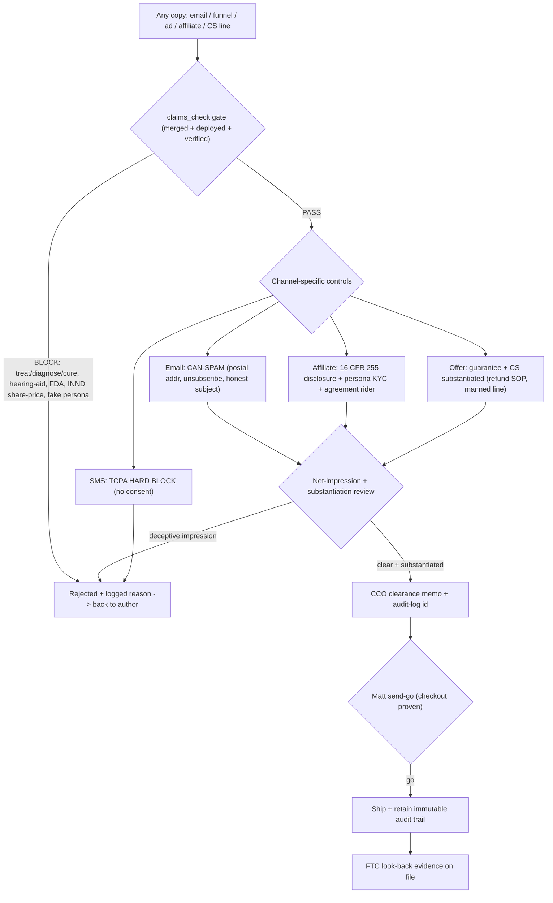

**Risks -> mitigations**
- The send fires before the claims_check gate is actually merged/deployed, so 'compliance in code' is fiction at the exact moment 66,224 emails land (Medvi's front-end-claim explosion). -> Hard sequencing: PRE-SEND-CHECKLIST line 1 is 'gate merged + deployed + CCO acceptance test passed with audit-log ids'; the CCO withholds the clearance memo (and therefore Matt's send-go input) until that line is GREEN.
- Creators are onboarded for the Phase-2 Wk12 LTV push before the FTC affiliate SOP exists, reproducing Medvi's fake-AI-doctor/affiliate liability (brand is liable for affiliate claims). -> Make the affiliate-FTC SOP (persona KYC + 16 CFR 255 disclosure + claims_check routing + CLO-reviewed agreement rider) a written hard prerequisite that blocks creator onboarding; CCO holds the go and CLO gates the agreement rider.
- A benefit-led, no-'PSAP'-in-headline net impression plus a buried disclaimer reads as an implied hearing-aid/treatment claim to the FTC even though each sentence is literally true. -> CCO net-impression review on the rendered page (not the source): disclaimer clear-and-conspicuous adjacent to the H1 and offer, comparative claims substantiated and dated, and the page re-run through claims_check after any CRO copy edit.
- Conversion pressure leads someone to enable SMS (TCPA) or bundle a CareNow share-promo (Securities Act 17(b)) without the consent/counsel control. -> Enforce these as platform-level BLOCKs and gate-ruleset blocks (not notes): Customer.io SMS disabled, CareNow 17(b) tagged in the gate, with written 'conditions to lift' docs requiring counsel sign-off before either can ever ship.

**First 72 hours**
- Get the claims_check gate REAL: CTO merges otchealth-mcp-server PR #24 and redeploys the gateway, then CCO runs the 12-string acceptance test (8 bad BLOCKED + 4 good PASS, each with an audit-log id) and posts the result to the cco ledger. Until this passes, nothing sends.
- Run draft-141 + the funnel landing copy through the now-live gate and issue the written CCO clearance memo confirming the 4 CAN-SPAM elements (Roseville postal address, wired unsubscribe, honest subject, ad identification); mark it 'cleared pending checkout-proof + Matt send-go.'
- Make the 60-day guarantee and CS claims operationally true: COO/CS publishes the refund SOP + CS SLA, Matt connects the Stripe payout bank (payouts_enabled is currently FALSE), and CCO verifies with one test refund end-to-end plus a timed phone+email CS contact.
- Lock TReO net-impression: CCO verifies the 'not a hearing aid / not intended to diagnose, treat, cure or prevent' disclaimer is clear-and-conspicuous next to the benefit H1 and the offer, and files dated substantiation for the '$299/side at CVS' and '$2,400 clinic markup' comparative claims.
- Confirm the hard BLOCKs are enforced, not just documented: verify Customer.io SMS is disabled at the platform level (TCPA), tag CareNow share-bundle as a Securities Act 17(b) BLOCK, and add INND/share-price terms to the gate's block ruleset so the securities firewall fires on product copy.

### 3. Finance & Unit Economics  ·  _CFO_

**Situation.** As CFO I inherit a company at ~$0 cash (Mercury ~$2.41), $0 revenue in 90 days, ~$50K/mo burn and ~0 months runway (PLAN.md §0; Playbook §2), against a PROVEN-but-dormant store ($227,290 all-time / 1,484 orders => historic AOV ~$153.16) and a locked warm list of 66,224 (SOURCES.md). The entire cash thesis rests on one untested assumption the docs themselves flag as load-bearing: "does the warm list still convert?" (Playbook §7). Critically, NO consumer unit-economics model exists yet: there is a revenue HEARTBEAT (revenue-tracker.mjs) but it sums ALL-TIME paid orders against the $25K gate, which is wrong for a REIGNITION gate that the docs define as NEW revenue from today (SOURCES.md "read it as NEW reignition revenue from today") — so the gate tracker as written would report a false ~100% the moment it runs. There is also no CAC/payback/churn/gross-margin-after-returns model despite a 60-day money-back PSAP and a $9.99-19.99/mo recurring back-end being central to the $1B math (Playbook §7).

**Gaps**
- **[P0] $25K gate tracker measures the wrong number (all-time, not new reignition revenue)** — revenue-tracker.mjs sums totalPaid across all-time orders ($227K) vs the $25K GATE, so pct=Math.min(100,...) prints ~100% on first run. SOURCES.md is explicit the gate = NEW reignition revenue from today. Until this is fixed the single instrument that authorizes the ~$10K FDA spend (Playbook Phase 2 W6/W7) is broken and will green-light spend on phantom revenue.
- **[P0] No unit-economics model: CAC, conversion bridge, payback, churn, GM-after-returns all undefined** — The $1B math hinges on ~200K subs x ~$19.99 (Playbook §7) and 'every 1% churn improvement at 50K subs adds ~$9M LTV', yet there is zero baseline model for subscriber CAC, the email->buyer->subscriber bridge, monthly churn, or contribution margin after the 60-day-guarantee returns. You cannot authorize paid spend (the Matt gate) without a cost-per-checkout target and a payback ceiling to kill/scale against (SOP-2).
- **[P0] Gross margin is asserted (85-90%) but never computed after returns, shipping, processing, and refund-labor on a 60-day-guarantee PSAP** — 60-day money-back + free shipping + Stripe fees + a known refund/CS backlog (PLAN brand-health) can convert an 85% gross margin into a materially lower CONTRIBUTION margin. A guarantee-eligible return inside 60 days reverses revenue AND eats outbound shipping/processing/restocking. Without GM-after-returns, the $25K 'cash' figure and every payback calc are overstated.
- **[P1] No cash bridge proving Phase 0 actually funds at ~$0** — Burn is ~$50K/mo with ~0 runway yet the plan asserts 'cost-neutral' (Cash Playbook cost ledger). That holds for infra (grants) but NOT for refund liability (cash out the door), the ~$10K FDA fee, or any inventory/fulfillment cash on TReO units shipped. A CFO must show the explicit day-0-to-$25K cash waterfall: which costs are truly $0 (grant-funded), which are deferred-until-revenue, and the minimum cash needed to honor guarantees before reignition cash lands.
- **[P1] Daily P&L heartbeat is not yet a P&L — it reports gross revenue, not contribution** — SOP-6 promises 'daily P&L, CAC/LTV, cohorts' but revenue-tracker.mjs only emits gross paid revenue + TReO units. Matt 'wakes up to the number' (SOP-6) that overstates reality because it ignores COGS, returns reserve, processing, and (once spend starts) ad cost. The board number must be CONTRIBUTION, with a returns reserve held back.
- **[P2] Subscription economics undefined despite being the valuation lever** — Playbook §7 names subscription MIX as the valuation multiple lever (~4-6x recurring vs ~1-1.5x hardware) and CareNow $9.99-19.99/mo as the LTV tier, but there is no model for attach rate (TReO buyer -> sub), monthly churn, or sub-CAC, and CareNow carries an unresolved Securities Act 17(b) share-bundle flag (PLAN open Q6). The recurring line that is 'half a billion-dollar revenue base' has no instrumented baseline.

**Execution plan**

| # | Action | Owner | Depends on | Gate | ETA | Done when |
|---|---|---|---|---|---|---|
| 1 | Fix revenue-tracker.mjs so the $25K gate measures NEW reignition revenue: add a REIGNITION_START_DATE env (set to today), and compute gateRevenue = sum of paid orders WHERE created_at >= REIGNITION_START_DATE (not all-time totalPaid). Keep all-time as a separate display line. Remove the pages<6 cap for the all-time line or label it explicitly as partial. Commit on a claude/* branch, draft PR. | CFO (with CTO/developer to merge) | none | none | 1 day | node revenue-tracker.mjs prints '$25K GATE' progress driven only by orders since REIGNITION_START_DATE; on an empty post-start day it reads 0.0% ($0/$25000), and the all-time $227K appears on its own line. |
| 2 | Build the unit-economics model as a single spreadsheet/workbook 'OTCHEALTH-UNIT-ECON.xlsx' with 6 tabs: (A) Assumptions (every input, sourced), (B) Conversion Bridge (66,224 emails -> opens -> clicks -> sessions -> initiated checkouts -> TReO buyers -> % attach to $19.99/mo -> monthly churn), (C) TReO Contribution (price, COGS, Stripe fee, shipping, return rate, refund cost) => GM-after-returns per unit, (D) CAC & Payback (email=$0; paid scenario = ad$/initiated-checkout / CVR), (E) Subscription LTV (ARPU, gross margin, churn => LTV, LTV:CAC), (F) Cash Bridge & $25K timeline. Use the document-skills:xlsx skill. | CFO | none | none (final pricing & paid budget are Matt gates but the MODEL is build-now) | 2 days | The workbook opens with live formulas where changing any Assumptions-tab cell (email CVR, return rate, churn) recalculates GM-after-returns, payback, LTV:CAC, and the days-to-$25K; baseline case is filled with the explicit assumptions below. |
| 3 | Instrument the TReO Contribution tab with the exact line items to fill: Price PAIR99 $99.00; minus Stripe fee 2.9%+$0.30 = $3.17; minus outbound shipping (free-to-customer => COGS, set placeholder $8 pending CTO/Commerce actual); minus landed COGS per pair (set from the 10,298-unit pool cost — pull from CFO source docs / Shopify cost field); minus returns reserve = price x return_rate x (1 + reship/restock loss). Solve for contribution $/order and contribution margin %. Flag every placeholder RED until Commerce confirms real COGS & shipping. | CFO | step 2 | none | 2 days | Contribution tab shows a per-PAIR99-order contribution dollar figure and % with each input either a confirmed actual or a RED placeholder, and a sensitivity mini-table for return_rate at 5/10/15/20%. |
| 4 | Pull the real COGS, fulfillment cost, and historical return/refund rate to replace placeholders: query Shopify (mcp__Shopify) for product cost + recent order/refund history, and reconcile against the CFO finance data room (cfo-store / company-brain ask 'TReO landed unit cost and historical refund rate'). Replace the RED placeholders in tabs C and D with sourced actuals. | CFO (Shopify + company-brain) | step 3 | none | 3 days | COGS/pair, fulfillment $/order, and historical return% are sourced (with the source cited in a cell comment) and the workbook's GM-after-returns recomputes off real numbers, not placeholders. |
| 5 | Stand up the Daily Contribution P&L heartbeat (upgrade SOP-6 output): extend the tracker to emit, per day, gross revenue, units, estimated COGS, Stripe fees, a held-back returns reserve (= today's revenue x return_rate), and net CONTRIBUTION; plus cumulative reignition revenue vs $25K and a rolling 60-day open-returns-liability number. Output a Bucket-Briefing block + write the daily numbers to a cfo-store CSV so cohorts accumulate. | CFO (+ CTO for cron wiring) | step 1, step 4 | none | 3 days | A single command prints today's CONTRIBUTION (not just gross), the returns reserve held, cumulative-vs-$25K (reignition basis), and open 60-day return liability; the CSV row is appended idempotently. |
| 6 | Define and publish the kill/scale thresholds for the (gated) paid test BEFORE any spend: from the model, set max allowable cost-per-initiated-checkout = contribution-per-order / (target CAC-payback multiple) and a first-order CAC ceiling such that blended payback <= 1 order (hardware-funded) with subscription as upside. Write these as a one-page 'PAID-SPEND GUARDRAILS' memo tied to PostHog cost-per-initiated-checkout (SOP-2). | CFO (with CRO) | step 4 | Matt (budget authorization) — memo is prepare-and-flag | 2 days | A memo states the explicit max cost-per-initiated-checkout (in $), the CAC ceiling, the payback rule, and the 48-72h kill rule, all derived from the workbook and referencing the PostHog metric of record. |
| 7 | Build the Cash Bridge tab proving Phase 0 at ~$0: list every Phase 0/1 cost line and tag each TRUE-$0 (grant-funded infra: Azure/GitHub/PostHog/ElevenLabs per cost ledger), DEFERRED-UNTIL-REVENUE (FDA ~$10K at W6/W7 gate; Amazon trademark ~$300-2k), or CASH-NOW (refund liability on guaranteed orders, minimum CS/refund-clearing cash). Compute the minimum cash cushion needed to honor 60-day guarantees before reignition cash clears (= expected returns on first N orders). | CFO | step 4 | Matt (any actual cash outlay) | 2 days | The Cash Bridge tab shows day-0 cash need = $0 for infra, an explicit refund-cushion $ figure for guarantee liability, and a dated trigger ($25K reached => authorize FDA $10K) — i.e. the waterfall from $0 to $25K with the only real cash-out items isolated. |
| 8 | Model the subscription engine baseline (CareNow/AWARE at $9.99-19.99/mo): set attach-rate scenarios (5/10/20% of TReO buyers), monthly churn scenarios (5/8/12%), ARPU $19.99, sub gross margin (digital ~90%) => LTV and the $9M-per-1%-churn-at-50K-subs sensitivity the Playbook cites; flag CareNow share-bundle as 17(b) BLOCKED so the model marks CareNow revenue as counsel-gated and runs AWARE/consumables as the launchable recurring line. | CFO (with CPO/CRO) | step 2 | counsel (CareNow 17(b) flag) — model is build-now | 2 days | The LTV tab outputs LTV and LTV:CAC for each attach/churn pair, reproduces the '~$9M per 1% churn at 50K subs' figure as a validation check, and visibly tags CareNow rows COUNSEL-GATED. |
| 9 | Reconcile the model's day-1 inputs against the ONE proving order: when Matt completes the real PAIR99 checkout (PLAN first-move #1), capture the actual order's real Stripe fee, real shipping charged, and real tax to true-up tab C's placeholders to a confirmed live transaction. | CFO | step 3; Matt proving-order | Matt (must place the order) | 1 day after Matt's order | At least one real TReO order's actual fee/shipping/tax line items are entered in the workbook and the per-order contribution is reconciled to a real Stripe payout, not an estimate. |
| 10 | Set the post-send measurement plan: on Matt's send-go, instrument the conversion bridge live in PostHog (email-sent -> open -> click -> session -> initiated_checkout -> purchase) and reconcile each stage daily into tab B for the first 7 days to lock the REAL email->buyer CVR (the load-bearing unknown), replacing assumed CVR with measured. | CFO (with CRO/lifecycle) | step 1, send-go | Matt (send-go) | 1 week after send-go | Tab B shows measured (not assumed) numbers for all six funnel stages for the first reignition wave, and the model's days-to-$25K is recomputed off the real CVR. |

**KPIs**
| KPI | Target | Kill / scale |
|---|---|---|
| Reignition revenue vs $25K gate (NEW revenue from REIGNITION_START_DATE) | $25,000 cumulative new TReO revenue by Phase 1 exit (Playbook W6 target) | SCALE: at $25K trigger FDA registration spend; KILL/DIAGNOSE: if first wave (66,224 emails) yields <0.3% email->buyer CVR or <$2.5K in 7 days, halt sends and re-test offer/list before any paid spend |
| Contribution margin after returns per PAIR99 order | >=$70 contribution/order (i.e. >=70% after Stripe ~$3.17, shipping, COGS, and a 10% returns reserve on $99) | SCALE paid if contribution/order holds >=$60 at real return rates; KILL the price/offer if GM-after-returns falls below $45 (1-order payback on paid CAC becomes impossible) |
| Paid CAC payback (once spend authorized) | <= 1 TReO order (first-order contribution >= cost-per-initiated-checkout / CVR); subscription LTV is upside not required for payback | SCALE an ad set if cost-per-initiated-checkout stays below the model's max for 48-72h (SOP-2); KILL at 48-72h if above the ceiling |
| 60-day open return liability (cash reserve) | Hold a reserve = (rolling 60-day shipped revenue x measured return rate); never let cash drop below this cushion | SCALE order volume only while cash cushion >= open return liability; HOLD scaling if liability exceeds available cash (guarantee-honoring is a hard brand-health rule) |
| Subscription LTV:CAC (AWARE/consumables; CareNow counsel-gated) | >=3:1 LTV:CAC at <=8% monthly churn, $19.99 ARPU, ~90% sub margin | SCALE retention spend on churn-save (every 1% churn ~ $9M LTV at 50K subs per Playbook); KILL a sub offer whose 90-day churn implies LTV:CAC <2:1 |

**Process diagram**
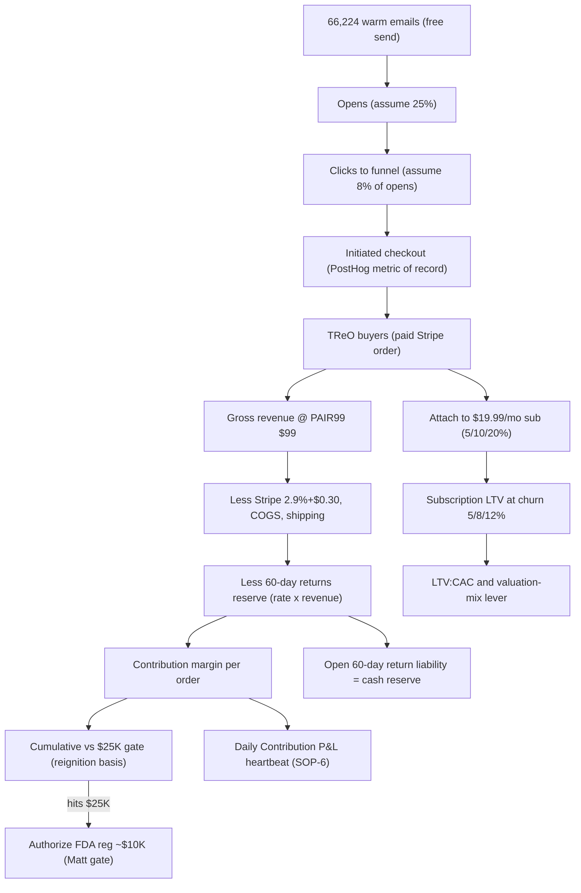

**First 72 hours**
- Fix revenue-tracker.mjs (step 1): add REIGNITION_START_DATE and make the $25K gate measure only orders since today, so the gate stops reporting a false ~100% off the $227K all-time total — draft PR on a claude/* branch.
- Build OTCHEALTH-UNIT-ECON.xlsx skeleton with the 6 tabs and fill the baseline Assumptions tab with the explicit, sourced numbers (PAIR99 $99, Stripe 2.9%+$0.30, 66,224 list, historic AOV $153.16, return-rate and CVR as labeled assumptions) using document-skills:xlsx.
- Compute first-pass GM-after-returns on a PAIR99 order with RED placeholders for COGS/shipping, plus the return-rate sensitivity (5/10/15/20%), so there is a contribution-per-order number on the board today.
- Query Shopify (mcp__Shopify) and company-brain for real TReO landed COGS, fulfillment cost, and historical refund rate to begin replacing placeholders; cite each source in a cell comment.
- Draft the one-page PAID-SPEND GUARDRAILS memo (max cost-per-initiated-checkout + CAC ceiling + 48-72h kill rule) as prepare-and-flag for Matt, so the moment checkout is proven and a budget is authorized the kill/scale thresholds already exist.

### 4. The Recurring Engine  ·  _CRO / Lifecycle_

**Situation.** As CRO/Lifecycle I own the recurring engine and it is vapor. The Moore Playbook (section 7) names recurring subscribers as "the load-bearing lever" (~200K members x ~$19.99/mo ~= ~$480M ARR, roughly half the billion-dollar base) and the subscription mix as the valuation re-rate (recurring ~4-6x vs ~1-1.5x hardware). But PLAN.md section 1 row 7 marks RETAIN as "not built": consumables and AWARE not live, milestone/day-14/45 churn-save drips not built, reactivation only DRAFT. The system-map (lines 114-115) draws the engine ("RevenueCat / Shopify subscriptions / Customer.io lifecycle") but nothing is wired, and a CRO-lane recall on "consumables subscription recurring" returns zero entries. Worse, there is no place to put recurring revenue yet: per the CTO 2026-06-29 ledger the Stripe rail can take charges (charges_enabled=true) but payouts_enabled=FALSE (no bank connected) and checkout is still unproven (1 charge ever, the owner test, refunded). The fastest real back-end is consumables replenishment on Shopify native subscriptions (same Stripe rail, same store, attaches to the first TReO buyer, no new gate), because CareNow is hard-blocked (Securities Act 17(b) share-bundle, CCO) and AWARE billing is app-store/build-gated.

**Gaps**
- **[P0] No recurring SKU exists on any rail - the load-bearing $1B lever has zero live product** — Playbook section 7 makes recurring ~half the billion-dollar revenue base and the valuation re-rate, yet PLAN.md row 7 confirms consumables/AWARE/CareNow are all not-live. Every device sale today is one-and-done; no LTV compounding starts. Until one recurring SKU bills a second cycle, the entire flywheel math is unbacked.
- **[P0] Payout bank not connected to Stripe - recurring cash cannot actually settle** — CTO 2026-06-29: payouts_enabled=FALSE, no requirements due => no bank account attached. Charges can be taken but money sits trapped in Stripe. A subscription that bills but cannot pay out is theater; this blocks recognizing any recurring dollar and is a Matt dashboard action, not API-fixable.
- **[P0] No post-purchase attach flow - the single highest-conversion subscription moment is unbuilt** — Medvi tactic 5 (Mirror Playbook section 3) is subscription-first with money on the back end; the attach happens at/just-after checkout. Today checkout dead-ends at the Shopify order page with no replenishment offer and no post-purchase upsell, so attach rate is structurally 0%. This is the cheapest recurring acquisition that exists (CAC ~= $0 on an already-converted buyer).
- **[P1] No churn-save engine (day-14/45) - retention is the #1 compounder and it does not exist** — Playbook section 7: every 1% monthly churn improvement at 50K subs adds ~$9M LTV; Mirror tactic 7 cites 35%+ save rates from day-14/45 triggers. PLAN.md row 7 marks these drips NOT BUILT. Without them, whatever subscribers we win bleed out at PSAP-category default churn (consumables churn is high without a save loop).
- **[P1] Brand-health gate will block any subscription launch on compliance grounds** — CCO 2026-06-23 review GATES the '60-day money-back' and 'help is a call/email away' claims on operationally-true refunds/support (FTC 5 / Mail-or-Telephone Order Rule / Magnuson-Moss). A subscription with auto-renew + a cancel/refund promise that CS cannot honor is a direct FTC-negative-option / ROSCA exposure - the exact Medvi-class front-end failure. Recurring cannot ship until cancel + refund are operationally real.
- **[P2] No validated attach-rate or churn assumptions - the model runs on round numbers** — The $480M ARR line assumes a subscriber scale and retention curve never measured for our base. There is no PostHog/RevenueCat instrumentation distinguishing attach rate, second-cycle retention, or churn-save lift. We will scale spend (Phase 2) against unvalidated unit economics unless we instrument cohort-1 from the first order.

**Execution plan**

| # | Action | Owner | Depends on | Gate | ETA | Done when |
|---|---|---|---|---|---|---|
| 1 | Connect the Stripe payout bank account in the Stripe dashboard for acct_1SQyXZAwjS2xuomw (OTCHealth Inc.) and flip payouts to enabled; confirm payouts_enabled=true via the SM stripe-secret-key read skill. Without this, recurring billing settles nowhere. | Matt (CTO verifies via API) | none | Matt | 24h | A Stripe API GET /v1/accounts returns payouts_enabled=true and a default external_account (bank) is present; CTO posts the confirmation to the exec feed. |
| 2 | Place ONE real, non-refunded full-price TReO Complete Pair order on otchealthmart.com with code PAIR99 ($99) on a real card and leave it captured; report the order number. This is the standing checkout-proof gate and the prerequisite to any send or subscription launch. | Matt | 1 | Matt | 24h | A real captured (not refunded) order appears in Shopify and Stripe shows the corresponding non-refunded charge; CRO logs the order # to the cro ledger. |
| 3 | Stand up the consumables replenishment subscription on Shopify NATIVE subscriptions (selling plans), not a 3rd-party app: create a Selling Plan Group 'TReO Care Replenishment' (30/60/90-day cadence, ~10-15% subscriber discount) and attach it via shopify graphql_mutation sellingPlanGroupCreate to the existing consumables SKUs (domes $9.99-14.99, tubes $14.99, batteries $4.99 BOGO, cleaning, dehumidifier). Same Stripe rail (Shopify Payments/Stripe PaymentSession), no new vendor, no new gate. | CRO + Developer | 2 | none | this week | sellingPlanGroupCreate returns a group id with >=2 cadence options bound to the 5 consumable variants, and a test add-to-cart on staging shows the 'Subscribe & Save' option and a recurring line item. |
| 4 | Route ALL subscription-touch copy (Subscribe & Save label, auto-renew disclosure, cancel-anytime, 60-day money-back, ROSCA negative-option terms) through claims_check on the gateway, and confirm with CCO that cancel + refund are operationally true before publish (the CCO 2026-06-23 brand-health gate). | CRO drafts, CCO clears | 3 | counsel/CCO | this week | claims_check returns pass on the subscription copy AND CCO posts written clearance that the cancel path + refund backlog are operationally honored; both logged to ledgers. |
| 5 | Build the post-purchase attach flow: enable Shopify post-purchase / order-status page upsell offering the matching consumables subscription to every TReO buyer ('keep them fresh - domes + tubes auto-shipped, cancel anytime'), wired to the Selling Plan Group from step 3. Where post-purchase checkout-extension is unavailable, fall back to a Customer.io day-0 'complete your kit' email with a one-click subscribe link. | Developer + CRO/lifecycle | 3,4 | none | week 2 | A test TReO purchase surfaces the consumables-subscription offer on the order-status page (or a day-0 Customer.io email fires) and a click creates a recurring order in Shopify; instrumented as a PostHog event attach_offer_shown / attach_subscribed. |
| 6 | Instrument the recurring funnel in PostHog (project to be the non-PHI commerce project, never MedReview): emit attach_offer_shown, attach_subscribed, subscription_renewed, subscription_churned, churn_save_clicked from the Shopify subscription webhooks via an n8n workflow on the self-host (automation.otchealth.app). Build a single 'Recurring Engine' dashboard: attach rate, cycle-2 retention, MRR, churn. | CRO + CTO | 5 | none | week 2 | The four events flow into PostHog from a live test subscription order and the Recurring Engine dashboard renders attach rate and MRR with non-zero test data. |
| 7 | Build the day-14 and day-45 churn-save drips in Customer.io (workspace 193366): day-14 milestone/value-reinforcement ('week 2: here is what most people notice'), day-45 pre-renewal save ('adjust cadence / pause instead of cancel / one-time discount'), each claims_check-cleared and CAN-SPAM compliant. Trigger off the subscription_created and upcoming-renewal events. | CRO/lifecycle | 4,6 | Matt (send-go) | week 2-3 | Both Customer.io journeys are published and verified firing against a test subscriber profile at the +14d and +45d marks; copy passes claims_check; Matt gives send-go. |
| 8 | Stand up the abandoned-cart + day-0 'complete your kit' lifecycle in Customer.io so subscription attach is also recovered for non-converters, drafted + segmented by CRO, send Matt-gated (email only; SMS stays TCPA-blocked per CCO). | CRO/lifecycle | 4,6 | Matt (send-go) | week 3 | Abandoned-cart and day-0 attach journeys are published, claims_check-clean, and fire against test profiles; Matt approves the send. |
| 9 | Wire AWARE as the SECOND recurring SKU (post-consumables): since AWARE already has RevenueCat live (developer ledger), define the AWARE subscription entitlement + a cross-sell from the TReO order-status page / day-7 email into the AWARE app subscription. Keep CareNow OUT (Securities Act 17(b) share-bundle is a hard CCO/counsel block). | CRO + Developer + CPO | 5,6 | counsel (confirm AWARE copy non-clinical) | week 4 | AWARE RevenueCat offering is live and a TReO buyer can reach an AWARE subscribe path from a post-purchase touch; a test AWARE subscription records in RevenueCat and emits subscription_renewed to PostHog. |
| 10 | Run a 2-week cohort-1 read against the validation targets (attach rate, cycle-2 retention, churn-save lift) and write a kill-or-scale memo: if attach >=15% and cycle-2 retention >=70%, scale (add cadences, push attach into every flow, authorize the AWARE cross-sell spend); if below, fix offer/price/cadence before any paid-traffic phase. | CRO + CFO | 6,7 | Matt | week 4-5 | A cohort-1 memo with the three measured metrics vs targets and an explicit scale/kill recommendation is logged to the cro + cfo ledgers and sent to Matt. |

**KPIs**
| KPI | Target | Kill / scale |
|---|---|---|
| Post-purchase consumables attach rate (subscriptions per TReO buyer) | >=15% of TReO buyers attach a consumables subscription within 7 days | Scale (push attach into every flow + add AWARE cross-sell) if >=15%; if <8% after 100 orders, rework the offer/price/cadence before any paid traffic |
| Second-cycle retention (subscribers who bill a 2nd time) | >=70% reach cycle 2 | Scale spend on the funnel feeding it if >=70%; if <50%, freeze acquisition and fix product fit / cadence / churn-save before scaling |
| Churn-save rate at day-14/45 triggers | >=30% of at-risk/cancel-intent subscribers saved (Mirror tactic 7 cites 35%+) | Keep + expand the save offers if >=30%; if <15%, redesign the save offer (pause/cadence-change before discount) before counting LTV in the model |
| Subscriber MRR (live recurring run-rate) | First non-zero MRR with >=25 active paying subscribers by week 5 | Proceed to AWARE + paid-traffic phase once MRR is real and renewing; if MRR is ~0 at week 5 the engine is still vapor - stop and diagnose the rail/attach before Phase 2 |
| Monthly subscriber churn rate | <=8% monthly on consumables once cohort-1 matures | Every 1% improvement = ~$9M LTV at 50K subs (Playbook section 7), so invest in retention; if churn >15%, the unit economics do not support the $1B recurring thesis - re-spec the product ladder |

**Process diagram**
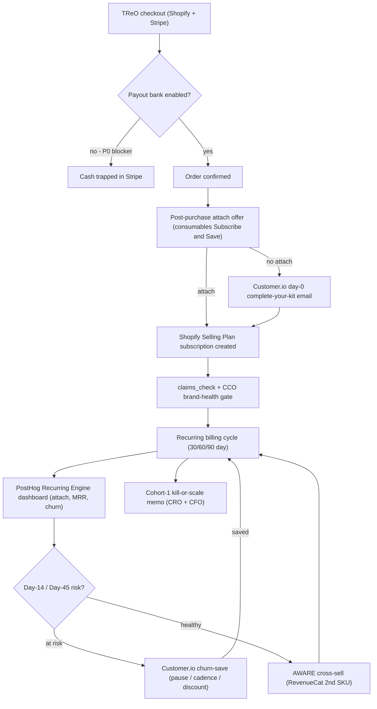

**Risks -> mitigations**
- FTC negative-option / ROSCA exposure on auto-renew if cancel and refund are not operationally honored (the Medvi-class front-end failure, flagged by CCO 2026-06-23) -> Hard-gate launch on CCO written clearance that cancel path + refund backlog are real; clear cancel-anytime + auto-renew disclosure through claims_check; one-click self-serve cancel before any auto-renew bills
- Building on a 3rd-party subscription app (Recharge/Skio) adds cost, a new data surface, and a new compliance gate, slowing the fastest path -> Use Shopify NATIVE subscriptions (selling plans) on the existing Stripe rail - zero new vendor, zero new gate, same store; only revisit a 3rd-party app if native cannot do post-purchase attach
- Attach rate and churn assumptions are unvalidated; scaling paid traffic against bad unit economics burns the first cash -> Instrument cohort-1 from the first order (PostHog events + RevenueCat) and enforce the week-4/5 kill-or-scale memo gate before any Phase-2 paid spend
- Consumables alone may show high churn (people forget they need domes), capping the LTV the model depends on -> Lead with the higher-retention cadence framing (auto-ship convenience), add AWARE as a stickier 2nd SKU, and stand up day-14/45 save loops before counting recurring in the valuation case

**First 72 hours**
- Escalate to Matt the two P0 unlocks as one packet: (1) connect + enable the Stripe payout bank on acct_1SQyXZAwjS2xuomw, (2) place one real non-refunded full-price PAIR99 TReO order; CTO confirms payouts_enabled=true and the captured charge via the SM stripe-secret-key read.
- Build the consumables Selling Plan Group in Shopify via graphql_mutation sellingPlanGroupCreate (30/60/90-day, ~10-15% subscriber discount) bound to the existing domes/tubes/batteries/cleaning/dehumidifier SKUs; verify the Subscribe and Save option renders on staging.
- Draft the subscription copy (Subscribe and Save label, auto-renew + cancel-anytime + 60-day money-back disclosure) and submit it to claims_check + CCO, with the explicit ask to confirm cancel + refund are operationally true before any auto-renew bills.
- Spec the post-purchase attach flow (Shopify order-status-page upsell with a Customer.io day-0 fallback email) and the four PostHog events (attach_offer_shown/subscribed, subscription_renewed/churned) so cohort-1 is instrumented from the very first subscriber.
- Write the recurring-engine kickoff to the cro ledger (mem.mjs decision --agent cro --share --tags medvi-ops) recording the chosen sequencing (consumables-first via Shopify native, AWARE second, CareNow blocked on 17(b)) and the validation targets (>=15% attach, >=70% cycle-2 retention, >=30% churn-save).

### 5. Tech & the AI Operating System  ·  _CTO_

**Situation.** As CTO, the honest state diverges from the playbook's "LIVE" labels. Verified-live by the 2026-06-30 functional E2E (3-5 testers back): the MCP gateway (Azure Container App mcp.otchealth.app, ring enforcement + a compliance gate that fires on the INND ticker), company-brain (cited across 14 sources), finance connectors (Xero 4 orgs, QBO, Plaid, Stripe livemode:true), n8n self-host (healthz 200, 29 active workflows), VoiceRAG (/health 200, / correctly 401-gated), PlantID backend, Datadog, and the read-only Shopify revenue tracker. But the playbook's "claims_check LIVE in the gateway" is DRIFTED: claims_check is gateway PR #24 (non-draft, UNMERGED) and the deployed image is a BRANCH build (rw4) AHEAD of main (44 native tools on main vs the ~838/rw branch figure) — deployed-but-not-merged, so a routine redeploy from main would silently drop claims_check + the full Shopify R/W (PR #25/#26). Two hard blockers stand above everything: the iHEAR TReO CHECKOUT IS UNPROVEN (one real charge ever, the $1 owner test), and the 28-credential otchealth-ops leak rotation is DEFERRED with ops secret-scan CI red — which blocks every public/investor action. Plus a live single-engine fragility (Hyperagent docs unreadable from Claude Code; only the kb-memory ledger + origin/main are cross-engine) and an Azure OpenAI throttle alert FIRING now on aoai-4701.

**Gaps**
- **[P0] Gateway is deployed-but-not-merged: claims_check + Shopify R/W live only on a branch image (rw4), not on main** — The Medvi moat is 'compliance enforced in code' (SOP-1). But claims_check is gateway PR #24 UNMERGED and the running image is a branch build ahead of main (main = 44 native tools; the ~838/rw figure is unmerged). A routine redeploy from main silently removes the compliance gate and the Shopify write path the funnel depends on. The system the whole playbook rests on has no durable source of truth.
- **[P0] TReO checkout is UNPROVEN — one real charge ever (the $1 owner test)** — PLAN.md rank-1 lever and the README non-negotiable: 'a correct link into a broken checkout still produces $0.' Every downstream lever (66,224 reignition send, ads, Amazon) is gated on this. The funnel HTML points at https://otchealthmart.com/products/treo-by-ihear-complete-pair-left-right with PAIR99 but no end-to-end paid-order verification exists. This is THE gate to first cash.
- **[P0] 28-credential otchealth-ops leak un-rotated; ops secret-scan CI red** — PLAN.md open question #7 and the CCO ledger: this 'BLOCKS any investor/public exposure.' Leaked creds in a public-facing posture (gateway is keys-to-the-kingdom) is an active breach surface and a Reg-FD/securities-adjacent reputational risk for a public-company (INND) operator. Must rotate before any send/ad/IR action.
- **[P1] Single-engine dependency: cross-engine state only survives in kb-memory + origin/main** — Confirmed pitfall 2026-06-29: Hyperagent global docs are unreadable from Claude Code; a CRO handoff was nearly lost. If the primary engine is at its weekly limit or down, work that lives only in branch PRs or doc-stores is unreachable. The fleet has one brain and fragile continuity. Also LLM-Obs is done-not-deployed (zero LLM spans) so a blackout is invisible.
- **[P1] Azure OpenAI throttle alert FIRING: default azure-openai secret points at the 10K-TPM aoai-4701, not the 1000K foundry** — Live Datadog alert 'Azure OpenAI throttled (blocked_calls>0)' is firing now. Agents on the default azure-openai-* secret 429 under load; the healthy high-capacity path (otchealth-foundry, azure-foundry-* secrets) is unused by default. VoiceRAG live CS and the claims gate both depend on inference; throttling during a funnel spike degrades CS and compliance throughput.
- **[P2] claude-tools/main and gateway repo lack PR-review gates; 47 stale drafts** — Audit 2026-06-29: otchealth-claude-tools/main was unprotected (now patched per 2026-06-30) and otchealth-mcp-server/main has CodeQL required but NO required PR reviews. The toolkit every agent live-pulls can be changed without review, and 47 open drafts hide real infra (#90/#103/#171/#182/#193/#236). Governance risk to the shared brain layer.

**Execution plan**

| # | Action | Owner | Depends on | Gate | ETA | Done when |
|---|---|---|---|---|---|---|
| 1 | Rotate the 28 leaked otchealth-ops credentials, Azure AD/Graph secret FIRST. For each: mint a new value, write a new Secret Manager version via setup/set-secret.mjs, update the consuming GitHub Actions secret / Container App env via ARM, then revoke the old. Re-run the ops secret-scan CI and confirm it goes green; scrub the leaked values from git history (BFG/filter-repo) on otchealth-ops. | CTO | none | Matt (provides/authorizes any creds pasted in chat; counsel notice if INND-adjacent) | 3 days | ops secret-scan CI is GREEN, all 28 creds have a new SM version + old revoked, and git history shows no leaked values (verified by a fresh secret-scan run). |
| 2 | Pin the gateway's source of truth: open the live Container App (otchealth-mcp-gateway.wonderfulpond-a1ddc412.eastus2), record the exact deployed image tag (rw4), then merge gateway PRs #24 (claims_check), #25 (Shopify R/W + Miro), #26 (full R/W connectors) into otchealth-mcp-server/main, rebuild :latest from main, and redeploy so the running image == main. Close stale PR #1. | CTO | none | none | 2 days | the deployed gateway image is built from main HEAD, claims_check + shopify_* tools resolve on a live tool-list call, and a main-built redeploy does NOT drop any tool (tool count before==after). |
| 3 | Add required PR-review + CodeQL to otchealth-mcp-server/main and otchealth-claude-tools/main (branch protection: require 1 review, CodeQL pass, linear history, enforce_admins). Bulk-triage the 47 claude-tools drafts: close superseded COO-brief drafts, surface the real-infra ones (#90/#103/#171/#182/#193/#236) for merge. | CTO | step 2 | none | 1 day | both main branches require review+CodeQL, and the claude-tools open-draft count is under 10 with the 6 infra PRs each either merged or labeled with a decision. |
| 4 | Prove the TReO checkout end-to-end: place ONE real full-price Complete Pair order on otchealthmart.com with code PAIR99 ($99) on a real card, complete payment, and confirm via the revenue-tracker.mjs heartbeat (SHOPIFY_ADMIN_TOKEN) that a paid order + a TReO line item appears. Capture the order number. | Matt (CTO instruments + verifies) | none | Matt (only Matt can place the real card order) | this week (10 min for Matt) | revenue-tracker.mjs prints todayCount>=1 paid with a TReO unit and Stripe shows a matching live charge; order # logged to the coo ledger. |
| 5 | Wire the claims_check gate into the actual publish paths so SOP-1 is enforced in code, not by convention: add a pre-publish call to the gateway claims_check tool in the Customer.io send path and the funnel/advertorial deploy step, blocking on a non-pass verdict. Add a unit/integration test that a treat/diagnose/cure string is REJECTED and a benefit-led PSAP string PASSES. | CTO | step 2 | CCO (owns the ruleset + final claims sign-off) | 3 days | a CI test proves claims_check blocks a banned-claim string and passes a compliant one, and the Customer.io draft-send path refuses to queue copy that fails the gate. |
| 6 | Repoint default inference to the healthy capacity tier to clear the firing throttle alert: change the gateway + skills default from azure-openai-* (aoai-4701, 10K TPM) to azure-foundry-* (otchealth-foundry, 1000K TPM) OR raise aoai-4701 quota via ARM; keep foundry gpt-4.1-mini as the documented fallback. Verify the Datadog 'Azure OpenAI throttled' monitor returns to OK. | CTO | none | none | 1 day | the Datadog throttle monitor reads OK for 24h and a load test of claims_check + company-brain returns zero 429s. |
| 7 | Close the single-engine fragility for state: enforce the cross-engine rule in code — a Stop-hook/CI check that fails if a 'master handoff' decision is not both in the kb-memory lane ledger AND committed to origin/main (not a claude/* draft). Document the 'engine-down' runbook (resume from kb-memory team feed + origin/main) in otchealth-cto/runbooks. | CTO | step 3 | none | 2 days | a handoff decision left only as a draft PR fails the CI check, and the runbook is on main with a tested 'cold-resume from ledger+main' procedure. |
| 8 | Deploy the done-not-deployed LLM observability so a blackout/throttle is visible: wire DD_LLMOBS / LLMObs.enable in src/instrument.ts (currently APM tracer.init only), set the llmobs key, and emit the otc.fleet.ledger_flush DD custom-metric from the Claude-side (KB_DD_EMIT). Confirm $ai_generation spans flow and the fleet-activity dashboard panels light. | CTO | step 6 | none | 2 days | Datadog shows non-zero LLM spans within 1h and the dashboard 43z-ffp-xp6 fleet-activity panels render live data. |
| 9 | Make VoiceRAG CS resilient before any send: run the SOP-3 nightly Shopify+Intercom -> cs-knowledge sync, confirm the index is fresh, and add a health/uptime synthetic (Datadog) on the VoiceRAG /health endpoint plus a PHI-forced-handoff test. This is the brand-health guardrail (PLAN rank-4) the warm list must not hit a dead line. | CTO | step 6 | none | 3 days | a Datadog synthetic pings VoiceRAG /health on a schedule, the cs-knowledge index shows today's TReO content, and a scripted PHI utterance triggers a human-handoff in test. |
| 10 | Stand up Sentry projects for the four apps with silent-drop risk (aware, flatstick, fourvault, innerease) so production errors are captured, and confirm GHAS push-protection/secret-scanning on .github, .github-private, app-template (the audit gaps). | CTO | step 1 | none | 2 days | all four apps have a live Sentry DSN wired and a test event received, and GHAS secret-scanning+push-protection is ON for the three config repos. |

**KPIs**
| KPI | Target | Kill / scale |
|---|---|---|
| Gateway image == main (no deployed-but-not-merged drift) | 100% of deployed gateway tools traceable to a merged main commit; weekly drift check | If a redeploy ever drops a tool, freeze gateway deploys until main is the sole build source |
| Leaked-cred rotation / secret-scan CI | ops secret-scan CI GREEN, 28/28 creds rotated within 3 days | Until green, HOLD all public/investor/send actions (hard gate) |
| Proven TReO checkout | 1 real full-price paid order confirmed in tracker + Stripe within this week | No reignition send or ad spend authorized until this is 1; if checkout fails, fix Shopify/Stripe before any traffic |
| claims_check enforcement coverage | 100% of owned publish paths (Customer.io, funnel deploy) call claims_check and block on fail | If any path can publish without the gate, block that channel until wired |
| Azure OpenAI throttle / inference availability | Datadog throttle monitor OK; <1% 429 on claims_check + brain over 24h | If 429s persist, raise quota or fail over all default inference to foundry permanently |

**Process diagram**
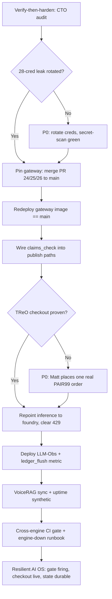

**First 72 hours**
- Start the 28-credential otchealth-ops rotation NOW, Azure AD/Graph secret first: new SM versions via setup/set-secret.mjs, update consumers, revoke old, re-run secret-scan CI until GREEN (this is the hard gate blocking every public action).
- Pin the gateway source of truth: record the live image tag (rw4), merge gateway PRs #24 (claims_check), #25 and #26 (Shopify R/W), rebuild :latest from main, redeploy, and confirm tool count before==after so no tool silently drops.
- Get Matt to place ONE real full-price Complete Pair order with PAIR99 on otchealthmart.com and confirm it in revenue-tracker.mjs + Stripe livemode (the rank-1 cash gate, ~10 min for Matt).
- Clear the live Azure OpenAI throttle alert: repoint default inference from aoai-4701 (10K TPM) to otchealth-foundry (azure-foundry-* secrets, 1000K TPM) and verify the Datadog monitor returns to OK.
- Add required PR-review + CodeQL branch protection to otchealth-mcp-server/main and otchealth-claude-tools/main, and bulk-triage the 47 claude-tools drafts to surface the 6 real-infra PRs.

### 6. Capital / INND Flywheel  ·  _Capital / IR (counsel-gated)_

**Situation.** As Capital/IR, the engine is documented but cold and prepare-and-flag only. INND-CAPITAL-FLYWHEEL.md §6 names the master unlock as engaging barred securities counsel (PRIORITIES #7, open, Matt-only); nothing in the capital sequence (Reg D 506(c) live tranche, Reg CF/WeFunder TTW, reverse split, roll-up) can fire until counsel exists and the GCP SA + PostHog keys are rotated (§6.2, an explicit HARD GATE that "blocks any investor/public action"). The CCO feed (2026-06-23) confirms the wall is enforced in operations (CareNow share-bundle is a Securities Act 17(b) BLOCK; the 28-cred ops leak rotation is still DEFERRED) and the CRO feed (2026-06-30) flags investor-targeted book distribution as a Reg FD/market-conditioning risk. Per the Moore Playbook §2, capital is downstream of one thing — does the warm 66,224 list still convert — so the legitimate, disclosable traction that justifies any raise narrative does not yet exist (store dormant, $0 in 90 days), meaning my job this week is strictly to assemble counsel-ready packets and the data-room scaffold, not to solicit anyone.

**Gaps**
- **[P0] Securities counsel not engaged — the master unlock for every rung** — INND-CAPITAL-FLYWHEEL §6.1 and §7 make counsel the gate on the capital chain, the live Reg D, litigation-disclosure posture, and the disclosure-controls calendar. Counsel selects the vehicle, structure, accredited-verification method, Rule 506(d) bad-actor checks, and all filings (§2 COUNSEL GATE). Until a barred securities attorney is retained, the fleet can only draft; no Form D, no Form C, no reverse split, no roll-up approach is permissible.
- **[P0] GCP SA + PostHog key rotation incomplete — the standing HARD GATE on all public action** — INND-CAPITAL-FLYWHEEL §6.2 states key rotation 'blocks any investor/public action until done,' and the CCO feed confirms the 28-cred otchealth-ops leak rotation is still DEFERRED with ops secret-scan CI red. Any investor-facing step before this is closed is reckless; this is a prerequisite I must track, not own.
- **[P1] No counsel-reviewed Reg D 506(c) data-room index or accredited-verification method selected** — §2 Rung 1 requires 'reasonable steps to verify' accredited status (self-certification is NOT allowed under 506(c)); the March-2025 SEC no-action high-minimum path ($200K/person, $1M/entity + no-third-party-financing rep) and document-review/CPA-attorney-BD-letter methods are the options. §6.3 asks the fleet to prepare a counsel-reviewed data-room index — that scaffold does not yet exist in a flaggable form.
- **[P1] Reg CF testing-the-waters reservation funnel not built off the owned list** — §2 Rung 2 and §6.4 call for a TTW reservation funnel (1,500–3,000 interested leads, no money accepted) off the 66,224-contact list, with all TTW materials filing with the Form C. The owned list is locked at 66,224 (CCO feed) and Customer.io exists, but no compliant interest-only reservation page or segment is staged, and the financial-statement tier (review vs audit) is undetermined.
- **[P2] Reverse-split prerequisites (FINRA 6490) not assembled — transfer agent not lined up** — §3 requires a board resolution + charter amendment + a simultaneous Transfer-Agent Verification Form, filed ≥10 calendar days before the record date, and FINRA may decline if the issuer is not current in SEC reporting. §6.5/§7 leave whether/when/ratio undecided. The transfer-agent identification and a current-reporting-status check are prepare-able now without touching the decision.
- **[P1] No disclosure-controls calendar or litigation-disclosure posture packet for counsel** — §6.1 names a 'go-forward disclosure-controls calendar' and §7 lists 'resolve the litigation-disclosure posture before any raise material is finalized.' The securities firewall (§5: Reg FD, no-promotion, PSLRA, 17(b), Rule 144 affiliate, FINRA 24-09) must be operationalized as a checklist the fleet runs before any draft moves, and that artifact is not yet written down for counsel sign-off.

**Execution plan**

| # | Action | Owner | Depends on | Gate | ETA | Done when |
|---|---|---|---|---|---|---|
| 1 | Draft the one-page 'Engage Securities Counsel' decision brief for Matt: scope = (a) the capital chain / live Reg D 506(c), (b) Reg CF vehicle + portal selection, (c) reverse-split / FINRA 6490 posture, (d) litigation-disclosure posture, (e) a go-forward disclosure-controls calendar; include 3 candidate barred securities counsel profiles (OTC/micro-cap experience, Reg A+/CF track record) as research-only options, an engagement-letter checklist, and the explicit note that this is the master unlock per INND-CAPITAL-FLYWHEEL §6.1/§7. Save to coo private lane, write-through mem.mjs --agent capital --tags moore-playbook,capital. | Capital/IR | none | Matt | by EOD day 2 | Brief exists in the coo private lane with 3 counsel candidates + scope list + engagement-letter checklist, flagged 'ATTORNEY REVIEW REQUIRED / Matt decides retention,' logged to the capital ledger; no outreach made. |
| 2 | Open and track the key-rotation hard-gate dependency with the CTO: file a fleet-dispatch to the CTO/CCO confirming the GCP SA + PostHog key rotation and the 28-cred otchealth-ops leak rotation status, and record it as a blocking precondition on every downstream capital step. Do NOT rotate anything (CTO-owned); only surface, link, and gate. | Capital/IR | none | none (tracking) / CTO executes | day 1 | A capital-ledger entry exists stating 'no investor/public-facing step proceeds until GCP SA + PostHog keys rotated and ops secret-scan CI green,' with a dispatched confirmation request to CTO and the current status (DEFERRED) recorded per INND-CAPITAL-FLYWHEEL §6.2. |
| 3 | Build the Reg D 506(c) data-room INDEX (folder tree + document checklist only, no confidential contents): standard sections — corporate/charter, cap-table summary (counsel-gated, placeholder), audited/reviewed financials status, material contracts, IP/patent schedule (52+ INND patents referenced in Moore Playbook §1), risk factors, litigation-disclosure section (placeholder), and the subscription/offering-doc slots — provisioned as an access-controlled Azure Blob data room via the cfo-store / cfo-onedrive pattern (non-PHI ring). Every node carries an 'ATTORNEY REVIEW REQUIRED' header. | Capital/IR + CFO | step 1 | counsel (reviews before any investor sees it) | day 5 | An empty-but-complete, access-controlled data-room index (folder structure + per-section document checklist) exists in the Azure Blob non-PHI data room, indexed by doc-indexer, with no confidential values populated and a counsel-review flag on the root; logged to the capital ledger. |
| 4 | Write the accredited-verification METHOD OPTIONS memo for counsel: lay out the three §2 Rung-1 methods — (a) March-2025 SEC no-action high-minimum path ($200K/natural person, $1M/entity + written no-third-party-financing rep), (b) document review (tax returns / W-2 / brokerage statements), (c) third-party CPA/attorney/registered-BD verification-letter services — with a recommended default and the Rule 506(d) bad-actor questionnaire template attached. Explicitly state self-certification is impermissible under 506(c). | Capital/IR | step 1 | counsel selects the method | day 6 | A method-options memo + a draft Rule 506(d) bad-actor questionnaire exist in the coo private lane, flagged for counsel selection, citing INND-CAPITAL-FLYWHEEL §2 Rung 1; logged to the capital ledger; no method is treated as chosen. |
| 5 | Stage the Reg CF testing-the-waters RESERVATION FUNNEL as a no-money interest-only artifact: a draft 'reserve your spot / register interest' landing page + a dedicated Customer.io segment carved from the locked 66,224 list, with copy that accepts NO money and NO commitment, carries the TTW legend, and routes through claims_check + the securities firewall. Do not send. Target a 1,500–3,000 reservation goal per §2. | Capital/IR + lifecycle/CRO | step 1 | counsel (TTW materials file with Form C) + Matt send-go | day 7 | A draft TTW reservation page + a Customer.io interest-only segment exist on staging, both labeled 'DRAFT — ATTORNEY REVIEW REQUIRED, NO SOLICITATION,' passing claims_check, with zero recipients targeted and no send scheduled; logged to the capital ledger. |
| 6 | Compile the Reg CF financial-statement-tier readiness note with the CFO: map the §2 tiers (<=$124K self-certified; $124K–$618K reviewed CPA; $618K–$1.235M reviewed/audited; >$1.235M audited) against the company's current financial-statement state (QBO/Xero exports already in the CFO data room) to identify which review/audit level a contemplated raise size would require, framed as a question for counsel + CFO, not a target. | Capital/IR + CFO | step 3 | counsel + CFO confirm tier and audit readiness | day 8 | A tier-readiness note exists stating, for each candidate raise band, the required financial-statement level and the current readiness gap, citing INND-CAPITAL-FLYWHEEL §2 Rung 2; logged to the capital ledger; no raise size committed. |
| 7 | Assemble the reverse-split (FINRA 6490) PREREQUISITES checklist (no initiation): the required artifacts — board authorization + charter amendment, FINRA Company-Related Action Notification, signed board resolution, the simultaneous Transfer-Agent Verification Form, the 10b-17 timely-notice fee schedule ($200 timely / $1,000/$2,000/$5,000 late), and the ≥10-calendar-day-before-record-date timing — plus a research-only shortlist of OTC transfer agents and a 'current in SEC reporting' status question for counsel (a 6490 deficiency factor per §3). | Capital/IR | step 1 | board + counsel decide whether/when/ratio; transfer agent runs 6490 | day 9 | A 6490 prerequisites checklist + transfer-agent options list exist in the coo private lane, with whether/when/ratio left explicitly UNDECIDED and flagged for board + counsel per INND-CAPITAL-FLYWHEEL §3/§6.5; logged to the capital ledger. |
| 8 | Operationalize the securities firewall as a runnable pre-publish CHECKLIST and a draft disclosure-controls calendar: convert §5 (Reg FD no-selective-disclosure, no-promotion / no share-price talk, PSLRA cautionary language, Section 17(b) compensated-promotion disclosure, Rule 144 affiliate trading is counsel-only, FINRA 24-09 quiet-period) into a gate every ir-support draft must pass, and lay out a periodic cadence (e.g., disclosure committee touchpoints, filing-deadline reminders) as a template for counsel to ratify. | Capital/IR + CCO | step 1 | counsel ratifies the calendar and owns all disclosure judgments | day 10 | A securities-firewall pre-publish checklist (the §5 gate chain: agent drafts -> counsel reviews -> Matt approves -> then sent/filed) and a draft disclosure-controls calendar exist, wired as a required gate on ir-support outputs, flagged for counsel ratification; logged to the capital ledger. |
| 9 | Draft a single factual, Reg-FD-safe investor-update TEMPLATE (no numbers, no share-price language, PSLRA cautionary legend, 'ATTORNEY REVIEW REQUIRED' header) via the ir-support skill, to be the standing format for activating the shareholder base ONCE real disclosable traction exists (Moore Playbook Phase 3 Weeks 15–16). Hold it; do not populate or send. | Capital/IR | step 8 | counsel reviews + Matt approves before any release | day 11 | A draft-only investor-update template exists with the PSLRA legend and the gate-chain header, carrying no MNPI/figures, parked for the traction trigger, citing INND-CAPITAL-FLYWHEEL §5/§6.7; logged to the capital ledger; nothing sent. |
| 10 | Package everything into a single counsel-onboarding bundle index (links to: the data-room index, the accredited-verification options memo + 506(d) questionnaire, the Reg CF tier note + TTW reservation draft, the 6490 prerequisites checklist, the firewall checklist + disclosure-controls calendar, and the investor-update template) so that the moment Matt retains counsel, the entire prepare-and-flag stack hands over in one move. | Capital/IR | step 3,step 4,step 5,step 6,step 7,step 8,step 9 | Matt + counsel (the handover itself) | day 12 | One bundle index in the coo private lane links every prepare-and-flag artifact, each flagged 'ATTORNEY REVIEW REQUIRED,' ready to hand to counsel on retention; logged to the capital ledger; no external action taken. |

**KPIs**
| KPI | Target | Kill / scale |
|---|---|---|
| Counsel-onboarding bundle completeness (prepare-and-flag artifacts ready) | 100% of the 7 §6 packets drafted + flagged ATTORNEY REVIEW REQUIRED within 12 days | If <70% complete by day 12, escalate to Matt that the capital lane is blocked on capacity, not on permission; reprioritize. |
| Hard-gate prerequisites closed before any investor-facing step | GCP SA + PostHog key rotation done and ops secret-scan CI green (binary, must = yes) | KILL all investor/public action until green per INND-CAPITAL-FLYWHEEL §6.2; do not advance any rung while red. |
| Securities counsel retained (the master unlock) | Engagement letter signed by Matt (binary) | Until signed, SCALE only drafting/scaffolding; the moment signed, hand over the bundle and let counsel select vehicle + sequence. |
| Reg CF TTW reservations captured (interest-only, no money) | 1,500–3,000 reservations off the 66,224 list per §2 — counted ONLY after counsel clears the TTW page and Matt gives send-go | Do not start counting/sending until counsel + Matt clear it; if <1,500 after launch, weaken/defer the Reg CF retail rung and lean on 506(c). |
| Securities-firewall pre-publish gate pass rate on all IR/INND drafts | 100% of investor/IR/INND drafts pass the §5 gate chain (counsel -> Matt) before any release | Any breach = immediate stop on the IR lane and incident note to counsel; zero tolerance per the absolute firewall. |

**Process diagram**
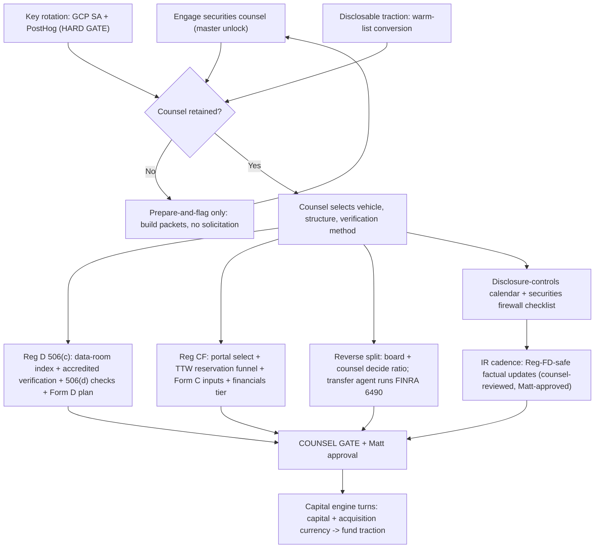

**Risks -> mitigations**
- Premature solicitation: a 'reservation' or investor-update draft is mistaken for a live offer and goes out before counsel + Matt clear it (Reg FD / unregistered-offer / market-conditioning exposure; CRO already flagged investor-targeted book distribution as a Reg FD risk). -> Every artifact carries an 'ATTORNEY REVIEW REQUIRED / NO SOLICITATION' header; TTW page accepts no money and targets zero recipients until the gate clears; the §5 firewall checklist runs as a hard pre-publish gate; the capital agent never publishes investor content (INND-CAPITAL-FLYWHEEL §5 COUNSEL GATE).
- Acting on the capital engine before the key-rotation HARD GATE is closed (28-cred ops leak still DEFERRED, secret-scan CI red). -> Record the rotation as a blocking precondition on every downstream step (execution step 2); do not advance any rung while CI is red; track CTO ownership and confirm green before any investor-facing move per §6.2.
- MNPI / confidential capital-structure specifics (share counts, prices, cap-table chain, litigation detail) leak into a repo or a draft that the fleet handles. -> All confidential specifics stay in the coo private lane + with counsel and never in this repo (per the doc's design); data-room index ships empty of values; the legal-personal/MNPI rings stay segregated; no share counts or prices in any drafted material.
- The capital narrative is built on traction that does not yet exist (store dormant, $0/90 days), risking a story that outruns disclosable facts. -> Gate all IR narrative to real, disclosable operating results per Moore Playbook §7/§8 (capital is downstream of warm-list conversion); the investor-update template stays parked and unpopulated until traction is real and counsel-reviewed.

**First 72 hours**
- Draft and file to the coo private lane the 'Engage Securities Counsel' decision brief for Matt (scope = capital chain / live Reg D / Reg CF portal / reverse-split posture / litigation-disclosure / disclosure-controls calendar) with 3 research-only counsel candidates and an engagement-letter checklist, flagged Matt-decides; write-through mem.mjs --agent capital --tags moore-playbook,capital (INND-CAPITAL-FLYWHEEL §6.1/§7).
- Open the key-rotation hard-gate dependency: dispatch the CTO/CCO for current status on the GCP SA + PostHog + 28-cred ops-leak rotation, and record 'no investor/public step until rotation done + secret-scan CI green' as a blocking precondition on every capital step (§6.2).
- Stand up the empty, access-controlled Reg D 506(c) data-room INDEX (folder tree + per-section document checklist, no values) in the Azure Blob non-PHI data room via the cfo-store pattern, root-flagged ATTORNEY REVIEW REQUIRED.
- Write the accredited-verification method-options memo (high-minimum no-action path vs document review vs third-party CPA/attorney/BD letters) plus a draft Rule 506(d) bad-actor questionnaire, flagged for counsel to select; state explicitly that 506(c) bars self-certification (§2 Rung 1).
- Confirm in writing (capital ledger) the standing firewall posture for this lane: prepare-and-flag only, no solicitation, no MNPI/share counts/prices in any artifact, every output ends in a COUNSEL GATE — and that nothing fires until counsel is retained and the key-rotation gate is green.

### 7. Competitive & Positioning  ·  _Growth_

**Situation.** The whole machine is built and waits behind one proven $99 checkout + a send-go to 66,224 warm HearingAssist contacts (MEDVI-MIRROR PLAN.md §0; team feed cto 2026-06-29 confirms Stripe charges_enabled=true, payouts bank unconnected). But every piece of live positioning leans on ONE anchor that is now broken: the funnel (iheartreo-funnel.html) and the playbook hook ("$299 a side at CVS. $99 here." — OTCHEALTH-CASH-PLAYBOOK.md, Canonical Products) frame TReO purely against clinic/CVS retail price. That comparison ignores the actual 2026 demand reality: Apple AirPods Pro 2 ship FDA-cleared hearing-aid mode FREE to the ~tens of millions who already own them, and the OTC field (Costco Kirkland/Sonova, Jabra Enhance, Eargo+Lexie=LXE, Bose/Lexie) already owns the "$99-$999 self-fit" mind-space — so a price-anchor-only PSAP at $99-149 has no defensible "why TReO not AirPods" answer, no named wedge segment, and no competitive creative test plan anywhere in the docs (none of MOORE-PLAYBOOK §4 market sizing, PLAN.md, or the funnel address a single competitor). The TReO is also a PSAP, not a hearing aid (CCO firewall, team feed cco 2026-06-23), which is simultaneously the compliance constraint AND, used correctly, the wedge.

**Gaps**
- **[P0] No "why TReO not AirPods Pro 2" answer — the demand-killing blind spot** — AirPods Pro 2 hearing aid mode is free and FDA-cleared for the ~tens of millions who already own them; if the prospect or their adult child owns AirPods, the natural reaction to a $99-149 PSAP is "why pay when Apple does it free?" The funnel and playbook hook (iheartreo-funnel.html; OTCHEALTH-CASH-PLAYBOOK Canonical Products) never address this, so paid traffic and the reignition email will convert against a strong, free, top-of-mind alternative with no rebuttal. This single gap caps every downstream revenue line in MOORE-PLAYBOOK §7.
- **[P0] No defined wedge segment to own — positioning is to "everyone with hearing trouble"** — The funnel addresses generic "started turning the TV up" buyers — the exact head-to-head where AirPods, Costco, Jabra, and Eargo all compete and outspend us. The Medvi template (MEDVI-MIRROR §1) demands a SINGLE STICKY WEDGE. The docs never name ours. We must own a segment those four structurally cannot serve well: the 70+ non-iPhone/non-smartphone senior who wants it working out of the box (the warm 66,224 list skews exactly here), where AirPods (needs iPhone + iOS 18 + setup), Eargo/Jabra (app-fit), and Costco (a clinic appointment) all add friction TReO removes.
- **[P1] Price-anchor is wrong and FTC-fragile post-AirPods** — "$299/side at CVS, $99 here" (funnel) anchors against a price that AirPods just reset to $0 for the function, making $99 look expensive-vs-free rather than cheap-vs-clinic; and the CCO has already flagged the broader claims firewall (team feed cco 2026-06-23). The offer needs to compete on FRICTION, FIT-FOR-PURPOSE, and a senior-specific risk-reversal, not on a now-defeated price anchor — without ever making a hearing-aid/medical claim (PLAN.md non-negotiables).
- **[P1] Zero competitive creative/channel test plan — spend would fly blind** — MEDVI-MIRROR tactic #2 (industrial creative testing, kill/scale on cost-per-initiated-checkout) and SOP-2 exist as process, but there is NO library of positioning angles to test, no channel map, and no competitor-conquest creative. PostHog cost-per-initiated-checkout is the source of truth (SOP-2) yet there is nothing staged to feed it. Without a structured angle x channel x audience test matrix, the first paid dollars (MOORE-PLAYBOOK Phase 2 Week 8) burn with no learning.
- **[P1] Reviews/social proof are placeholders against rivals with thousands of real reviews** — The funnel ships "Sample review · to be replaced" (iheartreo-funnel.html) and CCO has flagged fabricated social proof as a hard block (team feed cco 2026-06-23). Audien claims 1.5M+ customers and Eargo/Lexie have large review bases; a senior buyer comparison-shopping sees our empty proof vs their walls of reviews. Trust is the conversion lever for this demographic and we have none staged.
- **[P2] No channel-level competitive intelligence feeding positioning** — INND-ROLLUP-LANDSCAPE §3 names the competitive set (LXE/Eargo+Lexie, Audien, MDHearing, Audicus, Costco/Kirkland-Sonova, Jabra Enhance, Bose/Lexie) for M&A but that intel is never wired into front-end positioning, pricing checks, or ad messaging. We have the map; it is siloed in the capital lane, not the growth lane.

**Execution plan**

| # | Action | Owner | Depends on | Gate | ETA | Done when |
|---|---|---|---|---|---|---|
| 1 | Write the canonical positioning brief growth/positioning/TREO-WEDGE-POSITIONING.md: name the wedge = "the 70+ no-fuss, no-iPhone, no-appointment senior"; the one-line position = "Hearing help that just works out of the box. No iPhone, no app, no appointment, no $2,400 clinic."; and the verbatim "why TReO not AirPods" rebuttal block (AirPods need an iPhone + iOS setup + daily charging + earbuds people lose; TReO is ready-to-wear behind the ear, all-day, nothing to pair). PSAP/amplifier stays out of headlines per CCO; category in fine print only. | Growth (me) | none | none | 2 days | TREO-WEDGE-POSITIONING.md committed to otchealth-exec origin/main, dash-clean, with the wedge segment, one-line position, and the 4-point AirPods rebuttal — and a kb-memory decision logged (mem.mjs decision --agent cro --share --tags moore-playbook,positioning). |
| 2 | Build the competitor x angle x objection matrix growth/positioning/COMPETITIVE-CONQUEST-MATRIX.md covering AirPods Pro 2, Costco Kirkland, Jabra Enhance, Eargo/Lexie, Bose/Lexie, audiologist clinic — each with: their friction we beat, our one-sentence conquest line, the exact objection rebuttal, and the FTC-safe framing (no hearing-aid/medical claim). Source the competitive set from INND-ROLLUP-LANDSCAPE §3. | Growth (me) | 1 | none | 3 days | Matrix committed to origin/main with 6 competitors x {friction, conquest line, rebuttal, compliance note} fully filled; every line is amplification/wellness-only language. |
| 3 | Rewrite the funnel copy: replace the broken "$299/side at CVS, $99 here" hero with the friction-and-fit position from step 1, drop the price-only anchor to a secondary line, add a 3-line "already have AirPods?" objection-handler section, and add a senior risk-reversal block (60-day money-back + a real human phone line). Deliver as a copy-diff doc against iheartreo-funnel.html for the developer to apply. | Growth (me) -> developer applies | 1,2 | CCO (claims_check) then Matt go-live | 4 days | Funnel copy-diff committed; every changed line passes the gateway claims_check tool (SOP-1); developer has a ready PR against iheartreo-funnel.html; no hearing-aid/medical/FDA wording. |
| 4 | Stage 12 ad-creative concepts (4 angles x 3 formats) in growth/creative/CONQUEST-CREATIVE-BRIEFS.md: angles = (a) out-of-the-box/no-iPhone, (b) all-day vs charge-twice-a-day earbuds, (c) for-a-parent (adult-child buyer), (d) try-it-before-the-clinic. Each brief = hook, script beats, on-screen text, visual direction, target audience, and the claims-safe note. Route every script through claims_check before staging. | Growth (me) | 1,2 | CCO (claims_check) | 5 days | 12 briefs committed and claims_check-clean; ready to hand to the designer skill for asset generation; NO spend triggered (spend stays Matt-gated). |
| 5 | Run the staged funnel + top 4 creative concepts through the focus-group-loop (node skills/focus-group-loop/fgl.mjs round) targeting the 70+ wedge persona set, looped until the customer group averages >=90% on "would you buy this over AirPods/Costco"; catalog each round (--catalog) to the brain. | Growth (me) | 3,4 | none | 6 days | Focus-group customer-group score >=90% on the conquest question for the rewritten funnel + at least 2 creative concepts; rounds cataloged; losing angles killed in the matrix. |
| 6 | Define the channel test plan growth/channel/CHANNEL-TEST-PLAN.md mapped to budget tiers: Tier-0 (cost-neutral now) = the reignition email A/B (price-anchor control vs friction/AirPods-rebuttal variant) to a 5% list seed; Tier-1 ($50-100/creative, 48-72h, Matt-gated) = Meta/Facebook (the 70+ skew the rivals underweight) as primary, with the AirPods-conquest and for-a-parent angles. Define kill/scale = cost-per-initiated-checkout via PostHog (SOP-2). | Growth (me) | 2,5 | Matt (any spend) + CCO (copy) | 5 days | CHANNEL-TEST-PLAN.md committed with Tier-0/Tier-1 design, per-channel budget caps, PostHog cost-per-initiated-checkout as the single source of truth, and explicit kill (>target CPIC at 72h) / scale (<target) rules. |
| 7 | Prepare the reignition-email positioning variant: take draft-141 (cro/campaigns/DRAFT-141-SEND-PACKAGE.md, CONDITIONAL-CLEAR per CCO) and produce a B variant whose subject + body lead with the out-of-the-box/no-iPhone friction position and a one-line AirPods rebuttal instead of the price anchor; keep all CAN-SPAM elements (Roseville address + unsubscribe + honest subject) the CCO already verified. | Growth (me) with lifecycle | 1,3 | CCO (claims_check) + Matt send-go (after checkout proof + brand-health) | 4 days | Draft-141-B committed alongside draft-141; both pass claims_check; A/B split spec (control = price anchor, variant = friction/AirPods) documented for the send; send still Matt-gated. |
| 8 | Stand up the competitive-price + claim watch: a weekly growth/intel/COMPETITOR-WATCH.md updated from public sources (AirPods feature changes, Costco Kirkland price, Jabra/Eargo/Lexie promos) so positioning and the offer stay current; wire the headline deltas into the morning brief. | Growth (me) | 2 | none | 3 days | COMPETITOR-WATCH.md committed with the 6-competitor table and a cadence note; first weekly update logged; a kb-memory --share fact posted so CRO/COO/CFO see price moves. |
| 9 | Source real social proof to replace placeholders: pull verifiable buyer reviews/testimonials from the proven 1,484-order history via Shopify (mcp__Shopify list-orders/list-customers) + any existing review app, screen each for compliance, and stage a verified-review block for the funnel; flag the fabricated-review block for removal per CCO. | Growth (me) with commerce | 3 | CCO (review authenticity + claims) | 5 days | At least 5 real, attributable, claims-clean reviews staged for the funnel; the "Sample review" placeholders flagged for deletion in the developer PR; CCO fabricated-social-proof block cleared. |
| 10 | Define the success scoreboard in PostHog: create a saved insight/dashboard tracking cost-per-initiated-checkout, funnel quiz-completion -> offer-view -> checkout-start by traffic angle, and email variant CTR/checkout, so every positioning test reports against the same metric (PostHog is the SOP-2 source of truth; project = non-MedReview). | Growth (me) with CFO | 6 | none | 4 days | A PostHog dashboard exists with cost-per-initiated-checkout + the angle-tagged funnel breakdown + email-variant panels, on a non-PHI project, linked from the morning brief. |

**KPIs**
| KPI | Target | Kill / scale |
|---|---|---|
| Cost per initiated checkout (CPIC) by positioning angle (PostHog, SOP-2 source of truth) | Friction/AirPods-conquest angle CPIC <= $15 within 72h of a Tier-1 test | Scale any angle under target +20%; kill any angle over $25 CPIC at 72h; reallocate budget to the winning wedge angle. |
| Reignition email variant lift (price-anchor control vs friction/AirPods variant) | Friction variant >= +20% checkout-starts per delivered email vs the price-anchor control on the 5% seed | If the variant wins, send it to the full 66,224 (Matt go); if it loses, keep control and re-cut the variant from the next focus-group winner. |
| Focus-group customer-group score on "buy TReO over AirPods/Costco" | >= 90% on the rewritten funnel + at least 2 creative concepts | Below 90% = do not advance to paid spend; loop the funnel/creative; kill concepts that stall under 75% after 3 rounds. |
| Wedge-segment conversion (70+ / for-a-parent audience) vs generic audience | Wedge audience checkout-start rate >= 1.5x the generic "turning the TV up" audience | If the wedge outperforms, concentrate all spend there; if it does not, re-test the segment definition before scaling any audience. |
| Verified review count staged on the funnel (trust gate for the demographic) | >= 5 real, claims-clean, attributable reviews live before any paid scale | Do not lift the paid budget cap until >=5 verified reviews are live; below that, paid stays at the test-tier cap. |

**Process diagram**
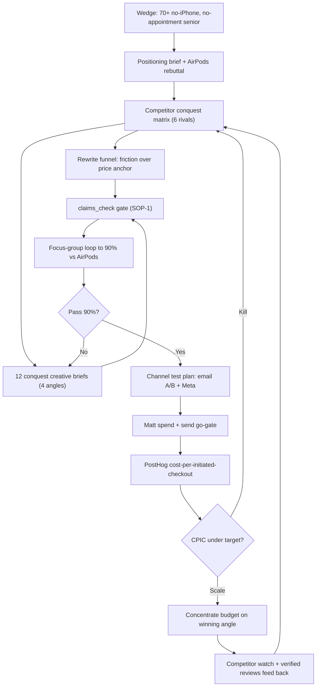

**Risks -> mitigations**
- Compliance overreach: a "why not AirPods" rebuttal drifts into comparing hearing performance, which implies a hearing-aid/medical claim and trips the CCO firewall (team feed cco 2026-06-23) or FTC. -> Compete ONLY on friction/fit/convenience (out-of-the-box, no-iPhone, all-day, behind-the-ear) and price-vs-clinic, never on hearing/audiological capability; route every line through claims_check (SOP-1); PSAP/amplifier stays out of headlines, category in fine print.
- Apple/AirPods owns the smartphone-native buyer; chasing that head-to-head burns spend against a free, better-funded incumbent. -> Do not contest the iPhone-native segment; concentrate the wedge on the non-smartphone 70+ and the for-a-parent adult-child buyer where AirPods setup friction is highest and the warm 66,224 list already lives.
- Empty social proof vs rivals' thousands of reviews kills senior trust even with perfect positioning. -> Pull and stage >=5 real reviews from the proven 1,484-order history before lifting any paid cap; flag the fabricated-review placeholders for removal; gate the paid budget on verified-review count.
- Spend authorized before checkout + payout are proven (Stripe payouts bank not connected per cto 2026-06-29) means money collected but stuck, or traffic into a broken close. -> Tier-0 email A/B and all creative/focus-group work are cost-neutral and run now; hold all paid spend behind Matt's checkout-proof + payout-bank gate and the brand-health (reachable CS) prerequisite (PLAN.md).

**First 72 hours**
- Write and commit growth/positioning/TREO-WEDGE-POSITIONING.md to otchealth-exec origin/main: name the wedge (70+ no-iPhone, no-appointment senior), the one-line position ("Hearing help that just works out of the box. No iPhone, no app, no appointment."), and the verbatim 4-point "why TReO not AirPods Pro 2" rebuttal; log it as a kb-memory decision (--agent cro --share --tags positioning).
- Build growth/positioning/COMPETITIVE-CONQUEST-MATRIX.md for AirPods Pro 2, Costco Kirkland, Jabra Enhance, Eargo/Lexie, Bose/Lexie, and the audiologist clinic (friction-we-beat + conquest line + objection rebuttal + claims-safe note each), sourcing the set from INND-ROLLUP-LANDSCAPE §3.
- Produce the funnel copy-diff against iheartreo-funnel.html that replaces the price-only hero with the friction/fit position and adds an "already have AirPods?" objection-handler block, and run every changed line through the gateway claims_check tool (SOP-1) before handing the diff to the developer.
- Draft reignition draft-141-B (friction/AirPods-rebuttal subject + body, all CAN-SPAM elements preserved) as the A/B variant against the existing price-anchor draft-141, and stage it for claims_check; keep the send Matt-gated.

### 8. Operations & Single Points of Failure  ·  _COO / Ops-Risk_

**Situation.** As COO/Ops-Risk lead, the honest state: the machine is ~90% built and dormant, and every operational SPOF that would turn a 66,224-person send into a disaster is still open. The single loudest documented risk is brand-health (MEDVI-MIRROR/README/PLAN: the #1 BBB/Trustpilot complaint is unreachable CS + unprocessed refunds), and it is now a hard compliance gate, not just a quality issue: CCO has BLOCKED the published "60-day money-back guarantee" + "help is a call/email away" copy until refunds and support are operationally TRUE (FTC Sec 5 / Mail-or-Telephone Order Rule / Magnuson-Moss). Two named ops failure points compound it: VoiceRAG answers questions but refunds require a human/finance action that has no owner (PLAN Q5), and the Stripe rail has charges_enabled=true but payouts_enabled=FALSE with no payout bank connected (CTO 2026-06-29) — so collected money sits in Stripe and refunds may not even be fundable. The 10,298-unit refurb pool (Playbook Week 10) has no named partner, per-unit cost, or throughput, and "Matt-is-the-only-gate" is proven by "19 days, zero cash moves executed."

**Gaps**
- **[P0] Refunds are unowned AND possibly unfundable before the send (Stripe payouts off, no human refund desk)** — CCO has gated the published money-back-guarantee copy until refunds are operationally true (FTC Sec 5 / Mail-or-Telephone Order Rule). VoiceRAG cannot issue refunds (PLAN Q5) and Stripe payouts_enabled=FALSE with no bank connected (CTO 2026-06-29). Firing 66,224 emails into a guarantee we cannot honor within 7 days is the exact Medvi brand-health failure mode plus a regulatory exposure.
- **[P0] Reachable CS has no staffed SLA, headcount, or escalation path before the send** — The #1 historical complaint is unreachable CS (README/MEDVI-MIRROR). VoiceRAG + Sarah 800-864-4337 / Helen 800-640-9731 are live but underloaded and untested at volume; a warm list of 66,224 hitting a line with no human backstop or measured response time re-creates the dead-line problem the whole brand-health gate exists to prevent.
- **[P1] 10,298-unit fulfillment + refurbishment has no named partner, per-unit cost, or throughput** — The $2-3M pool (Playbook Week 10, refurb to $199-299) is a one-line plan with zero operational substance — no 3PL/refurb vendor, no cost-to-refurb-per-unit, no inspection/QC/RMA flow, no daily throughput. Without it the inventory monetization lever cannot scale and returns from TReO sales have nowhere to go.
- **[P1] Matt is the sole gate on every cash-critical action; bus-factor = 1 (19 days, 0 moves)** — Checkout proof, send-go, payout bank, refund authorization, and pricing all wait on one person; the documented result is 19 days with zero cash moves executed. Any unavailability (the blackout pattern) freezes the entire revenue engine because no pre-authorized fallback exists.
- **[P1] No contingency if the 66,224 warm list is dead (deliverability/decay unknown)** — Every downstream model line is downstream of Phase 1 (does the warm list convert?) yet the list's age, bounce/spam rate, and domain reputation are untested. A cold or undeliverable list means the reignition thesis fails silently and there is no fallback acquisition path staged.
- **[P2] No incident runbook / on-call for the launch window** — A 66,224 send is a load event (CS spike, checkout errors, payout failures, deliverability blocks). There is no documented incident runbook, severity ladder, or who-does-what-at-3am — so a launch-night failure has no rehearsed response.

**Execution plan**

| # | Action | Owner | Depends on | Gate | ETA | Done when |
|---|---|---|---|---|---|---|
| 1 | Connect and verify the Stripe payout bank account so collected funds and refunds can move. Matt adds/enables the payout bank in the Stripe dashboard (acct_1SQyXZAwjS2xuomw); CTO then confirms via the stripe-read skill that payouts_enabled=true and requirements are empty. | Matt (action) + CTO (verify) | none | Matt | 24h | stripe-read skill returns payouts_enabled=true with no requirements due, posted to the coo ledger. |
| 2 | Stand up the refund desk: name ONE human refund owner (Matt or a finance delegate), document the refund SOP (request -> verify order in Shopify -> issue refund in Stripe within the 60-day promise), and set a 7-business-day refund SLA aligned to the Mail-or-Telephone Order Rule. Write it as runbooks/refund-desk-sop.md. | COO (writes SOP) + Matt (names owner/authorizes refund $) | 1 | Matt | 48h | refund-desk-sop.md committed with a named owner, a 7-day SLA, and one end-to-end test refund issued and reconciled in Stripe. |
| 3 | Make CS reachable with a measured SLA before any send: confirm Sarah (800-864-4337) and Helen (800-640-9731) answer, route unanswered/after-hours to a logged voicemail + email queue in Intercom, set a published <4-business-hour first-response SLA, and run a load smoke-test (10 simulated inbound queries through VoiceRAG + 3 live calls). Document in runbooks/cs-reachability-sop.md. | COO/CS | none | none | 72h | cs-reachability-sop.md committed; smoke-test log shows every channel answered and a first-response time recorded; CCO clears the 'help is a call/email away' copy. |
| 4 | Get CCO to lift the brand-health copy gate: present the live refund desk (step 2) + reachable CS SLA (step 3) as evidence that the 60-day guarantee and support claims are operationally true; obtain CCO conditional-clear on draft-141 brand-health terms. | COO | 2,3 | counsel/CCO | 72h | CCO posts a clear of the money-back-guarantee + support-claim copy in the exec feed, leaving only Matt's send-go and checkout-proof outstanding. |
| 5 | Prove the checkout end-to-end as an ops gate, not just a buy: Matt places ONE real full-price TReO Complete Pair order (PAIR99) with a real card and does NOT refund it; COO verifies the order in Shopify, the charge in Stripe, and a payout settling to the bank, then runs the refund SOP on a SEPARATE test order to prove the full money-out path. | Matt (order) + COO (verify both paths) | 1,2 | Matt | 72h | one non-refunded real order is settled to bank AND one test refund completed within SLA, both logged to the coo ledger. |
| 6 | De-risk the list before the full send with a staged warm-list test: send draft-141 to a 2,000-contact (~3%) holdout slice, measure bounce, spam-complaint, open, and click-to-checkout. Kill-or-scale the full 66,224 on deliverability + click thresholds. | CRO/lifecycle | 4,5 | Matt (send-go on the slice) | 5 days | 2,000-send report shows bounce <3% and spam-complaint <0.1% and at least one checkout initiated; go/no-go decision recorded for the full send. |
| 7 | Source the fulfillment + refurbishment partner for the 10,298-unit pool: COO issues a one-page RFQ to 3 hearing-device-capable 3PL/refurb vendors specifying inbound inspection, clean/test/repackage, QC pass criteria, per-unit refurb cost, and units/day throughput; returns also route here. Capture results in runbooks/fulfillment-refurb-rfq.md. | COO/Commerce | none | Matt (vendor selection + spend) | 7 days | three quotes captured with per-unit cost and daily throughput; a recommended vendor and a 100-unit pilot SOW drafted for Matt's sign-off. |
| 8 | Close the bus-factor: write runbooks/delegation-contingency.md defining pre-authorized fallbacks for each Matt-only gate (a refund dollar cap a delegate can approve; a pre-approved send-go condition list; a named backup who can place/verify checkout; an escalation chain) so an unavailability window does not freeze cash. Matt signs the pre-authorizations. | COO (drafts) + Matt (signs) | 2,5 | Matt | 7 days | delegation-contingency.md committed with Matt-signed dollar caps and a named backup per gate; tested by having the delegate approve one in-cap refund. |
| 9 | Publish the launch-night incident runbook: severity ladder (checkout down / payout fail / CS overflow / deliverability block), who-does-what, rollback (pause sends), and a single status channel. Use the incident-runbook-templates skill; commit as runbooks/launch-incident-runbook.md and do a 30-min tabletop with the fleet. | COO | 3,5 | none | 7 days | launch-incident-runbook.md committed and one tabletop walkthrough logged with every role acknowledging its on-call action. |
| 10 | Build the warm-list contingency: stage one cost-neutral fallback acquisition path (the iHEARtest free-screening magnet as top-of-funnel into the TReO offer) so that if the 2,000-slice test fails deliverability thresholds, there is an alternative to a dead list rather than a stall. | CRO + developer | 6 | Matt | 10 days | iHEARtest-to-TReO funnel link is live and tested end-to-end as a standby, documented as the warm-list fallback in the coo ledger. |

**KPIs**
| KPI | Target | Kill / scale |
|---|---|---|
| CS first-response time (warm-list window) | <4 business hours, >=95% of inbound | If median >4h or any channel goes unanswered during the 2,000-slice test, HALT the full 66,224 send until staffed. |
| Refund cycle time vs the 60-day promise | 100% of refunds issued <=7 business days from request | If any refund exceeds 7 days or Stripe payouts are not live, HALT sends (CCO copy gate stays closed). |
| Warm-list deliverability on the 2,000 test slice | bounce <3%, spam-complaint <0.1% | Above thresholds = list is degraded: do NOT send the full 66,224; pivot to the iHEARtest magnet contingency (step 10). |
| Refurb per-unit cost and throughput (10,298 pool) | per-unit refurb cost that preserves margin at $199-299 resale; >=200 units/day | If no vendor lands under-margin cost or >=200/day, run a 100-unit pilot only; do not commit the full pool. |
| Matt-gate latency (days a cash-critical gate sits open) | <=2 days per open gate | If any gate sits >2 days, trigger the delegation-contingency fallback (step 8) rather than wait. |

**Process diagram**
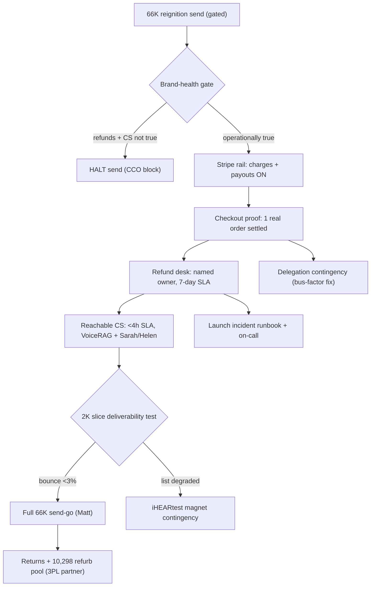

**Risks -> mitigations**
- Send fires before refunds are fundable (Stripe payouts off) and the brand eats a wave of money-back demands it cannot honor within the promised window — FTC/Magnuson-Moss exposure plus Medvi-style brand collapse. -> Hard sequence gate: no send until step 1 (payouts live) + step 2 (refund desk + 7-day SLA) + step 5 (full money-out path proven) are all green and CCO clears the copy (step 4).
- VoiceRAG plus two phone lines get overwhelmed by 66,224 contacts and CS becomes unreachable again, re-creating the exact #1 complaint at the worst moment. -> Measure CS SLA on the 2,000-contact slice first (step 6); kill-or-scale rule halts the full send if median first-response >4h or any channel is unanswered; logged voicemail+email overflow queue as backstop.
- The warm list is decayed/undeliverable and the reignition thesis fails silently while everyone assumes the funnel is broken. -> 2,000-slice deliverability test with explicit bounce/spam thresholds (step 6) before spending the whole list; iHEARtest magnet staged as the fallback acquisition path (step 10).
- Matt is unavailable (the blackout pattern) and every cash-critical gate freezes, repeating the 19-days-zero-moves outcome. -> Pre-authorized delegation runbook with signed refund dollar caps, a named checkout backup, and condition-based send-go criteria (step 8), tested with one in-cap delegate refund.

**First 72 hours**
- Matt connects/enables the Stripe payout bank and CTO verifies payouts_enabled=true via the stripe-read skill (step 1).
- COO writes runbooks/refund-desk-sop.md with a named refund owner + 7-day SLA, and runs one end-to-end test refund through Stripe (step 2).
- COO/CS verifies Sarah (800-864-4337) and Helen (800-640-9731) answer, wires the Intercom overflow queue, sets a <4h first-response SLA, and runs the CS load smoke-test (step 3).
- Matt places ONE real non-refunded full-price PAIR99 TReO order and COO verifies the charge settles to bank, then proves the refund path on a separate test order (step 5).
- COO issues the 3-vendor fulfillment/refurb RFQ for the 10,298-unit pool (per-unit cost + units/day) to start de-risking the inventory lever in parallel (step 7).

### 9. Completeness & Integration  ·  _Chief Strategy_

**Situation.** The program is strategically complete and the build is ~90% done, but the connective execution tissue that makes it ONE machine is missing. Across MOORE-PLAYBOOK §8, MEDVI PLAN.md, and the system-map, every phase ends with a narrative "Exit:" line (e.g. "first real revenue on the board," "Hit the $25K gate") but NONE carry numeric, instrumented exit/kill criteria, and the 9-stage loop has owners but no per-stage measured KPI. The cash bridge is unstated: the docs say $0 in bank / ~$50K-mo burn / ~0 runway (PLAN.md §0) yet fund FDA (~$10K, Phase 2 Wk7), paid ads, and inventory "from first cash" with no sequence connecting $0 to the $25K gate, and Stripe payouts_enabled=FALSE with no bank connected (cto ledger 2026-06-29) means collected money is trapped. The clinical/CPO sign-off "authority" is an AI agent backed informally by Mark Moore, a retired Licensed Hearing Aid Dispenser explicitly never an audiologist (MOORE-PLAYBOOK §1) — there is no defined human sign-off chain for the $25K-gated OTC/device tier, and risks (brand-health, FTC affiliate, key rotation, dilution, securities) live scattered with no single register or RACI.

**Gaps**
- **[P0] No per-phase numeric exit/kill criteria or per-stage KPI — the 9 dimensions cannot be run as one measurable machine** — Every Phase 0-4 'Exit:' line (MOORE-PLAYBOOK §8) is narrative, not a number with a kill rule. Without a measurement spine where each of the 9 loop stages (system-map: ignite→magnet→funnel→close→support→retain→ascend→measure→comply) has an instrumented metric, a target, and a kill-or-scale threshold, the COO morning brief is opinion, paid spend has no defensible kill rule (the Medvi cost-per-initiated-checkout discipline is named but not wired until Wk13-14 Fabric), and nobody can tell if a dimension is working. This is the single biggest integration gap.
- **[P0] The cash bridge from $0 to the $25K gate to FDA/paid spend is unstated, and Stripe cannot actually pay out** — PLAN.md §0: $0 in bank, ~$50K/mo burn, ~0 runway. The plan spends ~$10K FDA (Wk7), paid ads (Wk8), and inventory clearance 'from first cash' — but no document sequences how reignition dollars actually accumulate to $25K before those commitments, what the minimum-viable cash floor is, or what happens if reignition under-converts. Worse, cto ledger (2026-06-29) found Stripe payouts_enabled=FALSE with no bank account connected: every dollar collected sits trapped in Stripe. The flywheel's first turn is physically blocked at the cash-out step.
- **[P0] No defined human clinical/CPO sign-off authority for the device/OTC tier** — The system-map assigns 'Ascend to OTC' and device-claim sign-off to 'CTO + CPO gate', but the CPO is an AI agent (team feed) and the only human is Mark Moore — a retired Licensed Hearing Aid Dispenser, explicitly never an audiologist (MOORE-PLAYBOOK §1). The $25K gate unlocks the regulated OTC hearing-aid line and FDA registration with no named, qualified human authority to sign off device claims, adverse-event handling, or FDA wording. Mixing this with the AI-CPO informally ('Mark SHIP-IT') is a regulatory liability exactly where Medvi blew up (FDA misbranding letter).
- **[P1] No consolidated risk register — the known killers are scattered and unowned** — The five risks that can each kill the program — brand-health (unreachable CS/refund backlog, the #1 BBB complaint, PLAN.md), FTC affiliate/persona liability (the one Medvi failure that transfers, MEDVI-MIRROR §2), the deferred 28-cred / GCP-SA / PostHog key rotation that HARD-BLOCKS any public/investor action (CAPITAL-FLYWHEEL §6.2; cco ledger), the dilution spiral on stock-funded roll-ups (ROLLUP §7), and the securities firewall — exist as prose warnings across five documents with no single register assigning owner, trigger, status, and mitigation. They cannot be monitored as one.
- **[P1] No org/RACI defining what runs WITHOUT Matt — owners are agent labels, not an authority matrix** — Tasks carry bracket owners ([CRO], [COO], etc.) but the program's central premise — one operator runs the company of a thousand (MOORE-PLAYBOOK §0) — requires an explicit RACI separating (a) what the agent fleet executes autonomously, (b) what is a Matt hard gate (send-go, spend, pricing, INND), and (c) what needs counsel. The hard gates are listed in many places but never as one authority matrix, so hand-offs stall (e.g. Amazon path has two conflicting owner-views in PLAN.md §5 Q4) and the fleet cannot self-route.
- **[P1] The measurement scoreboard arrives in Phase 3, too late to govern Phases 0-2** — The unified Fabric/Power BI scoreboard (Stripe/Shopify/PostHog/RevenueCat) is scheduled for Wk13-14 (MOORE-PLAYBOOK §8 Phase 3), but the kill/scale decisions that matter most — does the warm list convert (the model's single point of fragility, §7 'Where the model is fragile'), what is cost-per-initiated-checkout on the first ad test (Wk8) — happen in Phases 0-2. The instrument must exist before the experiments it judges, or the first two phases fly blind.

**Execution plan**

| # | Action | Owner | Depends on | Gate | ETA | Done when |
|---|---|---|---|---|---|---|
| 1 | Create projects/moore-playbook/MEASUREMENT-SPINE.md: a table of all 9 loop stages (ignite, magnet, funnel, close, support, retain, ascend, measure, comply) each with one primary KPI, its data source (Customer.io/iHEARtest/PostHog/Stripe/Shopify/VoiceRAG-logs/RevenueCat/revenue-tracker.mjs/claims_check-log), a numeric target, and a kill-or-scale threshold. Map each Phase 0-4 'Exit:' line to a specific KPI value so 'Exit' becomes a number. | COO (Chief Strategy/integrator) |  | none | 2 days | MEASUREMENT-SPINE.md merged to exec main with all 9 stages + all 5 phase exits having a numeric target and an explicit kill rule; reviewed against existing revenue-tracker.mjs fields. |
| 2 | Resolve the Stripe payout block: Matt adds/enables a payout bank account on the OTCHealth Inc. Stripe account (acct_1SQyXZAwjS2xuomw) AND places one real, non-refunded full-price PAIR99 order on otchealthmart.com to clear the checkout-proof gate. CTO confirms via skills/stripe-read that payouts_enabled=true and the charge settles. | Matt (CTO verifies) |  | Matt | this week (~15 min Matt) | stripe-read shows payouts_enabled=true, requirements empty, and one full-price TReO order is captured and not refunded; logged to cro + cfo ledgers. |
| 3 | Write projects/moore-playbook/CASH-BRIDGE.md: an explicit sequence from $0 today to the $25K gate to the first hard-cash commitments. State the minimum-viable cash floor before any spend, the order of dollar use (reignition revenue first → reserve operating floor → FDA ~$10K only at a defined cumulative-revenue trigger → paid-ad test budget only after checkout-proof + brand-health green), and the fallback if reignition under-converts (e.g. Gumroad SOP cash, no paid spend, no FDA). Tie each spend to a MEASUREMENT-SPINE trigger. | CFO | 1 | Matt (spend triggers) | 3 days | CASH-BRIDGE.md merged with a dated dollar-trigger ladder; every Phase 1-2 spend ($10K FDA, ad budget, Amazon, inventory) is conditioned on a named cumulative-revenue number, not 'first cash'. |
| 4 | Create projects/moore-playbook/RISK-REGISTER.md consolidating the 5 scattered killers into one table: row = risk, owner, current status, trigger/early-warning metric (pulled from the measurement spine), mitigation, and gate. Seed it with brand-health (CS reachability + refund backlog), FTC-affiliate/persona, the deferred key rotation (HARD-BLOCK flag on all public/INND action), dilution-spiral, and the securities firewall. | COO + CCO | 1 | none | 2 days | RISK-REGISTER.md merged; every risk has a named owner, a monitorable trigger metric, and a mitigation; the key-rotation row is flagged as a hard pre-condition on Phase 3 INND work. |
| 5 | Create projects/moore-playbook/RACI.md: a matrix with rows = the 9 loop stages + the cross-cutting functions (compliance, brand-health, capital, M&A), columns = Responsible (which agent executes), Accountable (one name), Consulted, Informed, plus a fourth column 'Matt hard gate? / Counsel gate?'. Resolve the Amazon-path owner conflict (PLAN.md §5 Q4) by naming one owner + one path. Codify what the fleet runs autonomously vs the explicit gate list. | COO |  | Matt (confirms gate column) | 3 days | RACI.md merged; each of the 9 stages has exactly one Accountable owner; the hard-gate column matches the gate lists in PLAN.md §6 and CAPITAL-FLYWHEEL; Amazon path has a single named owner. |
| 6 | Define the human clinical sign-off authority in projects/moore-playbook/CLINICAL-SIGNOFF.md: name the qualified human (the program needs a credentialed audiologist or regulatory-qualified reviewer, NOT the retired-LHAD or the AI-CPO, for any device/OTC-tier claim), the exact artifacts requiring sign-off (OTC line copy, FDA establishment registration wording, adverse-event SOP, the $25K-gate unlock), and the chain: AI-CPO drafts → human clinical reviewer signs → CCO claims_check → Matt. Flag the engagement of that reviewer as a Matt decision. | CPO (AI) drafts; Matt engages the human |  | Matt | this week to draft; engagement is a Matt action | CLINICAL-SIGNOFF.md merged defining the chain + the artifact list; the named-human row is open and surfaced to Matt as Open Decision; the $25K-gate (SOP-7) is updated to require the human sign-off before any OTC/device action. |
| 7 | Wire the measurement spine into the existing SOP-6 daily autopilot BEFORE Phase 1: extend revenue-tracker.mjs / the cron to emit the per-stage KPIs from step 1 into one daily PostHog-backed scoreboard (cost-per-initiated-checkout, reignition open/click/convert, checkout completion rate, CS response time, refund backlog count, cumulative-vs-$25K). Do NOT wait for the Wk13-14 Fabric build; ship a minimal scoreboard now. | CTO + CFO | 1 | none | 5 days | The daily COO brief is generated from the live scoreboard with all step-1 KPIs populated; the first reignition wave (Phase 0 Wk2) is judged against real numbers, not estimates. |
| 8 | Hold a 60-minute integration review with Matt to ratify the five new artifacts (MEASUREMENT-SPINE, CASH-BRIDGE, RISK-REGISTER, RACI, CLINICAL-SIGNOFF) as the operating contract, confirm the hard-gate column, and approve the send-go conditions. Record ratification as a dated decision in the coo ledger (--tags moore-playbook) and commit to exec main so both engines read it. | COO + Matt | 1,3,4,5,6 | Matt | end of week 1 | A dated coo-ledger decision records Matt's ratification; all five artifacts are on origin/main; the COO brief template references them as the source of truth. |
| 9 | Stand up the weekly Friday integration review as a recurring cadence governed by the new artifacts: each week walk the RISK-REGISTER triggers, the MEASUREMENT-SPINE kill/scale lines per active stage, and CASH-BRIDGE progress to the $25K gate; file the outcome as a Bucket Briefing + coo-ledger entry. This is the heartbeat that runs the 9 dimensions as one machine. | COO | 7,8 | none | first Friday after ratification, then weekly | The first Friday review is filed referencing live spine numbers + risk triggers; the cadence is documented in RACI.md and runs without Matt except at gates. |

**KPIs**
| KPI | Target | Kill / scale |
|---|---|---|
| Per-stage KPI coverage of the 9-stage loop (stages with a numeric target + kill rule wired into the daily scoreboard) | 9 of 9 stages instrumented before the first paid-ad test (Phase 2 Wk8) | If <9/9 are live by the end of Phase 1, FREEZE paid spend until the spine is complete (no flying blind). |
| Reignition conversion (the model's single point of fragility, §7): warm-list email → completed TReO checkout | Set a board-ratified threshold in MEASUREMENT-SPINE (e.g. completed-order rate per send wave) before Wk2 | Below threshold after two waves → kill mass-send scaling, pivot to funnel/offer fix + Gumroad cash; at/above → scale to abandoned-cart + paid test. |
| Cash-bridge integrity: usable cash (Stripe paid-out + bank) vs the $25K gate, tracked daily | Stripe payouts_enabled=true within the week; positive net usable cash before any FDA/ad commitment | Any hard-cash spend authorized only when cumulative usable cash exceeds the CASH-BRIDGE trigger; if runway floor is breached, halt all non-cost-neutral activity. |
| Risk-register liveness: open killers with an owner + a monitored trigger metric | 100% of register rows have an owner and a live trigger; 0 HARD-BLOCK rows open before any Phase 3 INND action | If the key-rotation HARD-BLOCK row is still open, ALL public/investor/INND work stays blocked regardless of phase progress. |
| Autonomous-execution ratio: loop stages running without Matt vs requiring a Matt touch | Per RACI, only the codified hard gates (send-go, spend, pricing, clinical sign-off, INND) require Matt; all 9 stages otherwise run agent-led | If a non-gate task stalls on Matt twice, escalate to fix the RACI/automation rather than relay through Matt (the company-of-one premise). |

**Process diagram**
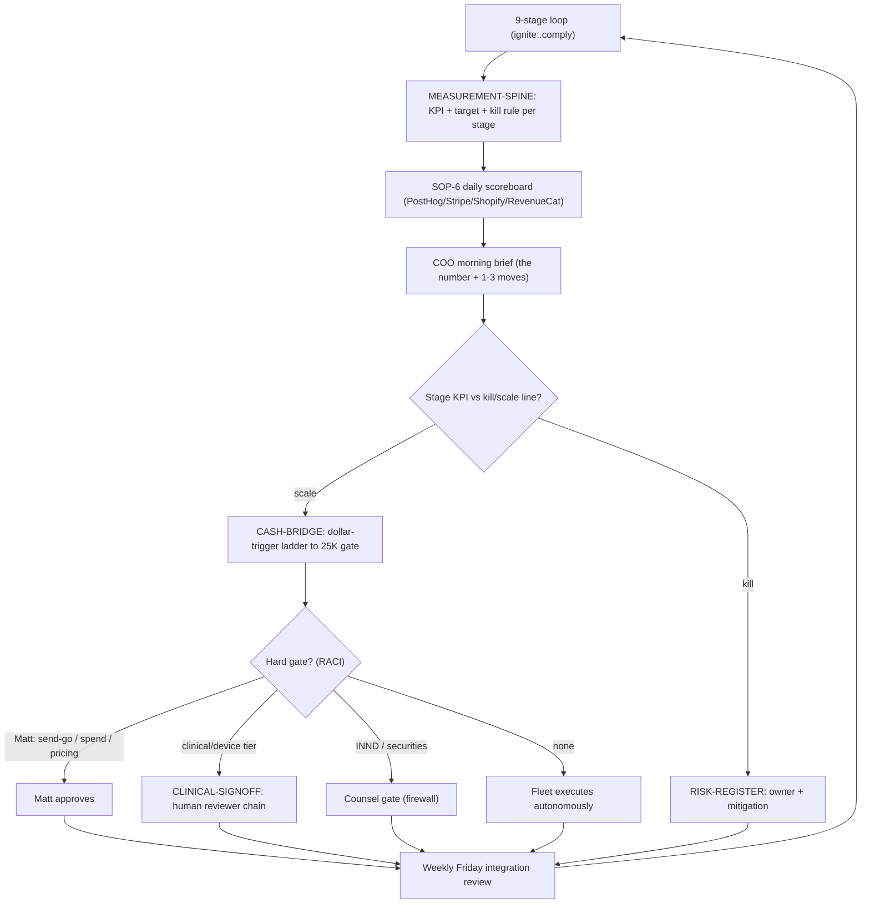

**First 72 hours**
- Draft and merge MEASUREMENT-SPINE.md (step 1): all 9 loop stages + all 5 Phase 'Exit:' lines converted to a numeric KPI + target + kill rule, sourced from existing revenue-tracker.mjs / PostHog / Stripe fields — this is the keystone every other artifact references.
- Unblock the cash-out physically (step 2): get Matt to (a) connect/enable the Stripe payout bank account and (b) place one real full-price PAIR99 order; CTO verifies payouts_enabled=true via skills/stripe-read and logs it. Until this is true, the first flywheel turn is blocked no matter what else ships.
- Stand up RISK-REGISTER.md (step 4) seeded with the 5 known killers, each with an owner and a trigger metric, and explicitly flag the deferred key-rotation row as a HARD-BLOCK on all INND/public action.
- Draft CLINICAL-SIGNOFF.md (step 6) defining the human-reviewer chain for the device/OTC tier and surface 'engage a credentialed clinical reviewer (not the retired-LHAD, not the AI-CPO)' to Matt as a new Open Decision before the $25K gate is reachable.
- Schedule the 60-minute integration review with Matt (step 8) to ratify the artifacts as the operating contract and confirm the hard-gate column, and record it as a dated coo-ledger decision on exec main so both engines read the same source of truth.

---
## Verified Gap Matrix (27 confirmed, adversarially checked)

| Sev | Dimension | Gap | Recommended fill |
|---|---|---|---|
| P0 | compliance-claims-securities | claims_check is asserted LIVE but is an out-of-scope LLM advisory, not a provable enforced publish-path interlock | Before first dollars: (1) Confirm claims-check.ts exists, is deployed, and has a frozen deterministic rule layer (regex/lexicon blocklist for treat/diagnose/cure/restore/hearing-loss/FDA-approved) that runs IN ADDITION to the LLM, so a clear violation BLOCKs even if the model errs. (2) Wire it as a REQUIRED pre-publish step in code on every surface that emits customer-facing copy (Customer.io send, page deploy, ad export, CS script load) - a publish that bypasses the gate must be technically impossible, not policy-discouraged. (3) Add a logged, tamper-evident audit trail per check (input, verdict, version, who-shipped) so an FTC inquiry can be answered with records. (4) Add adversarial test fixtures (golden non-compliant + compliant claims, like the eval-runner/agent-evals skills already provide) gating CI so a regression in the ruleset fails the build. Until (1)-(3) are demonstrable, treat the moat as UNPROVEN and do not fire any send. |
| P0 | compliance-claims-securities | 66,224-contact reignition blast has no documented consent provenance, list-age, or suppression/scrub control | Before the send-go: (1) Document the consent basis and collection date for the 66,224 (the SOURCES.md note that they are 'valid mailable HearingAssist email contacts' is not consent provenance). (2) Run a suppression pass (prior unsubscribes, hard bounces, complainers, any DNC/global suppression) and a deliverability/spam-trap scrub; warm the domain with a staged ramp, not a single 66K blast. (3) Confirm draft-141 carries a valid physical postal address, honest subject line, and one-click unsubscribe wired to Customer.io suppression. (4) Have the CCO sign the CAN-SPAM checklist as a logged clearance artifact, not a verbal 'clean'. Make all four prerequisites to Matt's send-go. |
| P0 | execution-cash | The proving order has no failure-diagnosis / fallback tree — a single binary test with no Plan B blocks all first dollars | Add a checkout-proof runbook: (1) a pre-flight the fleet runs BEFORE Matt touches it — confirm TReO Complete Pair SKU has a US-shipping profile, PAIR99 is active and applies to that SKU, Stripe is live not test-mode, tax/address logic resolves; (2) a failure decision tree mapping each failure mode (decline / code-fails / no-ship / address / 4xx-5xx) to an owner and a fix; (3) capture the actual order confirmation + receipt as the artifact, not just an order number; (4) a fleet-runnable synthetic test order (or $1 path) to localize the break before Matt spends 10 minutes hitting a wall. |
| P0 | execution-cash | Email deliverability / sending-domain reputation for a 66,224 cold blast from a 90-day-dormant domain is completely unaddressed | Before the send-go: verify SPF/DKIM/DMARC on the sending domain; run a bounce/hygiene + re-engagement-segment pass and suppress stale/risky addresses; warm up with a staged ramp (e.g. most-recently-active cohort first, then expand over days) rather than one 66K blast; run a seed-list inbox-placement test; throttle batch sends. Make 'deliverability green' an explicit named sub-gate of the send, with an owner (lifecycle/CRO), alongside the CAN-SPAM gate that is already there. |
| P0 | execution-cash | Brand-health (reachable CS + refund backlog) is asserted as a prerequisite but is not measurable, not resourced, and is sequenced more weakly than the send it is meant to protect | Make brand-health a HARD blocking sub-gate of the send (same tier as checkout-proof), with measurable exit criteria (e.g. CS first-response < N hours on the published 1-800-864-4337 line + a monitored inbox; open-refund backlog cleared or explicitly funded with a named dollar source and a human owner). Resolve PLAN.md §5 Q5 by naming WHO staffs CS and WHO funds/clears refunds before — not after — the send, and stage the send to the warmest cohort first to cap inbound volume while the line is proven. |
| P0 | finance-unit-economics | The $480M ARR keystone is asserted, never built from acquisition math — no CAC, no funnel conversion, no path from 66,224 contacts to 200,000 paying subscribers | Build a bottom-up subscriber model: start from 66,224 contacts × a defensible email reactivation rate (cite the store’s own historical 1,484 orders / list as the base rate) → TReO buyers → sub attach-rate → monthly churn → steady-state subscriber count, and show how many NEW acquired buyers (and at what blended CAC) are required to bridge from that base to 200K. Replace the ‘≈ ~$480M ARR’ assertion with the funnel that produces it, or restate the $1B path on a smaller, defended subscriber base. Note ARPU reality: $19.99/mo = ~$240/yr/customer vs Medvi’s ~$1,600/yr — the Medvi comp does not transfer to subscriber-COUNT credibility at 6.7x lower ARPU and must not be cited as proof of the 200K. |
| P0 | finance-unit-economics | Phase 0 funding is circular: ~$50K/mo burn against ~$0 cash, funded by ‘one $99 order’ — there is no funding bridge to survive even Weeks 1-6 | Itemize the ~$50K/mo burn (what is actually cash vs credit-funded) and state the bridge explicitly: how is rent/payroll/obligations covered during Weeks 1-6? Define the $25K gate in NET terms (after refunds, Stripe fees, COGS) or add a separate net-cash gate. If the only bridge is the live Reg D 506(c) tranche, say so and move it out of ‘Phase 3’ — but then the plan’s ‘cash proves the story before we raise’ sequencing is inverted and must be acknowledged. |
| P0 | finance-unit-economics | The ‘85-90% margin’ on TReO is asserted with zero COGS build — refurb cost, ~$5 batteries, the 60-day money-back guarantee, free shipping, and Stripe fees are all unmodeled | Produce a per-PAIR contribution-margin P&L for the $99 PAIR99 offer: refurb cost/unit ×2, batteries, packaging, outbound + estimated return shipping, Stripe fees, and a returns reserve at a defended rate (cite the store’s own historical refund/RMA data — the plan already flags refunds as the #1 BBB/Trustpilot complaint, so the data exists). State margin NET of returns and fees. Re-tag every ‘85-90%’ claim as gross-product margin vs contribution margin so downstream LTV/CAC and the $25K gate use the right number. |
| P0 | market-competitive | No answer to AirPods Pro 2 (and the wider device-class threat): the plan never names its strongest competitor | Add a Competitive & Positioning section before any send: (1) name the real comp set (AirPods Pro 2 Hearing Aid Feature, Costco Kirkland/Jabra Enhance, Bose-derived Lexie, Sony/OTC value tier, Audien) and segment TReO's defensible buyer — e.g. the senior who does not own/operate AirPods, wants an always-on open-box device with phone support (1-800-864-4337) and a 60-day guarantee, and does not want to manage an iPhone/charging-case workflow. (2) Write the explicit 'why us, not AirPods/Costco' objection-handling into the advertorial and the VoiceRAG/CS scripts. (3) Re-run the focus-group-loop with AirPods presented as the alternative, not CVS, before spending a dollar of the gated ad budget. |
| P0 | market-competitive | The only 'moat' in the program is compliance-in-code; there is no product, distribution, or positioning moat | Articulate a candidate moat and test it: e.g. (a) the owned 85K/66K database + iHEARtest highest-intent screening as a proprietary, hard-to-replicate acquisition funnel (quantify its true reusable size and decay rate); (b) the Moore 3-generation/80-year brand + human phone support + senior-trust as a positioning moat AirPods cannot match; (c) the recurring consumables/CareNow/AWARE switching-cost layer. Pick one, state why it compounds, and put a measurable Phase-1 test behind it (repeat-purchase rate, list-reactivation conversion, CS-driven retention) instead of asserting compliance is the moat. |
| P0 | retention-subscription | No attach-rate assumption — the leap from a $99 PSAP buyer to 200,000 paying members is asserted, never derived | Write the bottom-up funnel explicitly: list/ad reach → screening → PSAP buyers/yr → membership attach % (with a cited or stated basis) → net members after churn → MRR. Stress-test 200K against the actual TAM and the proven 1,484-order base. Run a real attach test the moment a billable membership exists (offer CareNow at checkout to the first cohort of TReO buyers and measure take rate before extrapolating). Until an empirical attach rate exists, label 200K as a target requiring validation, not a planning assumption. |
| P0 | tech-infra-aiops | The compliance moat (claims_check) and the unified surface run THROUGH the MCP gateway, which the CTO's own state says is NOT redeployed/connected — a single point of failure on the one control the whole thesis rests on | Pin down and document the exact gateway build serving claims_check in production, redeploy the reviewed build + complete the Cloudflare-only ingress lock + env provisioning, and run a verification matrix (a set of known-bad PSAP/FDA/affiliate claims that MUST be BLOCKed and clean ones that must PASS) against the LIVE endpoint, archiving the result. Add a deterministic local fallback ruleset (regex/keyword PSAP-FDA blocklist) so copy cannot ship if the gateway is unreachable. State the gateway's uptime/kill-switch behavior and who owns it. |
| P0 | tech-infra-aiops | The open 28-credential security incident is deferred AND is the same hard gate that blocks the INND capital flywheel — yet the plan keeps building on the un-rotated keys | Promote this to a tracked incident: enumerate the full leaked set (the 28 + the grown ROTATE list), assess exposure (were any used; revoke immediately), rotate in dependency order (subscription-Owner azure-sp and the over-privileged github-app FIRST, then the consumer-engine creds Stripe/Shopify/Customer.io, then ASC/PostHog/GCP SA), least-privilege the azure-sp/github-app while rotating, and gate BOTH Phase 0 send-go AND any INND step on rotation-complete — not just the public action. Assign the CTO + a date in Week 1, not Week 15. |
| P1 | capital-innd-flywheel | The reverse split (FINRA 6490, 3-12 month clock) is the long-pole gating real roll-up currency — and it is explicitly not started | Decouple the reverse-split initiation from operating traction and start the counsel/board workstream NOW in parallel with Phase 0-1 (it is paperwork + a regulatory clock, not revenue-dependent). Get counsel to (a) confirm INND is current in SEC reporting (the 6490 deficiency gate), (b) draft the board resolution + charter amendment + Transfer-Agent Verification Form, and (c) recommend a ratio and the ≥10-day-before-record-date timing. Add the FINRA 6490 timeline as an explicit critical-path Gantt item with its own owner, sequenced ahead of any roll-up activity. |
| P1 | capital-innd-flywheel | MNPI/Reg FD discipline is well-written policy but is NOT operationalized — there is no securities-side equivalent of the in-code claims_check gate | Build a securities-content gate analogous to claims_check: a deterministic pre-publish check that blocks any fleet output containing share-price/INND/capital-structure/raise language from going out without the counsel→Matt chain, and that hard-stops at the IR ring (mirror the existing PHI carve-out pattern). Explicitly separate the securities-solicitation/TTW list from the product marketing list with its own consent and access controls, and document who/what enforces the split. Make the "rotate GCP SA + PostHog keys" HARD GATE (FLYWHEEL §6.2 / MOORE §10.8 — currently open and stated to block ANY investor/public action) a tracked blocker with an owner, since the entire securities lane is gated behind it. |
| P1 | compliance-claims-securities | CareNow share-bundle 17(b) exposure is flagged but the bundle design itself breaches the securities firewall and the mechanism is never specified | Do NOT design, build, or stage any CareNow share-bundle until counsel has answered the threshold question (is this an offer/distribution of INND securities at all, under what exemption, with what 17(b)/Reg-FD treatment). Reframe it in the docs from a '17(b) flag' to a 'securities-firewall breach candidate - counsel gate before ANY build.' Keep CareNow itself (the $9.99-19.99/mo membership) cleanly separable from any equity component so the membership LTV lever can proceed without the stock entanglement. |
| P1 | compliance-claims-securities | Live funnel artifact ships fabricated reviews and an unsubstantiated comparative price claim | (1) Strip ALL sample/placeholder reviews from the artifact now; only verified, substantiated customer reviews may appear, with the consent/verification trail retained. (2) Build a substantiation file for the CVS comparative claim (exact competing product, configuration, price, capture date, refreshed periodically) before the page goes live, and make claims_check (or the CCO checklist) verify price-comparison and testimonial substantiation, not just medical-claim language. (3) Add 'no placeholder/fabricated social proof in any shippable artifact' to SOP-1 and the boot/publish gate. |
| P1 | execution-cash | There is no cash bridge to fund Phase 0 itself — the plan presumes '$0 incremental' but Phase 0 has real cash needs (refunds, FDA, the proving order's own working capital) | Add an explicit Phase-0 cash bridge: name the source that funds refunds + keeps critical accounts (Stripe, Shopify, sending domain, Azure-beyond-credits) current through the send-to-deposit gap (founder loan / the parallel Gumroad SOP cash / a small bridge), and a payout-timing reconciliation (when do Stripe deposits actually settle vs. when do bills/refunds come due). State the minimum cash needed to safely run Phase 0 and where it comes from, before the send. |
| P1 | execution-cash | The built $25K-gate tracker does not measure the metric the plan relies on (new reignition revenue), so the gate exit-criterion is unverifiable as instrumented | Fix the tracker to compute cumulative NET-NEW paid revenue from a defined reignition-start timestamp (anchor date), remove the 6-page cap or paginate fully, exclude refunds/chargebacks from the gate sum, and validate TReO matching against the actual live SKU rather than a substring. Define the gate exit-criterion in the doc as a precise, queryable number (new revenue since date X, net of refunds) so Phase-0/1 exits are objectively measurable. |
| P1 | finance-unit-economics | No payback period and no CAC ceiling defined before paid spend is authorized — the kill/scale rule has no economic threshold | Before Wk 8, the CFO must publish: (1) max-CAC = net contribution margin per order (from the corrected COGS build) for an immediate-payback rule, plus a separate LTV-inclusive ceiling once sub attach + churn are measured; (2) target CAC:LTV (e.g. ≥3:1) and a payback-period cap (e.g. ≤ first order, or ≤90 days); (3) an explicit LTV formula tied to the subscriber model. Make the Wk-8 spend gate contingent on these existing, not just on ‘brand-health fixed.’ |
| P1 | finance-unit-economics | Subscription churn — the named #1 value compounder — has no baseline, no target, and no data source, so the LTV and re-rating math are ungrounded | State an explicit, conservative churn assumption with its source and instrument it from day one: wire RevenueCat cohort retention (system-map shows RevenueCat ‘QUEUED’) the moment the first sub product launches, set a churn target, and re-run the §7 LTV and re-rate math at that assumed churn. Tie the multiple claim (4-6× / 7-9×) to a demonstrated retention curve, not an asserted one — counsel will require this before any IR narrative repeats the subscription-valuation story. |
| P1 | market-competitive | Pricing is anchored to a deliberately weak strawman (CVS $299/side), not the real value-tier or 'free' floor | Before scaling spend: (1) add a real competitive price/feature matrix (TReO vs Audien vs Costco/Kirkland vs AirPods-feature vs OTC iHEAR Matrix $349) to the funnel-experiment SOP; (2) A/B the CVS anchor against an honest 'why $99 here beats the $99/free alternatives' value frame (support, guarantee, no-iPhone-required, ready-out-of-box); (3) decide whether TReO competes on price or on a non-price axis, because at $99 it cannot out-cheap a free feature. |
| P1 | market-competitive | PSAP-vs-OTC-hearing-aid is treated only as a compliance constraint, never as a competitive disadvantage — and competitors sell the thing the customer actually wants | Make the PSAP/OTC boundary a strategic decision, not just a compliance rule: (1) decide whether the wedge should be TReO at all, or whether the $25K-gated OTC iHEAR Matrix should be pulled forward as the real answer for hearing-loss-intent leads; (2) segment the 66,224 by likely intent (situational-listening vs hearing-loss) and route accordingly; (3) explicitly script how CS/funnel converts a 'but I want something that helps my hearing loss' objection without crossing the claims line — or routes that buyer to a compliant OTC option. |
| P1 | retention-subscription | Churn is named the #1 compounder but has no assumed value and no involuntary-churn (card-failure) plan for a senior, low-ARPU base | State an explicit, defensible baseline monthly churn (gross and net) with a senior-DTC-membership basis; model involuntary vs voluntary separately. Add a dunning/billing-recovery system (Stripe Smart Retries / card-updater) to the recurring-engine build BEFORE scaling members — it is the highest-ROI retention work for this demographic. Re-run the LTV and the '$9M per 1%' sensitivity off the stated baseline so the multiple thesis has a numeric foundation. |
| P1 | retention-subscription | Internal price inconsistency ($9.99 vs $19.99) and the unresolved 17(b) share-bundle blocker make the ARR figure and the launch itself fragile | Lock a single planning ARPU and stop using the top of the range in the headline; if a 'founding rate for life' is offered, model it as a permanent ARPU haircut on the founding cohort and size that drag. Decouple the membership's core value prop from the INND share-bundle entirely (make shares an optional, separately-counsel-gated promo, not the membership's reason to exist) so the recurring engine can launch on product value alone without waiting on §17(b)/securities clearance. |
| P1 | tech-infra-aiops | Single-engine dependency on Claude Code with a proven 96h blackout, while the plan's autonomy (Tier-2 timed runner) is armed-but-idle on one un-mintable token | Document the weekly-limit/blackout as a named operational risk with a concrete failover runbook (which functions Hyperagent runs vs Claude Code; how durable state hands off without a human relay). Get Matt to mint CLAUDE_CODE_OAUTH_TOKEN in Cloud Shell so Tier-2 autonomy is actually armed, OR explicitly designate the cron-script Tier-1 + Hyperagent as the failover of record. For Phase 0–1, keep a no-AI manual playbook for the live-campaign critical path (send, CS escalation, kill-switch) so a campaign in flight never depends on a single engine being available. |
| P2 | market-competitive | 'Few points of a multi-billion category' assumes share is available, but the category is consolidating and the buyer is being captured by incumbents/Apple now | Add a SOM (serviceable obtainable market) cut to §4: from TAM/SAM, subtract the share already locked by Apple's installed base, Costco, LXE/Audien/MDHearing, and clinics; define the specific underserved wedge OTCHealth can actually win (e.g. non-Apple seniors reachable via the owned list and senior-trust channels); and tie the §7 scenarios to that obtainable number rather than to abstract 'few points of TAM.' |

---
## Dispatches (one task per owning brain)

| To | Task |
|---|---|
| CTO | This week: (1) verify CHECKOUT-PROOF after Matt's real PAIR99 order — Shopify paid+fulfilled, Stripe charge succeeded+unrefunded, payouts_enabled=true — and post PASS to coo+cro; (2) merge gateway PR #24/#25/#26, rebuild :latest from main, redeploy so deployed image==main (tool count before==after); (3) start the 28-cred ops-leak rotation Azure-AD/Graph-first until secret-scan CI is GREEN; (4) repoint default inference off aoai-4701 to otchealth-foundry to clear the Datadog throttle alert; then stand up the daily contribution heartbeat Container Apps Job. |
| CRO | Stage draft-141 in Customer.io against the LOCKED 66,224 segment (CAN-SPAM clean, claims_check-clean, email-only), scheduled-and-held awaiting only send-go; prepare a friction/AirPods-rebuttal B variant against the price-anchor control. After send-go, fire a ~2,000-contact seed wave (bounce <3 percent, spam <0.1 percent) then release the full list. In parallel build the consumables Shopify-native Selling Plan Group (30/60/90-day) + post-purchase attach flow. |
| CFO | Fix revenue-tracker.mjs to add REIGNITION_START_DATE so the $25K gate counts only orders since today (all-time $227K shown on a separate line). Build OTCHEALTH-UNIT-ECON.xlsx (6 tabs: assumptions, conversion bridge, TReO contribution GM-after-returns, CAC/payback, subscription LTV, cash bridge), pull real COGS/shipping/return-rate from Shopify + company-brain, draft the PAID-SPEND GUARDRAILS memo, and stand up the daily contribution P&L; reconcile the first Stripe payout into Mercury. |
| CCO | Run the 12-string claims_check acceptance test the moment CTO deploys the merged gate (8 bad BLOCKED incl. an INND share-price line, 4 good PASS, each with an audit-log id). Issue the written draft-141 + funnel clearance memo (4 CAN-SPAM elements verified, comparative-price substantiation on file). Verify the 60-day-guarantee + CS claims are operationally true via one end-to-end test refund + timed phone/email contact -> post BRAND-HEALTH=READY. Author the FTC affiliate/creator SOP before any creator onboarding; keep TCPA-SMS and CareNow-17(b) as enforced hard blocks. |
| Capital | Prepare-and-flag ONLY, no solicitation, no MNPI/share counts/prices: draft the one-page Engage Securities Counsel decision brief for Matt (capital chain / Reg D 506(c) / Reg CF portal / reverse-split posture / litigation-disclosure / disclosure-controls calendar) with 3 research-only counsel candidates; stand up the empty access-controlled Reg D data-room INDEX; write the accredited-verification method memo + Rule 506(d) questionnaire; record the key-rotation hard gate as a blocking precondition on every capital step. Every artifact flagged ATTORNEY REVIEW REQUIRED. |
| lifecycle | Build the held draft-141 journey in Customer.io ws 193366 with wired one-click unsubscribe -> suppression and the Roseville postal address; segment the 2,000-contact seed slice; after the recurring engine lands, build the day-0 complete-your-kit attach email, the day-14 milestone drip, and the day-45 pre-renewal churn-save journey (each claims_check-cleared, email-only, send Matt-gated) plus abandoned-cart recovery. |
| commerce | In parallel with the TReO gate: ship the zero-gate Gumroad SOP storefront (5 dash-clean SOP PDFs, instant delivery, one test purchase). Issue a 3-vendor RFQ for the 10,298-unit refurb/3PL partner specifying inbound inspection, QC criteria, per-unit refurb cost, and units/day throughput (returns route here too), and draft a 100-unit pilot SOW for Matt. Reconcile the Amazon TReO path (Apply-to-Sell vs iHEAR trademark Brand Registry) to one named owner + one path, to fund after first dollars. |

---
*Generated 2026-06-30 by the COO from 9 persona deep-dives + synthesis (workflow) reconciled against the program docs + the 27-gap adversarial review. Source of truth = the coo ledger (--tags moore-playbook,execution).*