# THE MOORE PLAYBOOK — 12-MONTH IMPLEMENTATION & EXECUTION PROGRAM
### OTCHealth (cash engine) + InnerScope/INND (capital flywheel), run as one AI-operated machine, mirroring Medvi

**Author:** COO (wearing all 9 executive hats internally) · **Date:** 2026-06-30 · **Status:** v1 long-range plan
> Internal strategy/execution doc. Not investor material, not an offer, not legal/financial advice. INND content is framework-level + MNPI-internal (counsel-gated); no share counts/prices. All dollar figures are ILLUSTRATIVE planning assumptions. TReO is a PSAP, never a hearing-aid/medical/FDA claim. Builds on the near-term EXECUTION-PROGRAM.md (weeks 1-26); this is the 12-month arc on top.

---
## Executive Summary

The Moore machine is ~90% built and 100% dormant: ~$2.41 cash, $0 revenue in 90 days, ~$50K/mo burn, ~0 runway, against a PROVEN-but-asleep store ($227,290 all-time / 1,484 orders) and a LOCKED warm list of 66,224. The entire 12-month program is one through-line: turn a dormant, hand-built machine into a self-running, instrumented, two-engine company that one operator runs hands-off except at hard gates, with compliance enforced in code as the moat. We mirror Medvi (a ~2-person, ~$401M AI-run marketing+distribution layer on outsourced atoms) but de-risked, because our wedge is a PSAP (no shortage clock, no PHI, no prescribing liability) and every owned AND affiliate claim passes the claims_check gate before it ships, which is exactly where Medvi blew up.

The arc has four quarters, each extending the existing EXECUTION-PROGRAM (its Phases 0-6 / weeks 1-26 land inside the first two quarters; this plan builds 6-12mo on top, not over).

Q1 (0-3mo) IGNITE: clear the four P0 gates in one motion (Stripe payout bank connected, one real full-price PAIR99 checkout proven end-to-end, claims_check merged+deployed+verify-firing so the moat actually exists, refunds+CS operationally true), fix the $25K tracker to a REIGNITION_START_DATE basis, fire the seeded 66,224 reignition, stand up the first recurring SKU (consumables) + Gumroad, and convert the morning brief into a FORCING GATE-STATE cadence with a daily contribution-P&L heartbeat. First bankable cash settles to Mercury.

Q2 (3-6mo) INSTRUMENT & SCALE: real measured CVR replaces assumptions, the Fabric/Power BI scoreboard becomes the board number, disciplined paid testing runs at 48-72h kill/scale on cost-per-initiated-checkout, the FTC affiliate-audit SOP is published, AWARE goes live as the second recurring SKU, and the $25K NET reignition gate clears and arms the ~$10K FDA OTC Establishment Registration behind a NAMED human clinical reviewer.

Q3 (6-9mo) ASCEND & MULTI-CHANNEL: FDA-register and launch the OTC iHEAR Matrix to the warmed base, open Amazon under (pending) Brand Registry, launch the creator/affiliate flywheel behind the audit SOP, begin liquidating the 10,298-unit pool in costed refurb waves, harden RTM-billing readiness (PHI-gated), and assemble the CPA-grade capital-sequence financials. Counsel (if retained) runs Reg D 506(c); Reg CF testing-the-waters reservations build off the owned list.

Q4 (9-12mo) COMPOUND & ENTERPRISE-READY: recurring becomes the headline metric on a renewing base, demand runs as a multi-channel machine on a real organic floor, the AI OS is diligence-grade and resilient, the legacy pool is cleared to cash, and the capital ladder is sequenced and turning under counsel (Reg A+ teed up, reverse-split decision-ready, a first stock-as-currency roll-up move structurable). What 12 months buys is not $1B but the PROVEN, instrumented engine plus the capital-grade financials and resilient AI OS that make the billion-dollar path a matter of turns, not invention. INND stays framework-level/MNPI-internal and counsel-gated throughout; the PHI wall and PSAP claims wall are absolute.

---
## The Operating Model (the Medvi mirror: one operator + an AI workforce)

The Medvi 3-layer model applied to Moore, so one operator runs a company of a thousand:

LAYER 1 - THE AI EXECUTIVE + AGENT WORKFORCE (in-house, ~$0 marginal cost on grant/credit infra). The exec agent fleet IS the C-suite, each running its own lane and escalating only at the seams the COO defines: COO (quarterback - cadence, integration spine, gate-graph, risk register), CTO (the AI OS - gateway, brain, claims_check, CI/CD, resilience), CRO/Rainmaker (funnel, email, creative, paid, channels), CFO (instrumented FP&A - contribution P&L, unit economics, the $25K gate, capital-grade financials), CPO (product ladder + the clinical/device sign-off chain), CCO (compliance enforced in code - the claims gate is the moat), CLO (legal/contracts), Capital/IR (the counsel-gated INND flywheel, prepare-and-flag only), and Developer + per-app App Leads. They coordinate through one shared write-through brain (kb-memory ledgers + the federated company-brain), one governed tool surface (the MCP gateway), and the forcing daily GATE-STATE brief + weekly kill/scale review + monthly board. Most maintenance, ops, CS, data-room, and build work runs on cron (Tier-1 Container Apps Jobs) and timed Tier-2 claude -p runners, draft-PR-only, at zero metered cost.

LAYER 2 - THE OUTSOURCED ATOMS (services rented, never staffed): manufacturing (iHEAR Medical), refurb/3PL fulfillment + physical returns for the 10,298-unit pool and live orders (selected via 3-vendor RFQ + 100-unit pilot), payment rails (Stripe/Shopify/Mercury), micro-creators (flat fee + 15-25% affiliate), Amazon FBA logistics, the regulated reviewed/audited financials + tax (an outside CPA signs the opinion; finance assembles the package), securities counsel + the registered Reg CF funding portal + transfer agent, FDA/regulatory consulting, audiology validation, and HSA/FSA eligibility. The atoms are bought as a costed service; that is the entire point.

LAYER 3 - THE THIN HUMAN LAYER (Matt + counsel, hard gates ONLY): connect the Stripe payout bank, place the proving order, give every mass-send send-go, authorize any cash outlay (refunds, FDA ~$10K, ad spend, inventory buys), set final pricing, mint the one interactive CLAUDE_CODE_OAUTH_TOKEN, engage securities counsel, ENGAGE THE NAMED HUMAN CLINICAL REVIEWER (who alone signs device/OTC-tier claims - the AI-CPO is forbidden to forge it), and everything INND/securities (MNPI, Reg FD, 17(b), counsel-gated). The COO's standing job is to SHRINK Layer 3 every quarter: move one class of soft gate (OAuth consents, portal clicks) to AI-autonomous via the browser-agent, and encode each surviving hard gate as a one-screen GO PACKET so the human touch is ~5-10 minutes. The structural punchline: revenue scales, headcount does not; adding the next AI employee costs ~$0.

---
## The AI Tech Stack (how the company runs at ~$0 marginal cost)

The concrete, real stack (verified-live, ~90% credit-funded on Azure, ~$0 marginal cash):

THE BRAIN + MEMORY: company-brain (skills/company-brain/brain.mjs) gives a cited gpt-4o answer federated across 14 Azure AI Search rooms (memory-exec, legal-company, finance-cfo, commerce, commons-journal); kb-memory is the durable per-agent write-through ledger (the source of truth over chat), with semantic.mjs vector recall and reflect.mjs auto-extracting lessons at session end. doc-indexer librarians (Container Apps Jobs on cron) keep every data room self-indexing.

THE GOVERNED TOOL SURFACE: the unified MCP gateway (otchealth-mcp-server at mcp.otchealth.app) is the single audited, scope-gated, ring-aware entry every agent uses for write actions, fronted by claims_check (the in-code FTC/FDA + securities-firewall compliance moat) and with the PHI ring carved OUT. Plus a large first-party MCP set live in-session: GitHub, Shopify, Stripe, PostHog, n8n (self-host, 29 active workflows), Customer.io, Mercury, QuickBooks, Xero, Plaid, Microsoft 365/Graph, Cloudflare, Sentry, Datadog, Amazon SP-API.

THE SKILLS/AGENT WORKFORCE: ~90 skills (designer, content-engine, paid-ads, lifecycle-crm, monetization, storefront-cro, amazon-sp-api, digital-products, partnerships, raise-ops, ir-support, focus-group-loop, document-skills xlsx/docx/pptx) + ~19 Dream Team agents.

INTELLIGENCE + AUTONOMY: VoiceRAG + the voice fleet (ElevenLabs 33M-char grant for pre-rendered VO + Azure gpt-realtime for live CS) run customer service; browser-agent shrinks soft OAuth/portal gates; fleet-telemetry + agent-evals + the PostHog Fleet Agents project (479484) measure per-agent cost/quality and CI-gate new agents; model routing (primary gpt-4o on the otchealth-foundry 1000K-TPM tier, fallback foundry gpt-4.1-mini) controls inference spend; fleet-medic auto-heals memory-off agents.

THE SUBSTRATE (rented, disposable): Azure (~$25K growing toward $150K - Container Apps, ACR, AI Search, Blob, Key Vault, Azure OpenAI/foundry, Speech), GCP Secret Manager + the BAA for PHI (standing exception), Depot ($5k - depot-macos-26 iOS + Linux Android CI), GitHub ($10k GHAS), PostHog ($50k), ElevenLabs (33M chars), Daytona ($10k sandboxes).

HOW ADDING THE NEXT AI EMPLOYEE IS ~$0: the Q3 paved-road scaffolder stands up a new agent (definition + skill + ring + gateway scope + golden-task eval + telemetry hook) or a new app (boot-gate + Depot CI + Sentry/PostHog wiring) in under a day with zero hand-wiring. The workforce grows by adding agent definitions + skills on already-paid infra, not by adding headcount or net-new cash cost.

### AI tech stack architecture
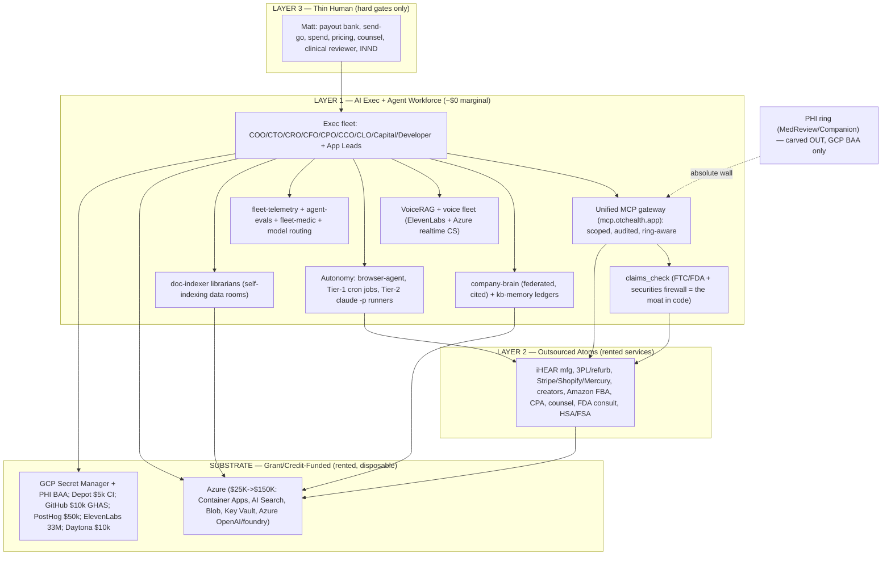

---
## Master 12-Month Roadmap

### 0-3mo (Q1 IGNITE)
**North star:** First bankable reignition cash settles to Mercury; the moat is real and the cadence forces action.  
**Cash target:** First real reignition revenue on the board; cumulative NEW reignition revenue ~$5K-$10K toward the $25K gate  
**Capital state:** Cold + prepare-and-flag only. Counsel NOT retained (master unlock pending Matt). Key-rotation is a HARD GATE recorded as a blocking precondition on every investor/public step. Bundle one-move-handoverable.  

**Milestones:**
- FOUR P0 GATES IN ONE MOTION: Matt connects the Stripe payout bank (payouts_enabled TRUE on acct_1SQyXZAwjS2xuomw); one real full-price PAIR99 order proven end-to-end (paid+unrefunded+settling) = CHECKOUT-PROOF=PASS; CTO merges+deploys+verifies claims_check (gateway PR #24/#25/#26, deployed image==main, 12/12 acceptance strings with audit-log ids); refunds+reachable CS operationally true = BRAND-HEALTH=READY
- CFO fixes revenue-tracker.mjs to REIGNITION_START_DATE (gate reads 0% not the false ~100% off the $227K all-time) and builds OTCHEALTH-UNIT-ECON.xlsx (6 live-formula tabs: Assumptions, Conversion Bridge, TReO Contribution GM-after-returns, CAC & Payback, Subscription LTV, Cash Bridge)
- CTO rotates the 28-credential ops leak to secret-scan CI GREEN and repoints default inference off the throttled aoai-4701 to otchealth-foundry
- Seeded reignition: ~2,000-contact wave (bounce <3%, spam <0.1%, clicks land on the proven checkout) then full release of the 66,224; first reignition orders
- First recurring SKU LIVE (consumables Shopify-native Selling Plan, 30/60/90-day, ~10-15% off) attached post-purchase, >=15% attach; Gumroad zero-gate SOP store live
- Daily CONTRIBUTION P&L heartbeat on cron + COO forcing GATE-STATE brief (gate header + heartbeat + one owned action + 2-red auto-escalation); integration spine artifacts (MEASUREMENT-SPINE/RACI/RISK-REGISTER/CASH-BRIDGE/CLINICAL-SIGNOFF) ratified
- Capital drafts the Engage-Securities-Counsel brief + the empty counsel-onboarding bundle (data-room INDEX, accredited-verification memo + Rule 506(d) questionnaire, TTW funnel scaffold, 6490 prerequisites, securities-firewall checklist) - all flagged ATTORNEY REVIEW REQUIRED, nothing solicited

### 3-6mo (Q2 INSTRUMENT & SCALE)
**North star:** Measured unit economics replace assumptions; the $25K gate clears NET and arms the OTC ascension.  
**Cash target:** Monthly run-rate reaching ~$20K-$40K; $25K cumulative reignition gate CROSSED (net); contribution/order holds >=$60 at real return rates  
**Capital state:** If counsel retained: data room DD-ready, TTW reservation funnel built+parked (no money), audit-readiness clock started with a CPA. If not: stack stays one-move-ready, blocker explicitly counsel-retention + key-rotation (escalated to Matt). No solicitation.  

**Milestones:**
- Live conversion bridge instrumented in PostHog (sent->open->click->session->initiated_checkout->purchase) and reconciled daily; measured email->buyer CVR replaces the load-bearing assumption
- Microsoft Fabric + Power BI FP&A scoreboard live (unifies Stripe/Shopify/PostHog/RevenueCat/QBO into contribution P&L, cohorts, CAC/LTV, runway, gate progress) and becomes the board number
- AI creative factory at 20-30 claims_check-gated creatives/week; disciplined paid-ads testing at small authorized budget, kill/scale at 48-72h on cost-per-initiated-checkout under the CFO PAID-SPEND GUARDRAILS
- Full Customer.io lifecycle live (abandoned-cart, welcome, day-14/45 churn-save >=30%, 7-day review request); AWARE wired as the SECOND recurring SKU (RevenueCat); CareNow stays BLOCKED (17(b))
- $25K NET cumulative reignition revenue confirmed and reconciled; SOP-7 fires; ~$10K FDA OTC Establishment Registration authorized at the CASH-BRIDGE trigger; NAMED human clinical reviewer engaged + sign-off SOP ratified
- FTC affiliate-audit + creator-persona-verification SOP published + CLO rider; CTO arms the Tier-2 autonomous runner and CI-gates agent-evals per role; n8n + secret-store SPOF reduction begun (Key Vault dual-read)
- FDA OTC pathway (21 CFR 800.30 self-cert vs 510(k)) scoped + labeling drafted + reviewer-signed, staged BEHIND the gate

### 6-9mo (Q3 ASCEND & MULTI-CHANNEL)
**North star:** Multi-channel revenue on validated unit economics; OTC line live; the pool liquidating; capital rung turning under counsel.  
**Cash target:** Monthly run-rate approaching six figures (~$80K-$120K/mo); >=3 profitable channels; recurring revenue >=30% of mix; >=70% of the 10,298 pool monetized in flight  
**Capital state:** First rung turning IF counsel retained + traction real + key-rotation green: 506(c) operating (front-load 20-30% week 1, 100% accredited-verified, never self-cert), Reg CF live (~35-40% reservation->investment), IR cadence started, roll-up screen research-only. CPA audit-readiness gap quantified.  

**Milestones:**
- FDA OTC registration filed; OTC iHEAR Matrix ($349) launched to the warmed/subscriber base via the screening-result upsell; ascension AOV lift measured; recurring tail (consumables/AWARE) attached to OTC buyers at >=15%
- Amazon TReO live under (pending) Brand Registry (iHEAR trademark refiled) - attach-our-offer-to-existing-ASIN first, then FBA + A+ content, CA/MX added; all copy claims_check-screened (PSAP-only)
- Creator/affiliate flywheel launched (30-50 vetted micro-creators) behind the published FTC audit SOP, 100% claims_check-logged; affiliate CAC below paid-ads CAC
- Legacy pool liquidation in costed refurb waves (~1,500-3,000 units cumulative; pool drawn to ~7,000-8,800) at $199-299 across Shopify+Amazon+clearance tier; HSA/FSA acceptance live at checkout
- Per-channel + per-SKU contribution P&Ls; RTM medication-adherence billing READINESS (CPT 98975-98981) with a PHI-ring/BAA + clearinghouse + payer path and a dated go/no-go (PHI-gated, carved out of the non-PHI gateway)
- Paved-road agent/app factory + IaC/DR (non-PHI landing zone in Bicep, brain reindex-from-source DR drill); cost-per-task down via model routing
- Capital (counsel-led): Reg D 506(c) accredited tranche operating with verified accredited status; Reg CF launched off the TTW reservations (Form C on EDGAR); first counsel-reviewed factual shareholder update; non-binding scored roll-up shortlist (zero outreach)

### 9-12mo (Q4 COMPOUND & ENTERPRISE-READY)
**North star:** The machine runs itself; recurring is the headline metric; the capital ladder is sequenced and the AI OS is diligence-grade.  
**Cash target:** Annualized run-rate crossing seven figures (~$1M+ ARR equivalent); 4+ profitable channels; recurring revenue >=35%; positive contribution + funded runway on the base scenario  
**Capital state:** Flywheel legitimately compounding (counsel-gated throughout): 506(c)+Reg CF operating, Reg A+ teed up, reverse-split board-decision-ready, first roll-up move structurable, IR cadence standing. Diligence-grade tech/security + CPA-grade financials packets assembled (ATTORNEY-REVIEW-REQUIRED, no MNPI/share counts/prices/valuations).  

**Milestones:**
- Recurring base material and growing: >=50% of device buyers on a recurring SKU, blended monthly churn <=8%, LTV:CAC >=3:1 sustained; recurring-mix re-rating modeled (framework-level, counsel-gated) as the prioritization lever
- Demand a self-running multi-channel machine on a real organic floor (ASO + content/SEO + PR + creator + paid) at stable/falling CAC; legacy pool cleared to ~0 (the $2-3M retail pool converted to realized cash + working capital)
- The AI OS runs the company by default: >=70% of recurring tech/ops/CS/data-room/build tasks autonomous (Tier-1 jobs + Tier-2 runners) at held eval quality; human touch limited to hard gates
- The full illustrative $1B model built bottom-up (recurring base + device + portfolio + roll-up) with every line traced to a CAC/conversion/churn/margin input; subscription-mix re-rating + M&A accretion/dilution templates built
- Operator-SPOF de-risked: ratified continuity/bus-factor plan, scheduled credential rotation, a tested DR drill, and each surviving hard gate a <=10-min GO PACKET
- Capital ladder compounding under counsel: Reg A+ Form 1-A inputs counsel-ready with audited financials; reverse-split (FINRA 6490) decision-ready package on the board's desk; a first stock-as-currency roll-up move structurable on Matt+counsel+CFO go; standing Reg-FD-compliant quarterly IR cadence
- Year-2 plan ratified: finance targets + treasury/reserve policy, the codified attach/retention/demand playbook, and next-12-month subscriber+LTV targets off MEASURED year-1 cohorts; company default-alive on the base scenario

### The whole machine across 12 months
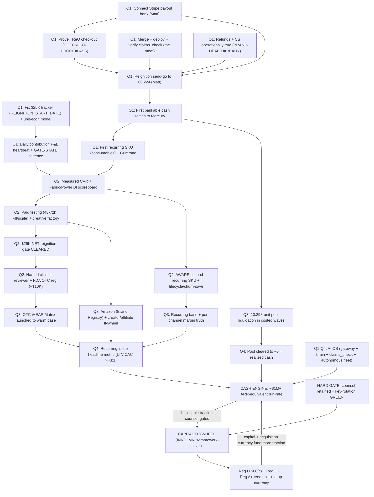

### 12-month Gantt
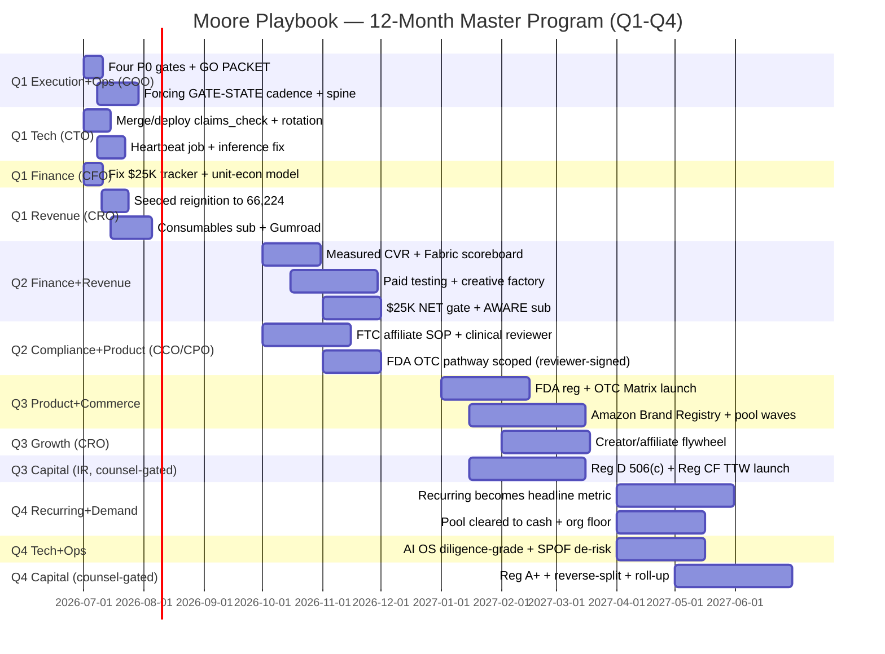

---
## The $1B Bridge (illustrative, assumptions not promises)

ILLUSTRATIVE planning trajectory, not promises or projections; securities-firewall-clean (no INND share counts, prices, floats, or valuations). Value = revenue x margin x multiple, amplified by the public vehicle; the path is a recurring base + ascension + portfolio + roll-up, over multiple years, NOT a single hero product or a 12-month sprint.

What the 12 months illustratively buys (the engine + the proof, not $1B):
- Q1: from $0 to first bankable reignition cash. The reignition is the load-bearing test - does the warm 66,224 still convert. Illustrative: a measured email->buyer CVR in the ~1-3% range on a proven checkout, plus a >=15% consumables attach, gets cumulative NEW reignition revenue to ~$5K-$10K.
- Q2: cross the $25K NET reignition gate; monthly run-rate ~$20K-$40K as paid testing scales only winners under the CFO CAC ceiling and AWARE adds a second recurring line. Contribution/order held >=$60 after returns/fees/COGS.
- Q3: multi-channel + OTC ascension take monthly run-rate toward six figures (~$80K-$120K/mo); recurring >=30% of mix; the 10,298-unit pool liquidating converts a one-time ~$2-3M retail asset toward realized cash.
- Q4: annualized run-rate crossing seven figures (~$1M+ ARR-equivalent), recurring >=35% and growing, company default-alive on the base scenario.

The three compounders that turn a seven-figure engine into the billion-dollar path over subsequent years (illustrative levers, not year-1 outcomes): (1) CHURN - every ~1% monthly churn improvement at ~50K subs adds ~$9M in LTV, so retention beats acquisition; (2) SUBSCRIPTION MIX - recurring revenue is valued at ~4-6x vs ~1-1.5x for hardware, so shifting mix re-rates enterprise value at the SAME revenue; (3) M&A ROLL-UP ARBITRAGE - the public vehicle can acquire complementary hearing/senior-health revenue at a low multiple and have it re-rated at the company's higher multiple, creating enterprise value without operating cash. The load-bearing model line remains ~200,000 recurring members x ~$19.99/mo ~= ~$480M ARR (roughly half a billion-dollar revenue base) - and the discipline is that EVERY such line must trace to a real CAC + conversion + churn + margin input (no asserted ARR without its funnel; an ARPU-reality caveat vs Medvi is noted). The 12-month job is to make that model defensible and instrumented, so the billion is a matter of turns of the flywheel, not new invention. All INND/capital framing is framework-level, MNPI-internal, and counsel-gated.

## Top Quarterly Moves
| Quarter | Move | Owner |
|---|---|---|
| Q1 (0-3mo) | Clear the four P0 gates in one motion (Stripe payout bank + checkout-proof + claims_check merged/deployed/verify-firing + brand-health true), then fire the seeded reignition to 66,224 on the send-go | Matt (gates) + CTO (verify/deploy) + COO (GO PACKET) + CRO (send) |
| Q1 (0-3mo) | Fix the $25K tracker to a REIGNITION_START_DATE basis, stand up the daily contribution-P&L heartbeat, convert the brief to a forcing GATE-STATE cadence, and launch the first recurring SKU (consumables) + Gumroad | CFO + CTO + COO + CRO |
| Q2 (3-6mo) | Replace assumed CVR with measured PostHog conversion-bridge numbers, stand up the Fabric/Power BI scoreboard, run disciplined paid testing at 48-72h kill/scale under CFO guardrails, and cross the $25K NET reignition gate | CFO + CRO + CTO |
| Q2 (3-6mo) | Publish the FTC affiliate-audit SOP, engage the NAMED human clinical reviewer + ratify the sign-off SOP, scope+reviewer-sign the FDA OTC pathway behind the gate, and authorize FDA registration (~$10K) at the CASH-BRIDGE trigger | CCO + CPO + Matt (clinical reviewer + FDA spend) |
| Q3 (6-9mo) | FDA-register and launch the OTC iHEAR Matrix to the warm base, open Amazon under (pending) Brand Registry, and launch the creator/affiliate flywheel behind the audit SOP | CPO + Commerce/CRO + named clinical reviewer + Matt |
| Q3 (6-9mo) | Liquidate the 10,298-unit pool in costed refurb waves across channels, assemble the CPA-grade capital-sequence financials, and (counsel-led, if retained) operate Reg D 506(c) + launch Reg CF off the TTW reservations | Commerce + CFO + Capital/IR + counsel + Matt |
| Q4 (9-12mo) | Make recurring the headline metric on a renewing base (>=50% device buyers on a sub, churn <=8%, LTV:CAC >=3:1) and run demand as a self-running multi-channel machine on a real organic floor | CRO/Lifecycle + Growth + CPO |
| Q4 (9-12mo) | Make the AI OS diligence-grade + SPOF-de-risked, build the bottom-up illustrative $1B model + re-rating/roll-up templates, and sequence the capital ladder (Reg A+ teed up, reverse-split decision-ready, first roll-up move structurable) - all counsel-gated, framework-level | CTO + CFO + COO + Capital/IR + counsel + Matt |

## Cross-function dependencies

- **Matt -> CTO/CRO:** Connecting the Stripe payout bank (dashboard-only, not API-fixable) and placing the one real full-price proving order both gate every downstream cash motion
- **CTO -> CRO:** Stripe payouts_enabled=true + CHECKOUT-PROOF=PASS + claims_check merged/deployed/verify-firing must ALL be green before any reignition send fires
- **CCO -> CRO:** claims_check clearance + operationally-true refund/CS (BRAND-HEALTH=READY) gate the reignition send; every owned AND affiliate claim must carry a passing audit-log id before publish
- **CTO -> Capital/IR:** The 28-credential ops-leak + GCP SA + PostHog key rotation to secret-scan CI GREEN is a HARD GATE blocking every investor/public/INND action
- **CFO -> COO:** The REIGNITION_START_DATE-basis $25K tracker + the daily contribution P&L feed the forcing GATE-STATE brief and the SOP-7 $25K alert; a false all-time-basis gate would green-light FDA spend on phantom revenue
- **CFO -> CPO/Matt:** Cumulative $25K NET reignition revenue (not all-time, not gross) is the trigger that arms the ~$10K FDA OTC Establishment Registration authorization
- **CPO/named clinical reviewer -> Matt/CCO:** A NAMED human clinical reviewer (not the AI-CPO, not the retired LHAD) must sign device/OTC-tier claims before the $25K gate can unlock the OTC line; chain is CPO drafts -> reviewer signs -> CCO claims_check -> Matt
- **CRO -> CCO/CLO:** The FTC affiliate-audit + creator-persona-verification SOP + CLO-reviewed agreement rider is a hard prerequisite that must exist BEFORE the creator/affiliate flywheel onboards creator #1 (the one Medvi failure mode that transfers)
- **Commerce -> CRO/COO:** The 3PL/refurb partner (via 3-vendor RFQ + 100-unit pilot) is the shared dependency for BOTH the 10,298-unit pool liquidation AND TReO returns-routing/brand-health
- **CRO/CFO -> CPO:** A proven recurring SKU renewing a second cycle + measured LTV:CAC are required to justify scaling paid acquisition and to back the recurring-mix valuation thesis
- **Matt + counsel -> Capital/IR:** Retaining barred securities counsel is the master unlock for every capital rung (506(c)/Reg CF/Reg A+/reverse split/roll-up); the fleet only prepares-and-flags, never solicits or decides any investor-facing item
- **CFO + CPA -> Capital/IR:** Reviewed/audited financials gate the Reg CF tiers, Reg A+ Tier 2, and any S-4 roll-up; the audit-readiness clock must start early or it becomes the binding constraint on the larger later rungs
- **Matt -> CTO:** The one interactive CLAUDE_CODE_OAUTH_TOKEN mint (cannot be headless) is the single blocker arming the Tier-2 autonomous runner that does overnight work at zero metered cost
- **CTO/COO -> all agents:** The live-pulled shared toolkit (claude-tools main) + kb-memory ledgers + company-brain are the cross-engine resume spine and single source of truth; a handoff left only in chat or a draft is lost

---
## The 9 Executive Functions — full 12-month lane plans

## CFO — Finance / FP&A

**Situation.** As CFO I inherit a company at ~$0 cash (Mercury ~$2.41), $0 revenue in 90 days, ~$50K/mo burn, ~0 runway, against a PROVEN-but-dormant store ($227,290 all-time / 1,484 orders, historic AOV ~$153) and a locked warm list of 66,224. Finance infrastructure exists in pieces: QBO production for 4 entities, Xero 4 orgs, Plaid (7 tokens, 24mo history), a CFO Azure Blob data room (17,962 objects, indexed + librarian-autonomous), the company-brain, and a read-only revenue-tracker.mjs heartbeat. But there is NO consumer unit-economics model, the $25K gate tracker measures all-time (~$227K) not NEW reignition revenue so it would false-green at ~100% on first run, gross margin is asserted (85-90%) but never computed after returns/shipping/Stripe/refund-labor on a 60-day-guarantee PSAP, and the daily heartbeat reports gross revenue not contribution. The entire $1B model is downstream of one untested fact the docs flag as load-bearing: does the warm list still convert. My job over 12 months is to turn finance from a dormant bookkeeping function into the company's instrumented FP&A nervous system that lets one operator scale without surprise, while honoring the PHI/non-PHI ring, the securities firewall (INND = MNPI, framework-level only, counsel-gated), and the PSAP claims wall.

**Gap analysis**
| Sev | Gap | Why |
|---|---|---|
| P0 | $25K gate tracker measures the wrong number (all-time totalPaid ~$227K vs NEW reignition revenue from today), so the single instrument authorizing the ~$10K FDA spend false-greens at ~100% on first run | SOURCES.md is explicit the gate = NEW reignition revenue; a broken gate green-lights real cash spend on phantom revenue and corrupts every downstream cohort/CAC calc |
| P0 | No consumer unit-economics model: CAC, the 66,224 email->open->click->checkout->buyer->sub-attach->churn bridge, payback, and GM-after-returns are all undefined | The $1B math hinges on ~200K subs x $19.99 (~$480M ARR) and the $9M-per-1%-churn-at-50K lever; you cannot authorize paid spend (the Matt gate) or defend the model without a cost-per-checkout target, a payback ceiling, and a defended subscriber bridge |
| P0 | Gross margin asserted at 85-90% but never computed as CONTRIBUTION after returns, free shipping, Stripe fees, and refund labor on a 60-day-guarantee PSAP | A guarantee-eligible return reverses revenue AND eats outbound shipping + processing + restocking; without GM-after-returns the $25K cash figure and every payback calc are overstated, and the 4-6x subscription multiple claim rests on the wrong margin |
| P0 | No cash bridge / treasury plan proving Phase 0 funds at ~$0 and no 60-day open-return-liability reserve, while Stripe payouts_enabled=FALSE with no payout bank (cash trapped, refunds maybe unfundable) | Burn is ~$50K/mo at ~0 runway; refund liability is real cash out the door on a money-back guarantee, and trapped Stripe cash + an unfunded refund desk is both an FTC/brand-health and a solvency risk that blocks scaling sends |
| P1 | Daily heartbeat is not yet a P&L (gross revenue only, no COGS/returns reserve/fees/ad cost) and there is no FP&A scoreboard (Fabric/Power BI) unifying Stripe/Shopify/PostHog/RevenueCat/QBO | Matt 'wakes up to the number' that overstates reality; SOP-6 promises daily P&L + CAC/LTV + cohorts and the 12-month scale phase needs a board-grade contribution scoreboard, not a gross-revenue ping |
| P1 | Subscription/recurring economics undefined (attach rate, monthly churn, sub-CAC, RTM medication-adherence billing readiness) despite recurring being the half-billion valuation lever, and CareNow carries an unresolved Securities Act 17(b) flag | The recurring line is 'half a billion-dollar revenue base' with no instrumented baseline; RTM (CPT 98975-98978) is a credentialing/payer/PHI-ring lift that cannot be turned on without months of prep, and CareNow revenue must be modeled counsel-gated |
| P1 | No counsel-ready finance artifacts for the capital sequence: reviewed/audited financial-statement tier for Reg CF/A+, the Reg D 506(c) cap-table/financials data-room slots, and roll-up acquisition financial-diligence/accretion-dilution models | Reg CF tiers require reviewed (>$124K) or audited (>$618K) financials; A+ Tier 2 requires audited; the roll-up arbitrage thesis needs accretion/dilution models, and none of these finance inputs are assembled, so capital is blocked on finance not just on counsel |

**AI operating model (in-house vs outsourced).** MIRROR OF MEDVI'S 3-LAYER MODEL FOR THE FINANCE LANE. LAYER 1 (AI marketing/ops brain = the CFO function itself, ~$0 marginal cost on grant/credit infra): the CFO agent runs FP&A in-house. Daily contribution-P&L heartbeat = revenue-tracker.mjs upgraded to a cron Container Apps Job on Azure (zero Max-plan draw) emitting gross rev, units, COGS, Stripe fees, held-back returns reserve, net contribution, cumulative-vs-$25K (reignition basis), and 60-day open-return liability into a cfo-store CSV + Bucket Briefing. Live connectors do the data pull: mcp__Shopify (orders/COGS/refunds), mcp__Stripe (fees/payouts), mcp__Intuit_QuickBooks + xero/quickbooks skills (4-entity books, P&L, AR/AP aging, cash flow), plaid-banking (24mo bank truth), mcp__Mercury (operating cash), PostHog mcp__PostHog (the conversion bridge of record, cost-per-initiated-checkout). The model lives in OTCHEALTH-UNIT-ECON.xlsx built via document-skills:xlsx (6 tabs: Assumptions, Conversion Bridge, TReO Contribution, CAC & Payback, Subscription LTV, Cash Bridge). The FP&A scoreboard is Microsoft Fabric + Power BI on the funded Azure credits (non-PHI ring), fed by the same connectors, replacing the gross-revenue ping with board-grade contribution/cohort/CAC-LTV views. company-brain + doc-indexer librarians keep the finance data room (cfo-store Azure Blob) self-indexing; kb-memory (cfo lane, MNPI-private) is the durable ledger; cfo-gateway mints the cfo-ring bearer so MNPI indexes resolve. agent-evals/fleet-telemetry measure the CFO agent's own output quality. LAYER 2 = THE ATOMS, OUTSOURCED: product COGS/refurb (iHEAR Medical + the 10,298-unit refurb partner), fulfillment/shipping (3PL/Shopify), payment rails (Stripe/Shopify Payments), banking (Mercury/Brex/WF/Chase/Schwab via Plaid), and the regulated reviewed/audited financials + tax (an outside CPA firm — finance assembles the package, the CPA signs the opinion for Reg CF/A+/roll-up diligence). RTM billing, once readied, outsources the clearinghouse/payer-enrollment and any PHI-touching claims processing to a BAA'd partner in the PHI ring (carved OUT of the non-PHI gateway). LAYER 3 = HUMAN-GATED (Matt + counsel only): any actual cash outlay (refund $, FDA ~$10K fee, ad spend, inventory buys, new financial commitments), connecting the Stripe payout bank + bank logins/KYC, final pricing, the send-go, and EVERYTHING INND/securities — the audit opinion sign-off, Reg D/CF/A+ vehicle + financial-statement tier selection, the roll-up purchase price/structure, and any investor-facing figure. The CFO agent prepares-and-flags; it never crosses a legal wall or authorizes spend.

**12-month roadmap**

#### 0-3mo — Make the number TRUE: fix the gate, build the unit-economics model, stand up a contribution P&L, and prove the cash bridge (this is the existing EXECUTION-PROGRAM CFO plan, landed)
| Initiative | Owner | Gate | Target |
|---|---|---|---|
| Fix revenue-tracker.mjs: add REIGNITION_START_DATE=today and compute the $25K gate from orders created_at >= that date only; keep all-time $227K as a separate display line; draft PR on claude/* branch | CFO (CTO/dev merges) | none | Gate reads 0.0% ($0/$25K) on an empty post-start day; all-time shows on its own line — done in 1 day |
| Build OTCHEALTH-UNIT-ECON.xlsx via document-skills:xlsx — 6 live-formula tabs (Assumptions, Conversion Bridge 66,224->buyers->sub-attach->churn, TReO Contribution GM-after-returns, CAC & Payback, Subscription LTV, Cash Bridge); baseline filled with sourced assumptions | CFO | final pricing/budget = Matt; model is build-now | Changing any Assumptions cell recalculates GM-after-returns, payback, LTV:CAC, days-to-$25K — done in 2 days |
| Pull real COGS/fulfillment/historical refund rate from mcp__Shopify + company-brain to replace RED placeholders; reconcile the FIRST real PAIR99 order's actual Stripe fee/shipping/tax once Matt places it | CFO | Matt places the proving order | GM-after-returns recomputes off sourced actuals (cited in cell comments), reconciled to one real Stripe payout |
| Stand up the Daily CONTRIBUTION P&L heartbeat (upgrade SOP-6) as an Azure cron job: per-day gross, units, COGS, fees, held-back returns reserve, net contribution, cumulative-vs-$25K, rolling 60-day open-return liability -> cfo-store CSV + Bucket Briefing | CFO (+CTO cron) | none | One command prints CONTRIBUTION (not gross) + reserve + reignition cumulative; CSV appends idempotently |
| Publish the PAID-SPEND GUARDRAILS memo (max cost-per-initiated-checkout = contribution/order ÷ payback multiple; first-order CAC ceiling; 48-72h kill rule tied to PostHog) and the Cash Bridge proving Phase 0 at ~$0 with an explicit 60-day refund-cushion figure | CFO (with CRO) | Matt authorizes any spend/cash outlay | Memo + Cash Bridge tab exist with explicit $ thresholds and the day-0-to-$25K waterfall isolating real cash-out items |

*Exit criteria:* The $25K gate measures NEW reignition revenue, a live-formula unit-econ model exists with sourced COGS and GM-after-returns, a daily contribution P&L runs on cron, paid-spend guardrails and the cash bridge are published, and (on the proving order) at least one real transaction is reconciled — finance can now defend or veto every spend decision.
  
*KPI targets:* Gate accuracy: 100% (reignition basis, not all-time). Contribution/PAIR99 order computed (target >=$70 after Stripe ~$3.17 + shipping + COGS + 10% returns reserve). Cash bridge: day-0 infra cash need = $0; explicit refund-cushion $ set. Model build: 6 tabs live with sensitivity (return-rate 5/10/15/20%).

#### 3-6mo — Instrument scale: measured CVR replaces assumptions, the FP&A scoreboard goes live, recurring economics get a baseline, and finance arms the $25K->FDA and paid-test decisions (overlays EXECUTION-PROGRAM Weeks 6-13)
| Initiative | Owner | Gate | Target |
|---|---|---|---|
| On Matt's send-go, instrument the live conversion bridge in PostHog (email-sent->open->click->session->initiated_checkout->purchase) and reconcile each stage daily into tab B for the first 7 days to lock the REAL email->buyer CVR, replacing the load-bearing assumption | CFO (with CRO/lifecycle) | Matt send-go | Tab B shows measured (not assumed) numbers for all 6 stages on wave 1; days-to-$25K recomputed off real CVR within 7 days of send |
| Build the Microsoft Fabric + Power BI FP&A scoreboard (non-PHI ring, Azure credits): unify Stripe/Shopify/PostHog/RevenueCat/QBO into contribution P&L, cohort retention, CAC/LTV, cash-runway, and the $25K/$X gate, refreshed daily; replace the gross-revenue ping as the board number | CFO (+CTO) | none (infra credit-funded) | Matt opens one dashboard for the contribution number, cohorts, runway, and gate progress; daily auto-refresh proven |
| Verify and reconcile the $25K gate hit in NET terms (after refunds/fees/COGS), reconcile cohorts/CAC/LTV, and arm the FDA OTC Establishment Registration decision (~$10K) as a dated trigger: gate-reached => Matt authorizes | CFO | Matt authorizes FDA spend | $25K NET cumulative reignition revenue confirmed and reconciled; FDA-spend trigger memo delivered the day the gate clears |
| Model the subscription/recurring engine baseline (AWARE + consumables at $9.99-19.99/mo): attach scenarios 5/10/20%, churn 5/8/12%, ARPU $19.99, ~90% sub margin -> LTV + LTV:CAC; reproduce the $9M-per-1%-churn-at-50K check; tag CareNow rows COUNSEL-GATED (17(b)) | CFO (with CPO/CRO) | counsel on CareNow 17(b); model is build-now | LTV tab outputs LTV/LTV:CAC per attach-churn pair; RevenueCat cohort retention wired the moment the first sub SKU launches; CareNow visibly counsel-gated |
| Connect Stripe payout bank reconciliation + 60-day open-return-liability reserve into treasury so collected cash actually settles and the guarantee reserve is never breached; weekly cash-runway report across all entities via Plaid/Mercury | CFO | Matt connects payout bank/bank logins (KYC) | Stripe payouts settling to bank; cash never drops below open-return liability; weekly multi-entity runway report on cron |

*Exit criteria:* Real measured CVR has replaced assumptions, the Fabric/Power BI scoreboard is the board number, the $25K gate is verified net and the FDA trigger is armed, a recurring-economics baseline with live RevenueCat cohorts exists, and treasury reconciles settled Stripe cash against the guarantee reserve — finance can scale the funnel with kill/scale thresholds grounded in real data.
  
*KPI targets:* Email->buyer CVR: measured (kill if <0.3% or <$2.5K in 7 days; scale otherwise). Contribution/order holds >=$60 at real return rates. Scoreboard refresh: daily, automated. LTV:CAC baseline modeled >=3:1 at <=8% churn. Cash cushion >= rolling 60-day return liability at all times.

#### 6-9mo — Multi-channel margin truth + RTM readiness + capital-grade financials: turn the model into a managed P&L across OTC line / Amazon / refurb pool / subscriptions, and assemble the reviewed/audited financials the capital sequence needs (overlays Weeks 13-20)
| Initiative | Owner | Gate | Target |
|---|---|---|---|
| Build per-channel and per-SKU contribution P&Ls as new revenue lines go live: OTC iHEAR Matrix $349, the 10,298-unit refurb pool ($199-299, the $2-3M lever), Amazon TReO, consumables replenishment — each with its own COGS/fee/return profile so margin truth is per-channel not blended | CFO (with Commerce/CRO) | Matt on inventory/channel cash outlays | Each live channel has a sourced contribution margin; the refurb-pool clearance has a per-unit cost/throughput/cash-recovery model |
| Stand up RTM medication-adherence billing READINESS (CPT 98975/98976/98977/98980/98981): model the reimbursement economics, map the PHI-ring/BAA + clearinghouse + payer-enrollment + device-supply requirements, and produce a go/no-go financial case — PHI ring, carved OUT of the non-PHI gateway | CFO (with CPO/CLO) | counsel + BAA + Matt (PHI legal wall) | RTM financial model + a documented credentialing/clearinghouse/payer path + a dated go/no-go decision packet; nothing PHI touches the non-PHI ring |
| Assemble the capital-sequence financial package with an outside CPA: determine the Reg CF financial-statement tier (reviewed >$124K / reviewed-audited >$618K) and the Reg A+ Tier 2 audited requirement for the contemplated raise band; ready the QBO/Xero exports for CPA review | CFO (with Capital/IR + CPA) | counsel selects vehicle; CPA signs the opinion; Matt | A tier-readiness note maps each candidate raise band to its required statement level; the CPA-review package is delivered; the gap-to-audited is quantified |
| Populate the Reg D 506(c) data-room finance slots (cap-table summary placeholder counsel-gated, reviewed financials status, historical financials, KPI/traction exhibits from the scoreboard) inside the access-controlled Azure Blob non-PHI data room; every node flagged ATTORNEY REVIEW REQUIRED | CFO (with Capital/IR) | counsel reviews before any investor sees it | The finance sections of the data-room index are populated (no MNPI/share counts/prices in repo), indexed by doc-indexer, counsel-flagged |
| Evolve the daily heartbeat into a rolling 13-week cash-flow forecast + monthly close (4 entities) with variance-to-model, so scaling spend never outruns settled cash and the board sees forecast vs actual | CFO | none | A monthly close + 13-week cash forecast produced on cadence with variance analysis; forecast accuracy tracked |

*Exit criteria:* Margin truth exists per channel and per SKU across the multi-channel business, RTM has a financial go/no-go with a compliant PHI-ring path, the capital sequence has a CPA-grade financial package and populated (counsel-flagged) data-room finance slots, and finance runs a monthly close + 13-week cash forecast — the company can scale revenue lines and support a raise without finance being the blocker.
  
*KPI targets:* Per-channel contribution margin sourced for OTC/Amazon/refurb/subs. Refurb pool: per-unit cost + cash-recovery modeled across 10,298 units. Reg CF/A+ financial-statement tier determined; gap-to-audited quantified. Monthly close on cadence; 13-week forecast variance tracked. RTM go/no-go delivered (PHI-gated).

#### 9-12mo — Build the $1B illustrative model end-to-end and arm the flywheel: recurring base + device + portfolio + roll-up, with subscription-mix re-rating and accretion/dilution math — finance as the engine that turns operating wins into capital (overlays/extends Weeks 19-26+)
| Initiative | Owner | Gate | Target |
|---|---|---|---|
| Build the full illustrative $1B model as four stacked engines (recurring base ~200K subs x $19.99 ~= ~$480M ARR + device/TReO/OTC/refurb + app portfolio + acquired/roll-up revenue) with the bottom-up subscriber bridge that the gap matrix requires — show the CAC + funnel that PRODUCES 200K, not just asserts it; ARPU-reality caveat vs Medvi noted | CFO | INND/valuation framing = MNPI, counsel-gated; figures illustrative | A defensible scenario model (base/bull/$1B) where every line traces to a CAC, conversion, churn, and margin input; no asserted ARR without its funnel |
| Model the subscription-mix re-rating lever explicitly (recurring ~4-6x vs hardware ~1-1.5x): show how shifting revenue mix toward recurring changes enterprise value at the same revenue, as the framework-level rationale for prioritizing churn + attach over hardware volume | CFO (with Capital/IR) | counsel (any INND-facing use); framework-level only, no share counts/prices | A re-rating sensitivity (mix % -> implied multiple -> EV) usable internally to prioritize retention spend; INND specifics stay MNPI/counsel-gated |
| Build the M&A roll-up financial engine: an accretion/dilution + multiple-arbitrage model template (acquire complementary hearing/senior-health revenue at a low multiple, re-rate at the pubco multiple) plus a target financial-diligence checklist, so finance can screen the 1-2 roll-up targets the capital lane identifies | CFO (with Capital/CLO) | counsel + Matt own purchase price/structure; finance models only | A reusable accretion/dilution template + diligence checklist; at least one identified target screened on a model basis (no commitment) |
| Operationalize the full FP&A scoreboard as the standing monthly board pack (contribution P&L, cohort retention curves, CAC/LTV by channel, runway, gate progress, model-vs-actual) + the daily heartbeat + the 13-week forecast, so one operator runs finance hands-off with model-vs-actual variance auto-flagged | CFO | none | A repeatable monthly board pack auto-assembled from Fabric; variance-to-model alerts fire; the operator touches finance only at gates |
| Lock the next-12-month finance targets + treasury policy (multi-entity cash allocation, reserve policy across guarantee liability + FDA/inventory/raise costs, grant/credit burn tracking via grant-tracker) so the company enters year 2 default-alive with a funded plan | CFO | Matt on capital allocation | A year-2 finance plan + treasury/reserve policy + grant-burn tracker published; company default-alive on a defended model |

*Exit criteria:* The illustrative $1B model is built bottom-up (recurring base + device + portfolio + roll-up) with every line traced to real unit-economics inputs, the subscription-mix re-rating and roll-up accretion/dilution levers are modeled (framework-level, counsel-gated), the FP&A scoreboard is the standing board pack with model-vs-actual variance, and year-2 targets + treasury policy are set — finance is the instrumented engine turning operating wins into capital, not a bookkeeping function. What 12 months buys: not $1B, but the proven engine PLUS a defended, instrumented financial model and the capital-grade financials that make the billion-dollar path a matter of turns.
  
*KPI targets:* $1B model: 100% of revenue lines traced to a funnel/CAC/churn/margin input (zero asserted ARR). Re-rating + roll-up accretion templates built. Monthly board pack auto-assembled; model-vs-actual variance < a defined band. Company default-alive: positive contribution + funded runway on the base scenario. Grant/credit burn: 0 grants expired unused.

**Process diagram**
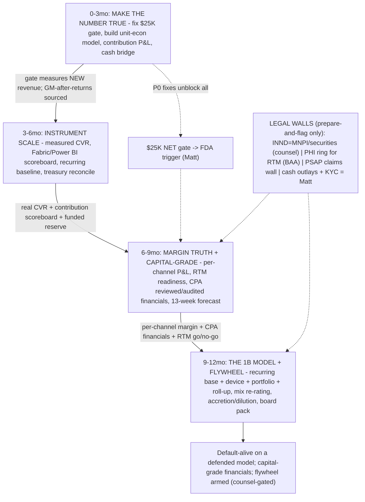

**Risks -> mitigations**
- The load-bearing unknown fails: the warm 66,224 list does not convert at a defensible rate, so the entire $1B model (downstream of Phase 1 reignition) is built on sand and the $25K gate never legitimately clears -> Instrument the live conversion bridge in PostHog on wave 1 and lock the REAL email->buyer CVR within 7 days; publish an explicit KILL rule (<0.3% CVR or <$2.5K in 7 days => halt sends, re-test offer/list before any paid spend); never let the model assert ARR without its measured funnel
- Margin/cash illusion: an asserted 85-90% gross margin and a gross-revenue heartbeat hide a much lower contribution margin after 60-day-guarantee returns + free shipping + fees, and Stripe payouts_enabled=FALSE leaves cash trapped and refunds unfundable while burn runs at ~$50K/mo -> Report CONTRIBUTION (not gross) as the board number with a held-back 60-day returns reserve; compute GM-after-returns off sourced COGS with a return-rate sensitivity; flag the Stripe-payout-bank connection as a Matt gate and never let cash drop below the open-return liability; weekly multi-entity runway report
- Securities/MNPI leak: a counsel-gated INND figure, share count/price, valuation, or roll-up purchase term enters a repo, a draft, or an investor-facing artifact prematurely (Reg FD / unregistered-offer / market-conditioning exposure) -> All INND/capital content stays framework-level only and in the cfo/coo private MNPI lane + with counsel; data-room finance slots ship empty of values with an ATTORNEY REVIEW REQUIRED header; every capital-finance artifact is prepare-and-flag, counsel-reviewed and Matt-approved before any release; the audit opinion + vehicle + tier are CPA/counsel/Matt decisions, never the agent's
- RTM/PHI ring breach or premature billing: standing up medication-adherence RTM (CPT 98975-98981) drags PHI into the non-PHI ring or bills before credentialing/payer-enrollment/BAA are in place, creating a HIPAA + payer-fraud exposure -> Keep RTM strictly in the PHI ring carved OUT of the non-PHI gateway; deliver a financial go/no-go packet with the full credentialing/clearinghouse/payer/BAA path mapped before any claim is submitted; gate the entire RTM lane on counsel + BAA + Matt; finance models the economics but never turns on billing autonomously

## CTO — AI Tech Stack & Infra

**Situation.** I run the tech function internally as the CTO: the Medvi-style 3-layer AI operating system (exec + app-lead/developer agent workforce, the unified MCP gateway mcp.otchealth.app, kb-memory + company-brain, claims_check, VoiceRAG + the voice fleet, doc-indexer librarians, browser-agent, fleet-telemetry/agent-evals, model routing on Azure OpenAI), all on grant/credit-funded infra at ~$0 marginal cash. Honest state per the 2026-06-30 E2E: the stack is ~90% built and verified-live (gateway with ring + INND-ticker compliance gate, company-brain across 14 sources, finance connectors, n8n self-host 29 active workflows, VoiceRAG, PlantID backend, Datadog), but it is dormant-ready, not scaled, and carries five live fragilities that gate the whole playbook. The load-bearing ones: claims_check (the in-code compliance MOAT) is gateway PR #24 UNMERGED running on a branch image (rw4) ahead of main, so a routine redeploy silently drops the moat; the 28-credential otchealth-ops leak is un-rotated with secret-scan CI red (hard-blocks every public/INND action); an Azure OpenAI throttle alert is firing now (default secret points at the 10K-TPM aoai-4701, not the 1000K foundry); cross-engine state survives only in kb-memory + origin/main (single-engine SPOF, LLM-Obs done-but-not-deployed so a blackout is invisible); and the shared brain layer + gateway repo lack PR-review gates with 47 stale drafts hiding real infra. This 12-month plan extends the existing near-term EXECUTION-PROGRAM (its 10-step CTO list + Phases 0-6) from "harden + survive the reignition" into "scale a resilient, multi-engine AI OS and grow the agent workforce one quarter at a time at ~$0 marginal cost."

**Gap analysis**
| Sev | Gap | Why |
|---|---|---|
| P0 | Gateway deployed-but-not-merged: claims_check + Shopify R/W live only on the branch image rw4, not on main (PRs #24/#25/#26 unmerged); no durable single source of truth for the system the whole playbook rests on. | The Medvi-vs-Medvi moat is 'compliance enforced in code' (SOP-1). A routine redeploy from main silently removes claims_check and the Shopify write path the funnel depends on, so the compliance gate and the cash rail can vanish without anyone touching them. |
| P0 | 28-credential otchealth-ops leak un-rotated; ops secret-scan CI red. | The gateway is keys-to-the-kingdom; leaked creds in a public-facing posture is an active breach surface and a Reg-FD/securities-adjacent reputational risk for a public-company (INND) operator. It is the standing HARD GATE that blocks every send/ad/IR/INND action until green. |
| P0 | Azure OpenAI throttle FIRING: default azure-openai secret points at the 10K-TPM aoai-4701, not the 1000K-TPM otchealth-foundry; no autoscaling inference tier and no enforced model-routing fallback across all skills. | VoiceRAG live CS, claims_check, and company-brain all depend on inference. A funnel/reignition spike will 429 the default path, degrading CS reachability (a brand-health + FTC gate) and compliance throughput exactly when load is highest. The healthy capacity tier sits unused by default. |
| P1 | Single-engine SPOF: cross-engine state survives only in kb-memory + origin/main; Hyperagent docs unreadable from Claude Code; LLM observability is built but not deployed (zero $ai_generation spans). | If the primary engine hits its weekly limit or goes down, work living only in branch PRs or a doc-store is unreachable, and a blackout/throttle is invisible because no LLM spans flow. The fleet has one brain and fragile continuity with no telemetry to detect failure. |
| P1 | No PR-review/CodeQL branch protection on the shared brain (otchealth-claude-tools/main) and the gateway repo (otchealth-mcp-server/main); 47 stale claude-tools drafts hide real infra (#90/#103/#171/#182/#193/#236). | Every agent live-pulls claude-tools/main mid-session; an unreviewed change to the toolkit propagates fleet-wide on the next prompt. Without review gates the shared layer can be corrupted or silently broken, and real infra work is lost in draft noise. |
| P1 | The AI workforce has no scalable spawn/eval/cost discipline: Tier-2 autonomous runner is armed-but-idle (blocked on the CLAUDE_CODE_OAUTH_TOKEN), agent-evals/golden tasks are not CI-gated per role, and there is no per-agent cost/quality budget enforced by model routing. | Growing the workforce 'at ~$0 marginal cost each quarter' requires headless agents on the Max subscription (not the metered SDK), quality gates so new agents do not regress, and routing so cheap models carry routine work. Without these, scaling adds risk and spend instead of leverage. |
| P2 | Infra-as-code and DR are partial: Azure Wave 0 landing zone exists but the secret store is still GCP Secret Manager (no Key Vault migration), the n8n self-host VM is a single point of failure, and there is no tested cold-resume/DR runbook for the gateway, brain indexes, or voice fleet. | The valuation thesis depends on the AI OS being a durable asset, not a hand-built artifact. A VM loss, a credential-store outage, or an Azure region issue currently has no tested recovery path, and the GCP/Azure split keeps a cross-cloud dependency the migration directive wants closed. |

**AI operating model (in-house vs outsourced).** Mirror Medvi's 3-layer model for the technology lane: a thin human/decision layer, an AI workforce that does the work, and outsourced commodity atoms.

LAYER 1 — HUMAN/DECISION (Matt + me-as-CTO, the only seats that decide): hard gates only. Matt owns the physical/legal gates the gateway cannot shrink: pasting/authorizing rotated secrets, the one interactive `claude setup-token` for the Tier-2 runner, Azure subscription-scope role grants and billing, OAuth consents the browser-agent escalates, Apple app-record creation, any spend authorization, and anything INND/securities (counsel-gated, MNPI, framework-level only). I (CTO) own architecture decisions, the merge/deploy go on the gateway, the rotation execution, and the kill/scale calls on infra.

LAYER 2 — AI WORKFORCE (the in-house 'employees', ~$0 marginal cost on grants/credits): the exec agent fleet + app-lead/developer agents run the build and the ops. Concretely by skill/agent/automation: the unified gateway (otchealth-mcp-server) is the single audited, scope-gated, claims_check-fronted entry every agent uses for write actions; kb-memory (write-through + semantic recall) + company-brain (federated cited answers across memory-exec/legal/finance/commerce/journal) are the shared memory and the engine-down resume spine; claims_check is the in-code compliance moat wired into every publish path; VoiceRAG + the voice fleet (ElevenLabs grant for pre-rendered VO, Azure gpt-realtime for live CS) run customer service; doc-indexer librarians (Container Apps Jobs on cron) keep the data rooms fresh; browser-agent shrinks the soft OAuth/portal gates; fleet-telemetry + agent-evals + the PostHog Fleet Agents project measure cost/quality and CI-gate new agents; model routing on Azure OpenAI (primary gpt-4o on the foundry 1000K-TPM tier, fallback foundry gpt-4.1-mini, cheap models for routine) controls spend; Tier-1 scheduled Container Apps Jobs (librarians, daily-digest, brain-reindex, the cash/contribution heartbeat) and Tier-2 timed `claude -p` runners do the overnight/autonomous work, draft-PR-only, draws the shared Max limit. CI/CD runs on GitHub Actions + Depot (Linux for Android, depot-macos-26 for iOS); GHAS (CodeQL + Copilot Autofix + Dependabot + secret-scanning + push-protection) is the security automation.

LAYER 3 — OUTSOURCED ATOMS (the commodity substrate we rent, never build): all compute/storage/inference is grant/credit-funded cloud — Azure (Container Apps, Container Registry, AI Search, Blob, Key Vault, Azure OpenAI/foundry, Speech; ~$25K growing toward $150K), Azure self-host n8n VM, GCP Secret Manager + claude-driver SA (the standing exception) and the GCP BAA for PHI; CI on Depot ($5k macOS/Linux runners) + GitHub ($10k GHAS); observability on PostHog ($50k) + Sentry + Datadog; voice on ElevenLabs (33M chars) + Azure realtime; parallel sandboxes on Daytona ($10k). The atoms are rented and disposable; the moat is the orchestration layer (gateway + brain + claims_check + the agent fleet) and compliance-in-code, which is ours and portable across the rented substrate. Net new cash cost stays $0 until Matt authorizes spend; the workforce grows by adding agent definitions + skills, not headcount.

**12-month roadmap**

#### 0-3mo — STABILIZE: close the moat-drift + breach + throttle gates and make the AI OS provably durable (extends the EXECUTION-PROGRAM CTO 10-step list into a hardened, scaled-ready stack).
| Initiative | Owner | Gate | Target |
|---|---|---|---|
| Pin the gateway source of truth: record the live image tag (rw4), merge gateway PRs #24 (claims_check) + #25/#26 (Shopify R/W + connectors) into otchealth-mcp-server/main, rebuild :latest from main, redeploy so deployed image == main, and add a weekly CI drift check that fails if a deployed tool is not traceable to a merged main commit. | CTO | CCO sign-off on the claims_check ruleset; self-merge or Matt if branch-protection blocks | 100% of deployed gateway tools traceable to merged main; tool count before==after a main-built redeploy; no tool silently drops |
| Rotate the 28 leaked otchealth-ops credentials (Azure AD/Graph secret FIRST): new Secret Manager version per cred via set-secret.mjs, update each consuming GitHub Actions secret / Container App env via ARM, revoke the old, scrub leaked values from git history, re-run the ops secret-scan CI to GREEN. | CTO | Matt authorizes any cred pasted in chat; counsel notice if INND-adjacent | ops secret-scan CI GREEN, 28/28 rotated within 3 days, git history clean by a fresh scan |
| Clear the firing Azure OpenAI throttle and enforce model routing fleet-wide: repoint the default azure-openai-* secret from aoai-4701 (10K TPM) to azure-foundry-* (otchealth-foundry, 1000K TPM), wire primary->fallback (gpt-4o -> foundry gpt-4.1-mini) into the gateway + company-brain + reflect + agent-evals, and confirm the Datadog throttle monitor returns to OK. | CTO | none | Datadog throttle monitor OK for 24h; <1% 429 on claims_check + brain under a load test |
| Wire claims_check into the actual publish paths (Customer.io send path + funnel/advertorial deploy step) with a CI test that a treat/diagnose/cure or INND share-price string is BLOCKED and a benefit-led PSAP string PASSES; add required PR-review + CodeQL branch protection to otchealth-mcp-server/main and otchealth-claude-tools/main and bulk-triage the 47 drafts. | CTO | CCO owns the ruleset + final claims sign-off | 100% of owned publish paths call claims_check and block on fail; both mains require review+CodeQL; open-draft count under 10 with the 6 infra PRs decided |
| Deploy the done-not-deployed LLM observability + the stand-up resilience basics: enable DD_LLMOBS/LLMObs.enable in instrument.ts, emit the ledger_flush custom metric, stand up the daily cash/contribution heartbeat Container Apps Job, add a Datadog uptime synthetic on VoiceRAG /health, and write the engine-down cold-resume runbook (resume from kb-memory team feed + origin/main). | CTO | none | non-zero LLM spans within 1h; fleet-activity dashboard renders live; VoiceRAG synthetic + heartbeat both live; runbook on main with a tested cold-resume |

*Exit criteria:* Compliance moat is durable on main (no deploy-drift), the breach gate is closed (secret-scan GREEN), inference no longer throttles, every owned publish path is gated in code, LLM-Obs + uptime synthetics make failure visible, and a tested engine-down resume exists. The stack is now safe to scale.
  
*KPI targets:* secret-scan CI GREEN; gateway image==main 100%; Datadog throttle OK + <1% 429; claims_check coverage 100% of owned paths; LLM spans non-zero; VoiceRAG uptime >99.5%

#### 3-6mo — SCALE THE WORKFORCE + ELIMINATE SPOF: arm autonomous runners, CI-gate agent quality, and remove the single-engine and single-VM failure points so the AI OS scales with the reignition load.
| Initiative | Owner | Gate | Target |
|---|---|---|---|
| Arm the Tier-2 autonomous runner: once Matt mints CLAUDE_CODE_OAUTH_TOKEN in a Cloud Shell, store it as the GH secret, uncomment the overnight cron, and run the least-privilege headless `claude -p` fleet (draft-PR-only, hard rails: no main pushes, no PHI/INND-HA financial writes/securities, stop at hard gates) for the overnight build/maintenance backlog. | CTO | Matt mints the interactive token (cannot be headless); shared weekly Max limit | Tier-2 runner executes >=3 overnight tasks/week as draft PRs with zero rail breaches; classifier-enforced credential isolation verified |
| Make the AI workforce measurable and self-improving: CI-gate agent-evals golden tasks per role (CTO/CFO/CLO/CRO) with the LLM-judge scorecard, wire fleet-telemetry as an auto Stop hook on every agent, and stand up a per-agent cost/quality budget in the PostHog Fleet Agents project that flags regressions. | CTO | none | every role has a passing golden-task suite gating its agent definition; per-session cost + quality visible per agent; a quality regression blocks the merge |
| Close the single-engine SPOF: enforce the cross-engine rule in CI (a master-handoff decision must be in BOTH the kb-memory lane ledger AND origin/main, not a draft), add a second-engine warm path (Hyperagent + Claude Code both resume from ledger+main), and run a quarterly engine-down game-day drill. | CTO | none | a handoff left only as a draft fails CI; a simulated primary-engine outage is recovered from ledger+main within 1h in a drill |
| Remove the n8n single-VM SPOF and migrate the secret store: stand up n8n on Azure Container Apps (or a second VM with a failover Caddy) behind a health synthetic, and begin the GCP Secret Manager -> Azure Key Vault (kv-otc-...) migration for non-PHI secrets with a dual-read shim so nothing breaks mid-cut. | CTO | Matt for any Azure subscription-scope grant; PHI secrets stay on GCP BAA | n8n has an automated failover with <5min RTO; >=50% of non-PHI secrets dual-read from Key Vault with no consumer breakage |
| Scale the gateway + voice fleet for reignition load: add gateway autoscaling rules + rate-limit/backpressure, expand VoiceRAG to handle the 66,224-send CS spike (SOP-3 nightly cs-knowledge sync proven fresh, Azure realtime concurrency tuned), and add per-tenant audit dashboards. | CTO | none | gateway sustains a 10x load test with <1% 5xx; VoiceRAG handles peak CS concurrency with PHI-forced-handoff verified under load |

*Exit criteria:* Autonomous runners are doing real overnight work at ~$0 marginal cash, agent quality is CI-gated and observable per agent, there is no single-engine or single-VM SPOF, the secret store is migrating to Key Vault, and the gateway+voice fleet are load-proven for the reignition spike. The workforce can grow without adding risk.
  
*KPI targets:* >=3 autonomous tasks/week; per-role golden-task gate live; engine-down RTO <1h; n8n failover RTO <5min; gateway 10x load <1% 5xx; >=50% secrets on Key Vault

#### 6-9mo — INDUSTRIALIZE: turn the AI OS into a repeatable, instrumented platform — a paved road for spawning new agents/apps, full IaC + DR, and cost/throughput engineering driven by telemetry.
| Initiative | Owner | Gate | Target |
|---|---|---|---|
| Ship the 'paved-road' agent + app factory: a scaffolder that stands up a new agent (definition + skill + ring + gateway scope + golden-task eval + telemetry hook) or a new Capacitor app (boot-gate, Depot iOS/Android CI, Sentry/PostHog wiring) in one command, so growing the workforce each quarter is a script, not a build. | CTO | none | a new agent or app is provisioned end-to-end (scope + evals + telemetry + CI green) in under 1 day with zero hand-wiring |
| Complete IaC + DR: finish the GCP->Azure secret migration to Key Vault (non-PHI), express the whole non-PHI landing zone (gateway, jobs env, AI Search, storage, n8n) as Bicep in otchealth-cto/infra, and write+test DR runbooks for the gateway, the brain indexes (reindex-from-source), and the voice fleet. | CTO | Matt for subscription-scope; PHI stays GCP BAA until Azure BAA | 100% of non-PHI infra reproducible from Bicep into a clean RG; a DR drill rebuilds the gateway + brain index from IaC + source within the documented RTO/RPO |
| Cost/throughput engineering (Fleet Intelligence #5): use fleet-telemetry to route by task class (cheap model for routine, gpt-4o for reasoning), enforce per-agent monthly token budgets, add prompt-caching, and report grant-burn-vs-runway so the $0-marginal-cost claim is measured, not asserted. | CTO | none | >=30% reduction in tokens-per-completed-task vs the 3-6mo baseline at equal eval scores; grant-burn dashboard live with >9mo projected runway per grant |
| Harden the gateway to enterprise posture for the INND/public phase: complete the OAuth 2.1 hardening, finish least-privilege trim of the over-privileged github-app + azure-sp Owner, add per-client revocable tokens + kill-switch tests, and a quarterly third-party-style security review. | CTO | Matt + counsel for any INND-facing exposure | github-app + azure-sp at least-privilege; gateway passes a full kill-switch + scope-escape test; security review closes with no P0/P1 open |
| Scale the data-room/brain platform: add new librarian rooms as apps/domains come online, move Azure AI Search off Basic only when the corpus nears limits (new service + repoint + reindex), and expose company-brain as a self-serve answer surface for every agent + Matt with citation provenance. | CTO | none | brain answers cited across all live rooms with <2s p50; AI Search headroom monitored with an auto-alert before Basic limits; new domains onboard via the librarian template in <1 day |

*Exit criteria:* New agents/apps are spawned from a paved road in under a day, the non-PHI stack is fully IaC + DR-tested, inference cost-per-task is down >=30% at equal quality with measured grant runway, the gateway is at enterprise security posture, and the brain/data-room platform scales on demand. The AI OS is a durable, repeatable asset.
  
*KPI targets:* new-agent/app provisioning <1 day; 100% non-PHI infra in Bicep; DR drill passes RTO/RPO; tokens-per-task -30%; github-app+azure-sp least-privilege; security review zero P0/P1

#### 9-12mo — COMPOUND + ENTERPRISE-READY: prove the one-operator/AI-workforce model at scale, make the platform investor/diligence-grade for the INND flywheel, and turn the OS into reusable leverage across the portfolio.
| Initiative | Owner | Gate | Target |
|---|---|---|---|
| Run the company on the autonomous fleet by default: most maintenance, ops, CS, data-room, and build work executes via Tier-1 jobs + Tier-2 runners with the human touching only hard gates, governed by agent-evals + telemetry + the forcing GATE-STATE cadence. | CTO | hard gates only (spend, INND/securities, PHI, physical/KYC) | >=70% of recurring tech/ops tasks completed autonomously (draft-PR or job) with eval scores held; human-touch limited to the defined hard-gate set |
| Make the AI OS diligence-grade for the capital phase: produce the technology/security/architecture data-room packet (IaC, DR evidence, security-review results, compliance-in-code attestation, telemetry SLOs) so the platform is a provable asset in the INND flywheel — prepare-and-flag only, counsel-gated, framework-level, no MNPI. | CTO | Matt + securities counsel; key-rotation GREEN (hard gate); no share counts/prices/valuations | a counsel-reviewable tech/security packet exists, ATTORNEY-REVIEW-REQUIRED flagged, with no MNPI; closes the diligence-readiness line for the capital lane |
| Cross-cloud + multi-engine resilience to remove residual SPOF: confirm a tested failover for inference (Azure OpenAI -> foundry -> a second region/provider), for the engine (no single LLM-client dependency), and for the secret store, with a published RTO/RPO SLA per critical service. | CTO | Matt for any new provider/BAA; PHI on GCP BAA until Azure BAA | every critical service has a documented + drill-tested RTO/RPO; an inference-provider outage is survived in a game-day with no customer-facing CS degradation |
| Plan the PHI-ring Azure move (Wave 4, gated): assemble the Azure BAA + HIPAA-eligible Azure OpenAI prerequisites packet for MedReview/Companion so the last GCP dependency can move when counsel + Matt approve, keeping the legal wall intact until then. | CTO | Matt + counsel; Azure BAA + HIPAA-eligible Azure OpenAI must exist FIRST | a flag-and-hold PHI-migration readiness packet exists; nothing moves off the GCP BAA without the Azure BAA in place |
| Productize the OS as portfolio leverage: package the gateway + brain + claims_check + agent-factory as a reusable internal platform any current or acquired app/brand inherits day-one, so each new property adds revenue without adding tech headcount (the Medvi compounding). | CTO | none | a new portfolio property inherits the full AI OS (gateway scope + brain rooms + compliance gate + CI) in under 1 week at ~$0 marginal cash |

*Exit criteria:* The company demonstrably runs on the AI workforce with the human at hard gates only, the platform is diligence-grade and resilient with tested cross-cloud/multi-engine failover, the PHI-move is prepared-and-flagged behind the legal wall, and the OS is reusable leverage that makes each new property cheaper. The one-operator/billion-dollar-machine tech thesis is proven and scalable.
  
*KPI targets:* >=70% tasks autonomous at held eval quality; tech/security data-room packet counsel-ready; RTO/RPO SLA + drill pass on every critical service; new-property OS inheritance <1 week; PHI-migration packet flag-and-hold complete

**Process diagram**
```mermaid
flowchart TD
    S["Today: AI OS ~90% built, dormant, 5 live fragilities"] --> Q1
    subgraph Q1["0-3mo STABILIZE"]
        A1["Pin gateway: merge claims_check + R/W to main, drift check"]
        A2["Rotate 28-cred leak, secret-scan GREEN"]
        A3["Clear AOAI throttle, enforce model routing"]
        A4["claims_check wired into publish paths + PR gates"]
        A5["Deploy LLM-Obs + heartbeat + uptime + engine-down runbook"]
    end
    Q1 --> Q2
    subgraph Q2["3-6mo SCALE WORKFORCE + KILL SPOF"]
        B1["Arm Tier-2 autonomous runners"]
        B2["CI-gate agent-evals + telemetry per agent"]
        B3["Cross-engine CI rule + game-day"]
        B4["n8n failover + secrets to Key Vault"]
        B5["Gateway + VoiceRAG load-proven for reignition"]
    end
    Q2 --> Q3
    subgraph Q3["6-9mo INDUSTRIALIZE"]
        C1["Paved-road agent + app factory"]
        C2["Full IaC + tested DR"]
        C3["Cost/throughput engineering -30% tokens"]
        C4["Gateway enterprise security + least-privilege"]
        C5["Brain/data-room platform scales on demand"]
    end
    Q3 --> Q4
    subgraph Q4["9-12mo COMPOUND + ENTERPRISE-READY"]
        D1["Run company on autonomous fleet by default"]
        D2["Diligence-grade tech packet (counsel-gated)"]
        D3["Cross-cloud + multi-engine failover SLAs"]
        D4["PHI-ring Azure move prepared-and-flagged"]
        D5["OS as reusable portfolio leverage"]
    end
    Q4 --> E["Resilient, scaled, ~$0-marginal AI OS: one operator runs the company of a thousand"]
```

**Risks -> mitigations**
- Compliance-moat regression: a gateway redeploy or an unreviewed claims_check ruleset change silently lets a banned PSAP/medical/FDA or INND share-price claim through, exposing FTC/Reg-FD liability. -> Make the gate undroppable: deployed image must==main with a weekly drift check, a CI test that BLOCKS a banned string and PASSES a compliant one on every publish path, required PR-review on the gateway repo, and CCO sign-off as the human gate on the ruleset; persist an audit-log id per check.
- Grant/credit exhaustion or throttle starves the AI workforce, turning ~$0 marginal cost into a cash bill or a degraded-CS spike during reignition. -> Grant-burn dashboard with >9mo per-grant runway alerts, model routing to the 1000K-TPM foundry tier + cheap models for routine work, per-agent token budgets, prompt-caching, and a tested inference failover (Azure OpenAI -> foundry -> second region) before any spend is authorized.
- Single-engine / single-VM / single-cloud SPOF: the primary LLM engine, the n8n VM, or the GCP secret store fails and work or continuity is lost with no visible alert. -> Cross-engine CI rule (handoffs in both ledger + origin/main), engine-down cold-resume runbook + quarterly game-day, n8n failover with <5min RTO, GCP->Azure Key Vault dual-read migration, and LLM-Obs + uptime synthetics so failure is detected within the hour.
- Over-privileged automation (github-app near enterprise-admin, azure-sp Owner) in an auto-approving autonomous loop becomes a breach or accidental-destruction surface as the workforce scales. -> Least-privilege trim of github-app + azure-sp on the 6-9mo security pass, classifier-enforced credential isolation on Tier-2 runners (no master creds in an auto-approving loop, draft-PR-only, hard-gate stops), per-client revocable gateway tokens + kill-switch tests, and a quarterly security review that must close with no P0/P1 open.

## CRO — The Cash Engine

**Situation.** The CRO function is ~90% built and 100% dormant: a proven-but-asleep Shopify store (~$227K all-time / 1,484 orders, $0 in last 90 days, 0 TReO units sold), a warm mailable list LOCKED at 66,224 contacts, a focus-group-tested TReO advertorial+quiz funnel, PAIR99 ($99 pair) live, and the claims_check compliance moat in place. But there is no proven full-price checkout, no recurring SKU, no creative factory, no affiliate program, and $0 authorized ad spend. The entire engine sits behind four P0 gates (Stripe payout bank, checkout-proof, claims_check deployed, brand-health true) plus a Matt email send-go that have not moved in ~20 days. My job over 12 months: convert this from a dormant store into a repeatable, multi-channel, AI-run acquisition machine that goes warm-list reignition -> first cash -> $25K gate -> six- then seven-figure run-rate, with compliance enforced in code as the moat.

**Gap analysis**
| Sev | Gap | Why |
|---|---|---|
| P0 | No proven full-price, unrefunded checkout and Stripe payouts_enabled=FALSE (no bank linked), so even a converting order leaves cash trapped and refunds unfundable. Every reignition send is hard-gated on this. | Without a verified CHECKOUT-PROOF=PASS and a payout that settles to Mercury, firing the 66,224 warm list burns the single best one-shot asset into a broken funnel for $0 of bankable cash. |
| P0 | Brand-health is not operationally true: 60-day guarantee + reachable-CS claims are advertised but refunds/CS are not provably issuable (the #1 historical BBB/Trustpilot complaint). | Reigniting 66,224 decaying contacts into an unreachable support line / unprocessed refund backlog triggers FTC (Sec 5 / Mail-or-Telephone Order Rule) and reputational exposure at the worst moment; CCO will not clear the send until this is real. |
| P0 | No recurring/subscription SKU live (consumables, AWARE). All revenue is one-shot PSAP transactions. | The load-bearing LTV and valuation lever is vapor; without recurring revenue, CAC payback math forces unprofitable paid acquisition and the path to a durable seven-figure run-rate does not exist. |
| P1 | No industrial creative factory and no PostHog cost-per-initiated-checkout as the live source-of-truth for kill/scale decisions. | Medvi's core mechanic is 20-50 creatives/week killed/scaled on cost-per-checkout at 48-72h; without the factory + the measurement spine, paid ads cannot scale profitably and creative becomes a bottleneck instead of an engine. |
| P1 | No creator/affiliate program and no FTC affiliate-audit / creator-persona-verification SOP. | The affiliate flywheel (hundreds of micro-creators) is the highest-leverage low-CAC channel, but the brand is FTC-liable for every affiliate claim; launching creators without the audit SOP is the exact Medvi failure mode (front-end claim specificity) that transfers directly to us. |
| P1 | Single channel (Shopify) only; Amazon TReO path is gated (Apply-to-Sell PDFs / iHEAR trademark question) and Gumroad SOP store not stood up. | Channel concentration caps the ceiling and the addressable demand; Amazon is where high-intent PSAP search lives (2,089 catalog hits) and Gumroad is a zero-gate parallel cash lane that de-risks dependence on the single TReO checkout gate. |
| P2 | The measured email->buyer conversion rate is assumed, not observed; the $25K-gate tracker measured against the $227K all-time total instead of new reignition revenue. | Every downstream forecast (days-to-$25K, CAC ceiling, paid-spend authorization) rests on a load-bearing assumed CVR; until a seeded send produces a real CVR and the tracker uses REIGNITION_START_DATE, spend and run-rate planning are unfalsifiable. |

**AI operating model (in-house vs outsourced).** I run the CRO function as a Medvi 3-layer machine where I (the CRO agent) am the marketing+distribution brain at ~$0 marginal cost, atoms are outsourced, and only legal/financial triggers are human-gated. LAYER 1 — AI IN-HOUSE (the brain, me + the fleet, grant/credit-funded): I own funnel/offer/email/creative/ads/channel strategy and orchestrate the skills. content-engine + designer skills generate advertorials, ad creative, UGC-style video (Vertex Imagen/Veo, GPT-image, ElevenLabs VO on the 33M-char grant) at industrial cadence; paid-ads skill structures ad sets and reads PostHog cost-per-initiated-checkout to kill/scale at 48-72h; lifecycle-crm + Customer.io build/segment the reignition, abandoned-cart, day-0/14/45 journeys; storefront-cro tunes the funnel; partnerships + a creator-brief engine run the affiliate flywheel; amazon-sp-api skill operates the Amazon channel; digital-products skill runs Gumroad; monetization sets pricing psychology; daily-briefing + revenue-tracker.mjs + PostHog are the measurement spine. company-brain answers grounded questions; kb-memory (cro lane, --tags medvi-ops) is my durable memory. n8n self-host automates the cron heartbeats. LAYER 2 — OUTSOURCED ATOMS (cash-cost, not headcount): physical TReO inventory + 3PL refurb/fulfillment (the 10,298-unit partner), micro-creators (flat fee + 15-25% affiliate), Amazon FBA logistics, payment rails (Stripe/Shopify), the warm-list send infra. LAYER 3 — HUMAN-GATED (Matt + counsel only, the legal/financial triggers): authorizing paid-ad spend, the email send-go to 66,224, final pricing changes, the Stripe payout-bank link + the real checkout-proof order, new financial commitments, anything INND/securities (MNPI, counsel + Matt), and CCO clearance of every claim before publish. COMPLIANCE-AS-CODE is the non-negotiable wrapper: NO owned OR affiliate copy ships without passing claims_check (PSAP amplification/wellness language only, zero treat/diagnose/cure/FDA), and the affiliate-audit SOP verifies creator personas + monitors their live claims because the brand is FTC-liable for them. That gate IS the moat — it lets me run creative and creators at Medvi volume without the FDA-warning-letter outcome that capped Medvi.

**12-month roadmap**

#### 0-3mo — IGNITE — clear the four P0 gates, prove checkout, fire the warm-list reignition, and stand up the first recurring SKU. First bankable cash.
| Initiative | Owner | Gate | Target |
|---|---|---|---|
| Stage the claims-cleared reignition campaign in Customer.io (draft-141 + seed-wave mechanics: segment the 66,224, suppression/unsubscribe wired, CAN-SPAM elements verified, honest subject), held send-ready pending the send-go. | CRO/lifecycle | CCO claims clearance + Matt email send-go AFTER all four P0 greens | Send-ready build validated; seed wave of ~2,000 fires first to confirm clicks reach a working checkout before releasing all 66,224 |
| Hard-gate the send on CTO's CHECKOUT-PROOF=PASS (real paid+unrefunded PAIR99 order, Stripe payouts_enabled=true, payout settles to Mercury) and on BRAND-HEALTH=READY; fire the seeded reignition wave with a live revenue heartbeat once green. | CRO (Matt order + CTO verify + COO/CS brand-health) | Matt + CTO + COO/CS + CCO | First real reignition orders; measured email->buyer CVR captured to replace the assumed CVR |
| Stand up the first recurring SKU: a Shopify-native consumables subscription (domes/tubes/batteries) attached at post-purchase, with monetization-skill pricing psychology and a day-0 attach offer. | CRO/monetization | CCO copy clearance; Matt pricing confirm | Recurring SKU LIVE; >=15% of TReO buyers attach a subscription |
| Launch the zero-gate Gumroad SOP storefront (5 drafted compliance/OTC SOP PDFs, instant delivery) as a parallel cash lane independent of the TReO gate. | digital-products under CRO | Matt account creation + upload | Gumroad live; first non-TReO dollars within days |
| Fix the measurement spine: revenue-tracker.mjs uses REIGNITION_START_DATE so the $25K gate measures NEW revenue, and PostHog cost-per-initiated-checkout becomes the live source-of-truth dashboard. | CRO + CFO | none (instrumentation) | Daily contribution heartbeat live; true days-to-$25K computed from the measured CVR |

*Exit criteria:* First bankable reignition cash settled to Mercury; consumables subscription live; Gumroad live; measured CVR + cost-per-checkout dashboards running; the warm list converting, not dormant.
  
*KPI targets:* First-cash within the quarter; reignition email->buyer CVR measured (baseline ~1-3%); cumulative new revenue $5K-$10K toward the $25K gate; consumables attach >=15%; CS response <24h, refunds issuable within 7-day SLA.

#### 3-6mo — INSTRUMENT & SCALE OWNED — industrial creative testing on paid, full lifecycle automation, and hit the $25K gate.
| Initiative | Owner | Gate | Target |
|---|---|---|---|
| Stand up the AI creative factory: content-engine + designer produce 20-30 advertorial/UGC-style ad creatives per week, each through claims_check, staged behind SOP-2 (angle -> advertorial+quiz on staging -> gate -> Matt spend approval -> launch). | CRO | CCO per-creative claims clearance; Matt paid-spend authorization + CFO guardrails (max cost-per-initiated-checkout + CAC ceiling + kill rule) | 20-30 creatives/week in rotation; kill/scale decisions at 48-72h on cost-per-initiated-checkout |
| Begin disciplined paid-ads testing at small authorized budget on the single TReO wedge (ad -> advertorial -> quiz -> PAIR99), scaling only winners under the CFO CAC ceiling. | CRO/paid-ads | Matt budget authorization; CFO unit-econ guardrails | First profitable acquisition cohort with CAC < contribution margin incl. consumables LTV; documented winning angle |
| Complete the lifecycle suite in Customer.io: abandoned-cart, day-0 welcome, day-14 and day-45 churn-save, milestone-framed retention, and a 7-day post-purchase review request (SOP-8) for social proof. | CRO/lifecycle | Matt send-go per journey; CCO copy | Full lifecycle live; churn-save recovering >=20% of at-risk; review-request feeding funnel social proof |
| Reach the $25K cumulative reignition revenue gate and trigger SOP-7 (alert Matt; unlock OTC-line prep behind a flag, gated on a NAMED human clinical reviewer). | CRO + CFO tracker | SOP-7; named human clinical reviewer for any OTC/device-tier copy | Cumulative new revenue crosses $25K; OTC-prep flag flipped |
| Build the FTC affiliate-audit + creator-persona-verification SOP (the one Medvi failure mode that transfers) so the creator flywheel can launch safely next quarter. | CRO/partnerships + CCO | CCO sign-off on the audit SOP | Affiliate-audit SOP approved and tooled (creator vetting + live-claim monitoring); 10-20 candidate micro-creators sourced |

*Exit criteria:* $25K gate crossed on new revenue; profitable paid cohort proven and instrumented; full lifecycle automation live; affiliate-audit SOP ready to launch creators; OTC-prep flag unlocked behind the named-reviewer gate.
  
*KPI targets:* Monthly run-rate reaching $20K-$40K; cost-per-initiated-checkout below the CFO ceiling on >=2 scaled angles; consumables/AWARE recurring >=20% of revenue; CAC payback < 60 days incl. recurring LTV.

#### 6-9mo — MULTI-CHANNEL & FLYWHEEL — launch the creator/affiliate flywheel, open Amazon, and push toward a six-figure monthly run-rate.
| Initiative | Owner | Gate | Target |
|---|---|---|---|
| Launch the creator/affiliate flywheel: onboard the first 30-50 vetted micro-creators (50-200K followers) on flat fee + 15-25% affiliate, each brief generated by the creator-brief engine and every claim run through claims_check + the affiliate-audit SOP. | CRO/partnerships | CCO per-creator claims monitoring; Matt affiliate-spend authorization | 30-50 active creators; affiliate channel CAC below paid-ads CAC; first creator-driven cohort profitable |
| Open the Amazon TReO channel via amazon-sp-api (resolve Apply-to-Sell vs Brand Registry / iHEAR trademark path), attach-our-offer-to-existing-ASIN first, with compliance-screened listing copy (PSAP, zero medical claims). | CRO/commerce + CLO + Matt | Matt signs Apply-to-Sell PDFs / trademark filing; CCO listing-copy clearance | TReO live on Amazon US (and CA/MX); first marketplace orders; channel-level cost-per-order tracked |
| Scale paid-ads to multiple proven angles and audiences (senior-first), retiring losers weekly; introduce the iHEARtest free-screening magnet as the highest-intent top-of-funnel feeding TReO. | CRO/paid-ads | Matt budget step-ups tied to CFO contribution targets; CCO claims | 5-8 scaled creatives/audiences; iHEARtest->TReO drip live and converting; blended CAC stable while spend grows |
| Expand recurring revenue: launch AWARE aural-rehab subscription as the LTV tier alongside consumables; build the cross-sell from TReO buyers. | CRO/monetization + CPO | CCO copy; CareNow stays counsel-blocked (Securities Act 17(b)) | Recurring revenue >=30% of total; blended LTV:CAC > 3:1 |

*Exit criteria:* Three live channels (Shopify owned, Amazon, creator/affiliate) all producing profitable cohorts; recurring revenue a third of the mix; creative + creator engines running at industrial cadence under compliance-as-code.
  
*KPI targets:* Monthly run-rate approaching six figures ($80K-$120K/mo); >=3 profitable channels; affiliate + paid CAC both under ceiling; recurring revenue >=30%; LTV:CAC > 3:1.

#### 9-12mo — REPEATABLE ACQUISITION MACHINE — compound the channels into a predictable engine and push toward a seven-figure annualized run-rate.
| Initiative | Owner | Gate | Target |
|---|---|---|---|
| Scale the creator flywheel to 100-200+ micro-creators with the affiliate-audit SOP running continuously (automated live-claim monitoring), making creator acquisition the lowest-CAC primary channel. | CRO/partnerships | CCO continuous claims monitoring; Matt scaled affiliate budget | 100-200+ active creators; affiliate the #1 or #2 channel by volume at below-target CAC |
| Run paid-ads as a mature kill/scale machine: 30-50 creatives/week, multi-platform, programmatic budget reallocation driven by PostHog cost-per-initiated-checkout, with model-routed creative generation keeping cost ~$0 marginal. | CRO/paid-ads | CFO rolling CAC guardrails; Matt monthly budget envelope | Predictable CAC at scale; paid spend scaling linearly with profitable revenue, not capped by creative throughput |
| Deepen multi-channel: expand Amazon (FBA, additional marketplaces), grow Gumroad into a small SOP-product line, and stand up post-$25K OTC-line offers to the warmed base (gated on the named human clinical reviewer). | CRO/commerce + CPO | Named clinical reviewer for OTC copy; CCO + Matt | 4+ revenue channels; OTC-tier ascension offers live to warmed buyers |
| Formalize the acquisition machine as a documented, self-running system (SOP-1..8 fully automated, cohort/CAC-LTV dashboards, weekly kill/scale review) so revenue is predictable and the function is a true compounding engine. | CRO + CFO | none (operational) | Documented repeatable playbook; forecastable monthly revenue with <20% variance; ready to feed the INND capital flywheel (framework-level, counsel-gated) |

*Exit criteria:* A documented, multi-channel, AI-run acquisition machine producing predictable, profitable, compounding revenue across owned + Amazon + creator + Gumroad + OTC-tier, with compliance-as-code intact across every owned and affiliate claim.
  
*KPI targets:* Annualized run-rate crossing seven figures ($1M+ ARR equivalent); 4+ profitable channels; blended LTV:CAC > 3.5:1; recurring revenue >=35%; cost-per-initiated-checkout stable at scale; zero compliance breaches (claims_check + affiliate-audit clean).

**Process diagram**
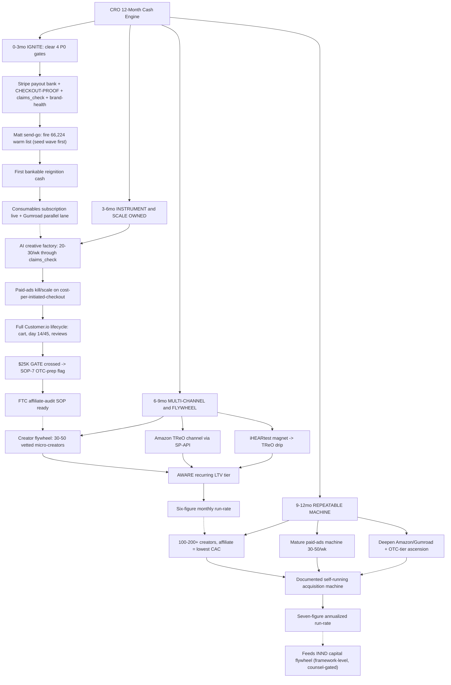

**Risks -> mitigations**
- Compliance breach on owned or affiliate copy (a PSAP marketed as a hearing-aid / medical / FDA claim) triggers an FTC warning letter — the exact ceiling that capped Medvi — destroying the moat and the channels at once. -> Compliance-as-code is non-negotiable: every owned AND affiliate claim passes claims_check before publish; the FTC affiliate-audit SOP verifies creator personas and continuously monitors their live claims; CCO clears all copy; ads/advertorials screened hardest. The gate IS the moat that lets us run at Medvi volume safely.
- Firing the one-shot warm list of 66,224 into a broken checkout or an unreachable CS line burns the single best asset for $0 and torches brand trust at the worst moment. -> Hard-gate the send on CTO CHECKOUT-PROOF=PASS (paid+unrefunded order, payouts settling to Mercury) AND BRAND-HEALTH=READY (live phone test + refunds issuable on a 7-day SLA + CCO guarantee clearance); fire a ~2,000 seed wave first to confirm clicks reach a working checkout before releasing all 66,224.
- Paid acquisition scales unprofitably (CAC exceeds contribution margin) because there is no live recurring revenue to support payback, burning authorized spend without a durable run-rate. -> Stand up the consumables subscription (then AWARE) as recurring LTV BEFORE scaling paid; enforce CFO guardrails (max cost-per-initiated-checkout + CAC ceiling + 48-72h kill rule) with PostHog cost-per-initiated-checkout as the live source-of-truth; only scale winners, kill losers weekly.
- Channel/gate concentration — revenue stays 100% hostage to the single Shopify TReO checkout gate, which has not moved in ~20 days, stalling all cash progress. -> Run the zero-gate Gumroad SOP lane in parallel from day one so cash progress is not fully gate-dependent; sequence Amazon and the creator/affiliate flywheel to diversify to 3-4 profitable channels by month 9; convert the cadence to a GATE-STATE forcing function that auto-escalates a gate red 2 briefs running.

## CCO — Compliance Moat

**Situation.** As CCO the honest state is: the "compliance enforced in code" moat the whole Medvi-mirror thesis rests on is asserted but NOT yet operational. The claims_check FTC/FDA gate lives in otchealth-mcp-server PR #24, UNMERGED, running on a branch image, so a routine redeploy from main silently drops the moat at the exact moment 66,224 reignition emails would land. Standing hard gates are correctly held (TReO PSAP firewall, OTC/iHEAR hearing-aid sale blocked pre-FDA-registration, CareNow share-bundle = Securities Act 17(b) BLOCK, outbound SMS = TCPA BLOCK, draft-141 CONDITIONAL-CLEAR pending proven checkout + reachable CS + Matt send-go), but enforcement is partly documentation not code, the 60-day-guarantee/CS-reachability claims are not yet operationally true (FTC Mail-or-Telephone-Order-Rule exposure), and the 28-credential ops leak is un-rotated (blocks any public/INND posture). The function today is one person's gate; the 12-month job is to turn it into hardened, audited, channel-aware code that scales faster than volume + affiliates + channels + the raise.

**Gap analysis**
| Sev | Gap | Why |
|---|---|---|
| P0 | claims_check gate is asserted-LIVE but unmerged/undeployed on a branch image; the moat does not actually exist in production and a redeploy from main drops it | The entire de-risking vs Medvi (every owned AND affiliate claim passes claims_check before it ships) is fiction until PR #24 is merged into protected main, the gateway Container App is redeployed, and CCO has run a verify-firing acceptance test with audit-log ids. Nothing should send into 66,224 inboxes without an enforced, logged FTC/FDA gate. |
| P0 | Send-readiness rests on operationally-TRUE refund/guarantee/CS claims, not just CAN-SPAM mechanics | draft-141 promises a 60-day money-back guarantee and the funnel says help is a call/email away, but Stripe payouts_enabled=FALSE (refunds may be unfundable) and CS reachability is unproven. Firing the warm list into a guarantee we cannot honor is the #1 historical BBB/Trustpilot complaint and a direct FTC Mail-or-Telephone-Order-Rule / Magnuson-Moss exposure — the exact Medvi brand-health own-goal. |
| P0 | No operational affiliate/creator FTC SOP exists before the Phase-2 creator/affiliate flywheel launches | Medvi blew up on ~30% of ads run by affiliates with fabricated AI doctor personas making unsubstantiated endorsement claims; the FTC holds the brand liable for affiliate claims. Launching micro-creators without a written persona-KYC + 16 CFR 255 disclosure + claims_check-routing + CLO-reviewed agreement-rider SOP reproduces Medvi's single highest-liability failure mode. |
| P1 | FTC net-impression + substantiation discipline on benefit-led TReO copy is manual and not yet codified per-channel | Benefit-led copy with no PSAP/amplifier in the headline and category only in fine print can read as an implied hearing-aid/treatment claim to the FTC even when every sentence is literally true. Net-impression review must run on the RENDERED page (not source) and comparative claims ($299/side at CVS, clinic markup) need dated substantiation on file — at scale this must move from a human reading each asset to a codified channel-aware ruleset. |
| P1 | Securities firewall (INND / Reg FD / 17(b) / FINRA quiet-period) is asserted but enforced only on the same unmerged image, and the confidential gated-term list has no private ring home | INND is a public company; product marketing must NEVER touch share-price/ticker/undervalued/invest language, and as the raise flywheel turns the surface area for an MNPI/Reg-FD slip multiplies. The gate must fire on INND terms in product copy, and the sensitive gated-term list needs a private CCO ring (like the CFO/CLO private rings), never the shared commons or git. |
| P1 | No adverse-event / MDR + device-volume compliance readiness as the OTC hearing-aid line approaches (post-$25K gate) | PSAP cash funds the OTC launch; the moment a regulated OTC hearing-aid SKU ships, FDA registration/listing, labeling, and a complaint-handling + adverse-event/MDR pathway become mandatory. Building this only after the device ships repeats the Medvi reactive posture; it must be staged in the 6-9mo horizon so volume never outruns the safety pipeline. |
| P2 | Compliance is a single-human bottleneck with no audit-trail durability, no per-channel acceptance-test regression suite, and no continuous monitoring | As volume + channels + affiliates scale, a one-pass human gate cannot keep 100% coverage. Without an immutable audit trail, a CI regression suite that re-proves the gate on every deploy, and automated post-publish scanning, coverage silently degrades and the moat erodes invisibly — the failure is detected only after an FTC look-back. |

**AI operating model (in-house vs outsourced).** Mirror Medvi's 3-layer model for the compliance lane. LAYER 1 — THE THIN HUMAN (gate-keeper + escalation): the CCO agent (Claude, cco lane) owns policy, runs the verify-firing acceptance tests, writes clearance memos, and escalates the irreducible human/legal gates to Matt + securities counsel (final pricing, mass-send go, paid spend, INND/IR/17(b), device claims, new financial commitments). LAYER 2 — THE AI COMPLIANCE WORKFORCE (runs at ~$0 marginal cost on grant/credit infra): the claims_check gate in otchealth-mcp-server (the enforced-in-code moat) is the spine — every owned AND affiliate asset (email/funnel/ad/affiliate/CS line/listing) routes through it and gets an immutable audit-log id before publish; it BLOCKS treat/diagnose/cure, hearing-aid, FDA, INND share-price, and fabricated-persona language. Supporting AI: the `legal` + `contract-analyzer`/`contract-redliner` skills draft and review affiliate agreement riders and disclosures; `amazon-sp-api` listing copy and `content-engine`/`paid-ads`/`growth-pr`/`ir-support` outputs are all forced through the gate; `company-brain` + `doc-indexer` keep an indexed substantiation/evidence data room (dated comparative-claim sources, refund SOP, CS SLA, FTC look-back evidence) in a private CCO ring; `kb-memory` (cco lane, --share for non-sensitive status) is the durable ledger and the gated-term list lives in a private ring (never shared/git); PostHog Fleet Agents + `agent-evals`/`eval-runner` golden-task suites measure gate quality and catch regressions; a nightly Azure Container Apps Job (the librarian pattern) post-publish-scans live channels and re-proves the gate on every gateway deploy via CI. LAYER 3 — THE OUTSOURCED ATOMS (compliance never touches the physical layer, only governs the claims about it): the PSAP/OTC hardware is iHEAR Medical's; payments/refunds run on Stripe/Shopify; fulfillment + CS-phone are vendor-run; legal e-signature, securities filings, KYC, and FDA registration submission are human/counsel-gated. CCO does NOT manufacture, fulfill, or sign — it enforces that every claim made about those outsourced atoms is substantiated, channel-legal, and logged. HARD HUMAN GATES (never crossed by AI): mass sends, paid-spend authorization, final pricing, any INND/IR/17(b)/Reg-FD-touching publish, device/FDA claims, and counsel sign-off to lift any standing BLOCK.

**12-month roadmap**

#### 0-3mo — Make the moat REAL and survive the first reignition send (extends EXECUTION-PROGRAM weeks 1-13)
| Initiative | Owner | Gate | Target |
|---|---|---|---|
| Merge otchealth-mcp-server PR #24 into protected main, redeploy the gateway Container App, then run the verify-firing acceptance test: 8 known-bad strings (hearing aid, treat/cure hearing loss, FDA-cleared, INND share-price, fabricated doctor persona) all BLOCKED + 4 good PSAP/wellness strings PASS, each with an audit-log id posted to the cco ledger; pin deployed image == main with branch protection so a redeploy can never silently drop the gate | CCO (CTO merges/deploys) | CTO posts gateway redeploy green; CCO acceptance test passes before any send | 12/12 acceptance strings correct with audit-log ids by end month 1; deployed image == main enforced |
| Route draft-141 + the funnel landing copy through the now-live gate and issue the written CCO clearance memo confirming the 4 CAN-SPAM elements (Roseville postal address, wired unsubscribe, honest subject, ad identification), marked cleared-pending-checkout-proof + Matt send-go | CCO | Gate live+verified first; clearance memo recorded as a decision in cco ledger | draft-141 PASS with audit-log id; clearance memo on file before send-go is presented to Matt |
| Make the 60-day guarantee + CS-reachability claims operationally TRUE: COO/CS publish the refund SOP (named owner, 7-day SLA, Stripe/Shopify refund path) + manned CS path; CCO verifies one test refund end-to-end (after Matt connects the Stripe payout bank) plus a timed phone + email CS contact | CCO (COO/CS execute; Matt connects bank) | Stripe payouts_enabled=TRUE + one issuable refund + reachable line are the evidence CCO needs to clear the claim | BRAND-HEALTH=READY: refund issuable within SLA and CS first-response within SLA on phone + email, verified once |
| Lock TReO net-impression + comparative-claim substantiation: verify the not-a-hearing-aid / not-intended-to-diagnose-treat-cure-or-prevent disclaimer is clear-and-conspicuous adjacent to the benefit H1 and the offer on the RENDERED page, and file dated substantiation for the $299/side-at-CVS and clinic-markup comparative claims; re-run the page through claims_check after any CRO copy edit | CCO | Net-impression clear before send; substantiation dated and on file in the private CCO evidence room | 100% of substantiation-requiring claims have a dated source on file; net-impression cleared on the live funnel |
| Confirm the hard BLOCKs are enforced in code not just documented: verify Customer.io SMS is disabled at the platform level (TCPA), tag CareNow share-bundle as a Securities Act 17(b) BLOCK in the gate ruleset, and add INND/ticker/share-price/undervalued/invest terms to the claims_check BLOCK list so the securities firewall fires on product copy; publish the single pre-send go/no-go checklist | CCO | Each BLOCK proven to fire; checklist line 1 = gate merged+deployed+acceptance-passed | SMS/17(b)/INND BLOCKs each demonstrably fire; pre-send checklist published and required for every send |

*Exit criteria:* claims_check is merged, deployed, verify-firing, and CI-pinned to main; draft-141 + funnel cleared with audit-log ids; BRAND-HEALTH=READY (refund + CS operationally true); all hard BLOCKs (SMS/17(b)/INND/device) proven to fire; the first 66,224 reignition send goes out with 100% gated, logged copy and zero un-gated assets.
  
*KPI targets:* 100% of shipped customer-facing assets carry a passing claims_check audit-log id; 0 un-gated sends; acceptance test 12/12; refund + CS within published SLA; 0 device/FDA/INND claims published

#### 3-6mo — Scale enforcement to paid media + the affiliate flywheel without reproducing Medvi's affiliate blowup (extends weeks 14-26)
| Initiative | Owner | Gate | Target |
|---|---|---|---|
| Author and PUBLISH the FTC affiliate/creator compliance SOP BEFORE any creator is onboarded: real-identity KYC + persona-verification (no fabricated/AI doctor personas), mandatory 16 CFR 255 #ad/#sponsored disclosure, all creator copy routed through claims_check, and a CLO-reviewed agreement rider making the creator contractually liable and disclosure-bound | CCO (CLO gates the rider) | Written SOP + CLO-approved rider are a hard prerequisite that blocks creator onboarding; CCO holds the go | Affiliate SOP published and rider executed before creator #1; >=95% of sampled creator assets have correct disclosure + verified real identity |
| Codify channel-aware net-impression + substantiation rules into the gate config (per-channel rulesets for email, funnel, paid ad, affiliate, Amazon listing, CS line) so the gate, not a human read, enforces clear-and-conspicuous disclosure placement and substantiation-required flags as paid volume ramps | CCO | Paid spend stays Matt-gated; gate ruleset versioned with the substantiation evidence room | Ads/advertorials screened hardest (the Medvi failure point); 100% of paid + affiliate assets gated before launch; kill/scale decisions never override a BLOCK |
| Stand up the recurring-subscription compliance pack for the LTV layer (consumables Subscribe-and-Save first, AWARE second): clear ROSCA/negative-option auto-renew disclosure, cancel-anytime + one-click self-serve cancel, and the 60-day money-back disclosure through claims_check, with written CCO clearance that cancel + refund are operationally true before any auto-renew bills | CCO (CRO/lifecycle build) | Launch hard-gated on CCO clearance that cancel-path + refund backlog are real (FTC ROSCA) | Subscription copy PASS + cancel path verified live before first auto-renew bill; 0 ROSCA/negative-option exposure |
| Wire the post-publish monitoring + CI regression layer: a nightly Azure Container Apps Job scans live owned channels for un-gated or drifted claims, and a CI gate re-runs the acceptance suite on every gateway deploy so the moat can never regress silently; emit coverage + violation metrics to PostHog Fleet Agents | CCO (CTO infra) | Runs on grant/credit infra (~$0); HALT-on-violation policy | 100% coverage sustained 2 weeks; any un-gated asset HALTs sends until enforced; weekly coverage report on file |
| Provision the private CCO ring for the confidential securities gated-term list + the substantiation/FTC-look-back evidence room (like the CFO/CLO private rings), indexed by doc-indexer/company-brain, never in shared commons or git | CCO (CTO provisions ring) | Ring discipline: only non-sensitive status leaves the lane; INND specifics counsel-gated | Private CCO ring live with gated-term list + dated substantiation; FTC look-back evidence retrievable on demand |

*Exit criteria:* Affiliate/creator program launches behind a published FTC SOP + CLO rider with zero fabricated personas; paid media + subscriptions run through channel-aware codified gates; post-publish monitoring + CI regression keep coverage at 100% automatically; the private CCO evidence/gated-term ring is live.
  
*KPI targets:* >=95% creator-asset disclosure + persona compliance, 0 fake personas; 100% paid+affiliate+subscription assets gated; sustained 100% coverage with automated HALT; refund + cancel SLAs met as volume scales

#### 6-9mo — Stage device-grade + securities-flywheel compliance ahead of the $25K-gate OTC launch and the raise turning
| Initiative | Owner | Gate | Target |
|---|---|---|---|
| Build the OTC hearing-aid regulatory readiness pack BEFORE the device ships (post-$25K gate): FDA establishment registration + device listing timing, OTC labeling/IFU review, and a written complaint-handling + adverse-event/MDR reporting pathway so the safety pipeline exists before the first regulated unit sells | CCO (CPO clinical sign-off; Matt + counsel gate FDA spend) | OTC/iHEAR hearing-aid SALE stays BLOCKED until FDA registration complete; named human clinical sign-off required | MDR/complaint-handling SOP + registration plan on file before any OTC SKU is payable; waitlist-only (no payment, no claims) until then |
| Establish the device-claims substantiation + labeling gate: extend claims_check with a regulated-device ruleset (OTC hearing-aid vs PSAP boundary enforced in code) so the moment marketing shifts from PSAP-amplification language to OTC-device claims, the gate enforces the new substantiation + clearance requirements | CCO | Device claims = human/counsel + CPO gate layered on the code gate | PSAP vs OTC-device claim boundary enforced in the gate; 0 device claims published pre-registration |
| Harden the securities firewall for the active raise: codify Reg FD + Section 17(b) + FINRA quiet-period rules into the IR/ir-support path so every shareholder update, IR newsletter, and FAQ is draft-only, gate-screened for MNPI/share-price language, and counsel + Matt approved before anything sends or files; keep the CareNow share-bundle 17(b) BLOCK enforced | CCO (IR/Capital agent; counsel + Matt gate all sends) | Absolute: nothing INND/IR-facing publishes without counsel + Matt; framework-level only, no share counts/prices/valuations | 100% of IR-facing drafts gate-screened + counsel-approved before send; 0 Reg-FD/17(b)/quiet-period violations |
| Run a quarterly compliance audit + FTC/FDA/SEC mock look-back: sample owned + affiliate assets, verify audit-log coverage and substantiation-on-file, and produce a dated evidence dossier defensible against an FTC/FDA inquiry | CCO | Findings drive HALT/remediate on any gap | Quarterly audit dossier on file; >=99% audit-log coverage; every live comparative/guarantee/CS claim has dated substantiation |

*Exit criteria:* The OTC device line cannot ship a payable unit without FDA registration + an operational MDR/complaint pathway; the gate enforces the PSAP-vs-device claim boundary in code; the securities firewall is codified into the IR path for the active raise; a defensible quarterly audit dossier exists.
  
*KPI targets:* 0 device/FDA claims pre-registration; MDR/complaint SOP live before unit 1; 100% IR-facing drafts counsel-gated; >=99% audit-log coverage; quarterly mock-look-back passed

#### 9-12mo — Institutionalize compliance-as-moat as a durable, auditable, multi-channel system that scales faster than the business
| Initiative | Owner | Gate | Target |
|---|---|---|---|
| Formalize a written Compliance Management System (CMS): the policy library (PSAP/OTC/FTC/TCPA/CAN-SPAM/ROSCA/Reg-FD/17(b)/MDR), the enforced-in-code controls map, the audit-trail + retention standard, and the escalation matrix — the documented system a diligence/acquirer or regulator would inspect | CCO (counsel review) | INND/securities sections counsel-gated; framework-level externally | CMS documented + versioned; passes a third-party/diligence compliance review with no P0 findings |
| Extend enforced-in-code compliance to every new channel + entity the flywheel adds (additional apps, Amazon/marketplace listings at scale, new geos/state-law SMS-TCPA + email-privacy variants, acquired brands) via per-channel/per-jurisdiction rulesets in claims_check | CCO (CTO infra; counsel for new-jurisdiction rules) | New channel cannot go live without its gate ruleset + acceptance test | Every active channel + acquired brand has a gate ruleset + passing acceptance suite before first publish; 0 un-gated channels |
| Make compliance a measured, self-improving system: agent-evals golden-task suites for the gate, drift alerts in PostHog, and a continuous improvement loop where every blocked asset + every audit finding feeds the gate ruleset and the company-brain compliance knowledge so the gate gets sharper as it sees more | CCO | Runs on grant/credit infra; HALT-on-regression | Gate eval score rising quarter-over-quarter; mean-time-to-detect un-gated asset under 24h; 0 silent regressions |
| Produce the acquisition/diligence-grade compliance package (the moat as an asset): a clean audit-trail history, substantiation archive, zero-violation track record, and the documented CMS — turning compliance from a cost into a valuation lever for the INND flywheel + any M&A | CCO (Matt + counsel for INND/IR use) | Any external/investor use of the package is counsel + Matt gated (Reg FD) | Diligence-ready compliance package on file; usable (counsel-gated) as a de-risking proof point in the capital flywheel |

*Exit criteria:* Compliance is a documented, audited, code-enforced CMS that onboards new channels/entities with a gate ruleset before they publish, measurably self-improves, and stands up to third-party diligence — the moat is now a durable, transferable asset that scales ahead of volume, affiliates, channels, and the raise.
  
*KPI targets:* CMS passes diligence with 0 P0 findings; 100% of channels/entities gated before first publish; gate eval score improving QoQ; 0 FTC/FDA/SEC violations across the full 12 months; compliance package diligence-ready

**Process diagram**
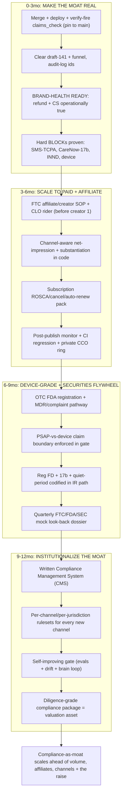

**Risks -> mitigations**
- The reignition send fires before claims_check is actually merged/deployed/verified, so compliance-in-code is fiction at the exact moment 66,224 emails land (Medvi's front-end-claim explosion). -> Hard sequencing: pre-send-checklist line 1 = gate merged + deployed + CCO acceptance test passed with audit-log ids, and deployed image pinned == main via branch protection. CCO withholds the clearance memo (and therefore Matt's send-go input) until that line is GREEN.
- Creators/affiliates are onboarded for the Phase-2 LTV push before the FTC affiliate SOP exists, reproducing Medvi's fake-AI-doctor/affiliate liability (the brand is liable for affiliate claims). -> Make the affiliate-FTC SOP (persona KYC + 16 CFR 255 disclosure + claims_check routing + CLO-reviewed agreement rider) a written hard prerequisite that blocks creator onboarding; CCO holds the go, CLO gates the rider, and the post-publish monitor samples creator assets continuously.
- Benefit-led, no-PSAP-in-headline net impression with a buried disclaimer reads as an implied hearing-aid/treatment claim to the FTC even though each sentence is literally true; or device-claim creep as the OTC line nears. -> CCO net-impression review on the RENDERED page (not source): disclaimer clear-and-conspicuous adjacent to H1 + offer, comparative claims substantiated and dated, page re-run through the gate after any edit; the PSAP-vs-OTC-device boundary enforced in the gate ruleset so device claims cannot publish pre-registration.
- Conversion/raise pressure leads someone to enable SMS (TCPA), bundle a CareNow share-promo (Securities Act 17(b)), or let INND/share-price language into product copy without the consent/counsel control. -> Enforce these as platform-level + gate-ruleset BLOCKs (not notes): Customer.io SMS disabled at the platform level, CareNow 17(b) tagged in the gate, INND/ticker/share-price terms in the BLOCK list, each with written conditions-to-lift requiring counsel sign-off; the confidential gated-term list lives in a private CCO ring.

## CPO — Product Portfolio

**Situation.** The product engine is ~90% built and 100% dormant: the TReO PSAP wedge, the iHEARtest magnet, and the AWARE/Companion/PlantID app portfolio all exist, but $0 in 90 days, no recurring SKU live, and the load-bearing $25K-gate tracker is broken (it sums $227K all-time against the gate and false-greens at ~100% on first run). The product ladder is sound on paper (TReO wedge -> iHEARtest magnet -> consumables/AWARE recurring -> OTC iHEAR line ascension at $25K + FDA) but every ascension rung is vapor: zero recurring product has billed a second cycle, no FDA registration is filed, and there is NO named human clinical reviewer engaged (the AI-CPO and the retired LHAD cannot sign device/OTC-tier claims). The CPO's defining authority this year is the clinical/device sign-off chain that unlocks the regulated OTC line, plus pacing what ships vs pauses across the product ladder and the incubator app portfolio. Honest read: the function is a roadmap-and-gatekeeper today, not a shipping engine, and its single highest-leverage 12-month job is to convert the $25K gate from a false instrument into a real one and to stand up the human-clinical chain BEFORE cash forces the OTC decision.

**Gap analysis**
| Sev | Gap | Why |
|---|---|---|
| P0 | No named human clinical reviewer is engaged; the device/OTC-tier sign-off chain that gates the entire ascension tier does not exist as a human-accountable process (only the AI-CPO and the retired LHAD, neither of whom can lawfully sign device claims). | The $25K gate unlocks the regulated OTC iHEAR line, but no copy, FDA wording, or device claim can ship without a named human clinical reviewer per the RACI. If cash hits $25K before the reviewer exists, the OTC ascension stalls at the moment of maximum momentum, or worse, ships an unsigned device claim and triggers the exact FDA-letter failure mode that killed Medvi's ceiling. |
| P0 | No recurring SKU is live on any rail; consumables and AWARE subscriptions have never billed a second cycle, so the product ladder's recurring rung (≈half the billion-dollar valuation base) is unbacked. | Every TReO sale is one-and-done with zero LTV compounding. The CPO owns product fit/cadence for consumables (domes/tubes/batteries replenishment) and AWARE; until one recurring SKU renews, the ascension math and the $9M-per-1%-churn-at-50K-subs thesis are pure model with no product behind them. |
| P0 | The $25K-gate tracker measures all-time revenue, not new reignition revenue, so the single instrument that authorizes ~$10K FDA spend is broken and would green-light an unfunded regulated launch on phantom revenue. | The CPO is the consumer of this gate, FDA-prep spend triggers on it. A false ~100% reading would force a premature OTC-line decision and FDA registration spend against $0 of actual new cash. |
| P1 | iHEARtest (the magnet, the unfair top-of-funnel) is not wired as a product into the TReO offer; it is a free screening app with no instrumented hand-off to the wedge SKU and no premium/upsell path. | The magnet is the highest-intent, self-qualifying funnel and the company's structural advantage over Medvi (who had to manufacture intent). If the screening result does not route into the TReO offer with a clean, compliant 'you may benefit from amplification' hand-off, the entire wedge starves regardless of list reignition. |
| P1 | FDA OTC-hearing-aid registration pathway, labeling, and 510(k)-or-self-cert determination for the Matrix/Axis/Linx line is unscoped; the ascension SKUs are listed at prices ($349/$329/$239) with no regulatory readiness work done. | The OTC line is the ascension margin engine, but OTC hearing aids are an FDA-regulated category (21 CFR 800.30). Without a scoped pathway and labeling-ready clinical copy staged BEHIND the gate, the $25K trigger cannot actually convert to a sellable OTC product, only to a months-long scramble. |
| P1 | The incubator app portfolio (AWARE, Companion, PlantID, Flatstick) has no portfolio-level revenue thesis, prioritization, or kill/keep discipline; apps ship as engineering proof points with no product owner deciding which monetize vs which pause. | At ~$0 marginal cost the apps are real incubator revenue + INND narrative proof points, but undirected they consume build cycles with no revenue accountability. The CPO must decide each quarter what ships and what is paused so the portfolio funds proof, not drift. |
| P2 | No clinical substantiation file exists for TReO's comparative and benefit claims, and the PSAP-vs-hearing-aid net-impression line is enforced only by the (unmerged) claims_check gate, not by a CPO-owned product-claims spec. | The CPO owns the product-truth layer beneath the CCO's claims gate. Comparative price claims ('$299/side at CVS') and benefit framing need dated, CPO-held substantiation so the compliance moat rests on real product facts, not just a regex blocklist. |

**AI operating model (in-house vs outsourced).** MIRRORS MEDVI'S 3-LAYER MODEL for the product lane: (LAYER 1 = AI brain, in-house, ~$0 marginal cost) The AI-CPO persona runs daily product ops on grant/credit infra: roadmap + ship/pause decisions written through the kb-memory cpo ledger (--tags moore-playbook); company-brain federated queries to keep product decisions grounded in the live finance/commerce/legal rooms; focus-group-loop (20 personas: 10 customers, 5 audiology/clinical pros, 5 investor twins) looped to ≥90% as the product-quality gate on every funnel page, app build, and OTC label draft, cataloged to the shared brain so one app's QA makes every app smarter; persona-focus-group + ios-qa + release-readiness skills as the pre-ship product gates; boot-gate + eval-runner for any in-app LLM feature; aso-growth + monetization skills for app-portfolio store presence and pricing; designer skill (Azure/ElevenLabs grants) for product visuals/screenshots; PostHog (project-per-app, $50k credit) as the product source-of-truth for screening-completion, offer-CTR, attach-rate, and second-cycle retention. The AI-CPO also DRAFTS all OTC/device-tier and iHEARtest clinical copy and the FDA labeling language. (LAYER 2 = OUTSOURCED ATOMS) Everything physical/regulated below the product spec is bought, never hired: TReO hardware = iHEAR Medical (existing vendor); refurb/3PL fulfillment of the 10,298-unit pool = sourced via 3-vendor RFQ (commerce lane); audiology validation, FDA regulatory consulting, and the OTC labeling review = contracted services, not staff; app icon/screenshot/video render = grant-funded AI render pipeline; clinical-trial/competitive intelligence = the Clinical_Trials MCP. (LAYER 3 = HUMAN-GATED, the irreducible set) A NAMED HUMAN CLINICAL REVIEWER (engaged by Matt) signs every device/OTC-tier and any health-adjacent product claim before it ships, the one signature the AI-CPO is explicitly forbidden to forge; Matt authorizes FDA registration spend at the $25K cash-bridge trigger, sets final pricing, and approves any new financial commitment; the CCO claims_check gate clears all copy after CPO substantiation; counsel gates anything touching INND/CareNow share-bundle (Securities Act 17(b) BLOCK). The CPO function thus runs as one AI operator + a thin contracted-services bench + two human signatures (clinical reviewer, Matt), exactly the Medvi 2-person shape applied to the product lane.

**12-month roadmap**

#### 0-3mo — Make the gate real, ship the first recurring SKU, and stand up the human-clinical chain (extends EXECUTION-PROGRAM Phases 1-5 on the product side)
| Initiative | Owner | Gate | Target |
|---|---|---|---|
| Fix the $25K-gate product instrument: define REIGNITION_START_DATE so the gate measures only NEW TReO revenue from reignition day, and define the CPO-side gate spec (what cumulative-new-revenue number authorizes which OTC-prep action). Pair with CFO on revenue-tracker.mjs. | CPO (CFO implements) | none (build-now) | Gate reads 0% at reignition start and tracks only post-start orders; CPO-signed gate spec in the cpo ledger |
| Spec and ship the consumables replenishment subscription (domes/tubes/batteries) as the FIRST recurring SKU, with a post-purchase attach offer on the TReO order. Own product fit, cadence (60/90-day), and price; hand the rail to CRO/developer. | CPO (CRO/developer build) | checkout-proof PASS + Stripe payouts enabled (Matt/CTO) | ≥1 consumables subscription bills a SECOND cycle; ≥15% attach rate on first 100 TReO orders |
| Engage the named human clinical reviewer: write the role spec, sign-off SOP, and the device/OTC-tier claim chain (CPO drafts -> human reviewer signs -> CCO claims_check -> Matt); get Matt to engage a contracted audiologist/clinical reviewer. | CPO (Matt engages) | Matt (engagement); counsel for scope | Named reviewer under contract; signed SOP ratified as the operating contract BEFORE the $25K gate can fire |
| Wire iHEARtest as a product into the funnel: instrument the screening-result -> 'you may benefit from amplification' -> TReO offer hand-off in PostHog, run it through focus-group-loop to ≥90% and claims_check, with the PSAP net-impression disclaimer clear-and-conspicuous. | CPO (developer/CRO) | CCO claims_check | Screening-to-offer hand-off live + instrumented; ≥90% focus-group score; magnet launched as top-of-funnel |
| Build the TReO product-claims substantiation file (comparative price + benefit claims, dated sources) so the compliance moat rests on CPO-held product facts. | CPO (CCO consumes) | none | cpo/substantiation/treo-claims.md cites a dated source for every comparative/benefit claim; CCO sign-off |

*Exit criteria:* The $25K gate measures real new revenue; one recurring SKU has renewed a second cycle; the named human clinical reviewer is engaged with a ratified sign-off SOP; iHEARtest is live as the instrumented magnet feeding the TReO offer.
  
*KPI targets:* Recurring: ≥25 active subscribers + first non-zero MRR by week 5, ≥70% reach cycle 2. Magnet: screening-completion -> offer-CTR baseline set. Gate: tracker accurate to the dollar. Clinical: reviewer engaged.

#### 3-6mo — Scope the FDA OTC pathway behind the gate and prove the second recurring SKU (AWARE)
| Initiative | Owner | Gate | Target |
|---|---|---|---|
| Scope the FDA OTC-hearing-aid regulatory pathway for the iHEAR Matrix/Axis/Linx line: determine self-certification vs 510(k) under 21 CFR 800.30, build the labeling-ready clinical copy draft, and stage it BEHIND the gate so the $25K trigger converts to a sellable product, not a scramble. Use Clinical_Trials MCP + contracted regulatory consultant. | CPO (regulatory consultant; named reviewer signs) | named human clinical reviewer + Matt (consultant spend) | Written OTC pathway determination + labeling draft staged + reviewer-signed, ready to file at the $25K trigger |
| Ship AWARE as the SECOND recurring SKU: define the entitlement/cross-sell from the TReO order-status page and day-7 email into the AWARE app subscription (RevenueCat already live). Keep CareNow OUT (Securities Act 17(b) BLOCK). | CPO (CRO/developer) | counsel (AWARE copy non-clinical); CCO | AWARE RevenueCat offering live; a TReO buyer can reach an AWARE subscribe path; test subscription emits subscription_renewed to PostHog |
| Run the portfolio ship/pause review: decide which incubator apps monetize now (iHEARtest premium, AWARE) vs which pause (Companion/PlantID/Flatstick) based on PostHog revenue + retention signal; document the kill/keep decision per app. | CPO | none | Per-app ship/pause decision in the cpo ledger; build cycles concentrated on revenue-positive apps |
| Stand up the OTC-line product spec + pricing-test plan (Matrix $349 active; Axis/Linx reserve) with a focus-group-loop validation of the OTC value framing to the warmed base. | CPO (CFO pricing; Matt final price) | Matt (final pricing) | OTC product spec + ≥90% focus-group score on the OTC framing, staged for ascension |

*Exit criteria:* FDA OTC pathway is scoped, labeling-drafted, and reviewer-signed and waiting behind the gate; two recurring SKUs (consumables + AWARE) are live and renewing; the app portfolio has an explicit monetize/pause map.
  
*KPI targets:* Recurring: ≥2 live SKUs, blended ≤8% monthly churn, ≥3:1 LTV:CAC on subs. Portfolio: ≥1 app generating non-zero revenue. OTC: pathway determination complete.

#### 6-9mo — Cross the $25K gate and execute the OTC ascension
| Initiative | Owner | Gate | Target |
|---|---|---|---|
| On cumulative $25K NEW reignition revenue, execute SOP-7: CPO drafts final OTC-line copy/FDA wording -> named human reviewer signs -> CCO claims_check -> Matt authorizes ~$10K FDA registration at the cash-bridge trigger -> file. | CPO + named reviewer (Matt authorizes spend) | $25K gate + named reviewer + Matt | FDA OTC registration filed; OTC line cleared to sell to the warm base |
| Launch the OTC iHEAR Matrix ($349) to the warmed/converted base as the ascension SKU, with the screening-result -> OTC upsell path for higher-need users routed off iHEARtest. | CPO (CRO funnel) | FDA clearance + CCO + Matt pricing | First OTC-line orders from the existing TReO/iHEARtest base; ascension AOV lift measured |
| Layer consumables/AWARE retention onto OTC buyers (the OTC line has its own consumables/replenishment tail) and wire day-14/45 churn-save into both device tiers. | CPO (lifecycle/CRO) | none | OTC buyers attach a recurring SKU at ≥15%; churn-save drips live on device cohorts |
| Promote/pause the next portfolio tier based on 3-6mo signal; greenlight the highest-LTV app for a paid push and sunset any non-performer via the sunset-protocol skill. | CPO | Matt (any paid push spend) | Portfolio pruned to revenue-positive set; one app on a funded growth push |

*Exit criteria:* OTC line is FDA-registered and selling to the warm base; the full product ladder (wedge -> magnet -> recurring -> ascension) is live end-to-end with the recurring tail attached to device buyers.
  
*KPI targets:* Ascension: first OTC revenue + measurable AOV lift. Recurring: MRR growing on a renewing base. Funnel: screening -> device CVR baselined across both PSAP and OTC tiers.

#### 9-12mo — Compound the ladder into a recurring base + portfolio proof for the INND narrative
| Initiative | Owner | Gate | Target |
|---|---|---|---|
| Scale the recurring engine across the full base (consumables + AWARE on PSAP and OTC buyers); drive the LTV:CAC and churn levers the valuation thesis rests on, with monthly cohort review. | CPO (CFO economics) | none | ≥50% of device buyers on a recurring SKU; blended monthly churn ≤8%; LTV:CAC ≥3:1 sustained |
| Stage the OTC reserve tier (Axis $329 / Linx $239) and the Hearing Assist line as the next ascension rungs, each behind the same named-reviewer sign-off chain, sequenced on demonstrated OTC-Matrix sell-through. | CPO (named reviewer; Matt pricing) | named reviewer + Matt | Axis/Linx product + labeling staged and reviewer-signed, ready to release on Matrix sell-through |
| Package the product portfolio (TReO, OTC line, recurring base, monetizing apps) into a framework-level product-proof artifact for the Capital/IR lane (NO share counts/prices/valuations; counsel-gated) so operating product wins feed the disclosable INND narrative. | CPO (IR consumes; counsel gates) | counsel + Matt (any INND/IR use) | Counsel-cleared product-proof summary usable in framework-level IR narrative |
| Ratify the 12-month product operating contract v2: refreshed product ladder, portfolio ship/pause map, clinical sign-off chain, and the next-year ascension sequence. | CPO (Matt ratifies) | Matt | v2 operating contract in the cpo ledger + ratified by Matt |

*Exit criteria:* A renewing recurring base + a live OTC ascension line + a pruned monetizing app portfolio, with every regulated rung behind a working human-clinical sign-off chain and the product story feeding (counsel-gated) the INND narrative.
  
*KPI targets:* Recurring base ≥50% of device buyers; LTV:CAC ≥3:1; OTC reserve tier staged; ≥2 portfolio apps revenue-positive; clinical chain has signed every shipped device claim with zero unsigned ships.

**Process diagram**
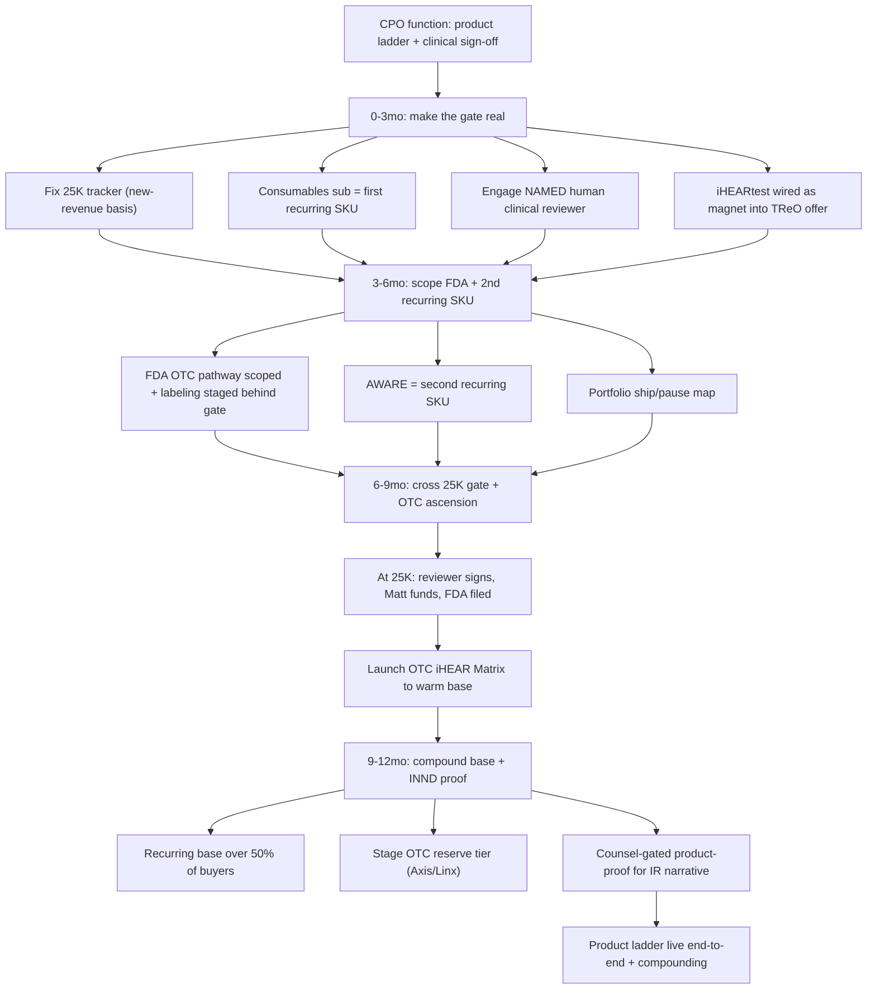

**Risks -> mitigations**
- Cash hits the $25K gate before the named human clinical reviewer is engaged, forcing either an OTC-line stall at peak momentum or an unsigned device claim that triggers an FDA letter (Medvi's exact ceiling). -> Treat reviewer engagement as a 0-3mo P0 deliverable, sequenced AHEAD of the cash trigger; the ratified sign-off SOP is a hard gate that physically blocks any OTC/device copy from shipping unsigned, enforced in claims_check, not just documented.
- Recurring SKUs never renew (one-and-done device sales), leaving the ~half-of-valuation recurring thesis unbacked and the ascension math fictional. -> Gate the whole recurring narrative on one real second-cycle bill by week 5; if attach <8% or second-cycle <50% after 100 orders, freeze the recurring expansion and re-spec product fit/cadence/price BEFORE any paid traffic, rather than scaling a broken rail.
- The OTC FDA pathway turns out to require a 510(k) or clinical data the company cannot self-certify, making the ascension tier far slower/costlier than the $349 price implies. -> Scope the 21 CFR 800.30 determination in 3-6mo with a contracted regulatory consultant BEFORE the gate fires, so the pathway, cost, and timeline are known facts staged behind the gate; keep the PSAP wedge + recurring base as the standalone business if OTC slips.
- The incubator app portfolio drains build cycles as undirected proof points with no revenue accountability, starving the core ladder. -> Quarterly CPO ship/pause review driven by PostHog revenue/retention signal; explicit kill/keep decision per app via the sunset-protocol skill, concentrating build on revenue-positive apps and pausing the rest rather than maintaining all in parallel.

## Capital / IR — INND Flywheel

**Situation.** The Capital/IR function is fully documented and architecturally complete (INND-CAPITAL-FLYWHEEL.md, INND-ROLLUP-LANDSCAPE.md, the raise-ops and ir-support skills) but 100 percent cold: zero counsel retained, zero artifacts built, zero disclosable traction. Two absolute upstream blockers govern everything I do: (1) no barred securities counsel is engaged (the master unlock for every rung), and (2) the 28-credential ops-leak / GCP SA / PostHog key rotation is DEFERRED with secret-scan CI red, an explicit HARD GATE that blocks any investor or public-facing action. The deepest constraint is honest: capital is strictly downstream of operating traction, and with the store dormant ($0 in 90 days), there is no legitimate, Reg-FD-compliant story to raise on yet, so my entire 12-month job until traction arrives is to assemble counsel-ready packets and the data-room scaffold, never to solicit anyone. The EXECUTION-PROGRAM already specifies my near-term 12-action prepare-and-flag bundle (days 1-12) and Phase 6 (weeks 8-24); this plan extends that into the full 12-month arc, advancing each rung only as gates clear.

**Gap analysis**
| Sev | Gap | Why |
|---|---|---|
| P0 | No barred securities counsel retained (the master unlock for every capital rung: Reg D 506(c) structure, Reg CF portal, reverse split, roll-up, disclosure-controls calendar) | Per INND-CAPITAL-FLYWHEEL section 6.1 and 7, counsel selects vehicle, structure, accredited-verification method, Rule 506(d) bad-actor checks, and all filings. Until a barred securities attorney is engaged the fleet can only draft. No Form D, Form C, reverse split, or roll-up approach is permissible. Matt-only decision. |
| P0 | GCP SA + PostHog + 28-credential ops-leak rotation incomplete, secret-scan CI red | INND-CAPITAL-FLYWHEEL section 6.2 states key rotation blocks any investor/public action until done. Any investor-facing step before this closes is reckless and could taint a raise. CTO-owned; I track and gate, never advance a rung while CI is red. |
| P0 | No legitimate disclosable operating traction (store dormant, $0/90 days) to support any raise narrative | Moore Playbook section 7-8: capital is downstream of warm-list conversion. A capital story built on traction that does not exist risks an unregistered-offer / market-conditioning / Reg FD violation and an SEC-credibility own-goal. The investor-update template must stay parked and unpopulated until traction is real and counsel-reviewed. |
| P1 | No counsel-reviewed Reg D 506(c) data-room (access-controlled, indexed, sections complete but values empty) and no accredited-verification method selected | 506(c) requires reasonable steps to verify accredited status; self-certification is barred. The data-room scaffold (corporate/charter, cap-table placeholder, financials status, material contracts, 52+ patent IP schedule, risk factors, litigation-disclosure placeholder, offering-doc slots) does not exist in a flaggable form, so even on counsel retention there is nothing to hand over. |
| P1 | No Reg CF testing-the-waters reservation funnel built off the owned 66,224 list | Reservations convert ~35-40 percent vs ~1-3 percent cold (raise-ops). The owned list is the unfair advantage that lets the retail rung work, but no compliant interest-only (no-money, TTW-legend, claims_check-passed) reservation page or Customer.io segment is staged, and the financial-statement review/audit tier is undetermined, so the broad retail flywheel cannot turn when its time comes. |
| P1 | Audited/reviewed financials readiness undetermined, which gates the Reg CF tiers, Reg A+ Tier 2, and any S-4 roll-up deal | Reg CF tiers escalate from self-certified to reviewed-CPA to audited as raise size grows; Reg A+ Tier 2 and S-4 stock-for-stock mergers require audited financials and Rule 3-05 audited target financials. A CFO+counsel audit-readiness program has a long lead time; if not started early it becomes the binding constraint on the larger, later rungs and on roll-up currency. |
| P2 | Reverse-split (FINRA 6490) prerequisites unassembled, transfer agent not lined up, current-SEC-reporting status unverified | 6490 needs board resolution + charter amendment + simultaneous Transfer-Agent Verification Form, filed >=10 calendar days before the record date, and FINRA may decline if the issuer is not current in reporting. A reverse split is an uplisting prerequisite that materially improves roll-up currency, so the prerequisites and a current-reporting check are prepare-able now without touching the whether/when/ratio decision (board + counsel only). |
| P1 | No operationalized securities-firewall pre-publish checklist or disclosure-controls calendar; IR cadence not standardized | Section 5 (Reg FD, no-promotion, PSLRA, 17(b), Rule 144 affiliate, FINRA 24-09 quiet period) must be a runnable gate every ir-support draft passes, plus a periodic disclosure-committee/filing-deadline cadence. The CRO already flagged investor-targeted book distribution as a Reg FD/market-conditioning risk, proving the firewall needs to be enforced in code, not just stated. |

**AI operating model (in-house vs outsourced).** I run as a single AI Capital/IR seat (the `capital` lane) mirroring Medvi's 3-layer model, with one inviolable difference: my lane is the GATED lane, so the AI prepares and the human plus counsel decide every investor-facing word.

LAYER 1 - AI automation (what the fleet does at ~$0 marginal cost): The `raise-ops` skill operates the campaign mechanics (vehicle selection scaffolding, reservation funnel, investor CRM, data-room readiness, campaign timeline/fee tracking) and `ir-support` drafts all factual, Reg-FD-safe materials (shareholder updates, FAQ from the 21 Reg-FD-defensive templates, data-room and investor-update drafts). Supporting fleet plumbing: the access-controlled Azure Blob data room via the cfo-store / cfo-onedrive pattern (non-PHI ring), indexed by doc-indexer so counsel and DD can search it; company-brain federates the answer layer across the finance/legal/commerce rooms (legal-personal and INND/MNPI content stay segregated); the CFO data room (QBO/Xero exports already staged) feeds financial-statement-tier and audit-readiness analysis; Customer.io (ws 193366) + lifecycle build the TTW reservation segment off the locked 66,224 list; claims_check + the operationalized securities-firewall checklist run as hard pre-publish gates on every draft; kb-memory (`--agent capital --tags moore-playbook,capital`) is the write-through ledger and the coo private lane holds all confidential capital-structure specifics. fleet-dispatch tracks the cross-agent gates (CTO key-rotation, CFO audit readiness, CPO/clinical-traction).

LAYER 2 - outsourced atoms (services, never hires): barred securities counsel (selects vehicle, structure, accredited-verification method, runs all filings, owns every disclosure judgment); the SEC-registered funding portal / broker-dealer for Reg CF (e.g. WeFunder - the issuer legally cannot run CF directly); a CPA/audit firm for reviewed/audited financials; the transfer agent (runs the FINRA 6490 process and the Transfer-Agent Verification Form); third-party accredited-verification letter services (CPA/attorney/registered-BD) for 506(c); EDGAR filing agent. Atoms are contracted, not employed.

LAYER 3 - the thin human layer (Matt + counsel, hard gates only): retain counsel (the master unlock), every send-go and filing, the reverse-split whether/when/ratio (board + counsel), any roll-up target approach/LOI/valuation/share issuance, audited-financials authorization, and all Rule 144 affiliate trading (the Moores are affiliates; the fleet never advises or facilitates trading). The fixed gate chain on every output: AI drafts -> counsel reviews -> Matt approves -> then and only then sent/filed. The capital agent never publishes investor content; the data-room index ships empty of values; no share counts, prices, floats, or valuations ever appear in any artifact the fleet handles.

**12-month roadmap**

#### 0-3mo — Prepare-and-flag the full counsel-onboarding bundle; gate everything on counsel + key-rotation + traction (extends EXECUTION-PROGRAM days 1-12)
| Initiative | Owner | Gate | Target |
|---|---|---|---|
| Draft the one-page 'Engage Securities Counsel' decision brief for Matt: scope = capital chain / live Reg D 506(c) / Reg CF portal selection / reverse-split FINRA-6490 posture / litigation-disclosure posture / disclosure-controls calendar; include 3 research-only barred-securities-counsel candidate profiles (OTC/micro-cap, Reg A+/CF track record) and an engagement-letter checklist; note this is the master unlock per flywheel 6.1/7 | Capital/IR | Matt decides retention (master unlock) | Brief in coo private lane by day 2, flagged ATTORNEY REVIEW REQUIRED, logged to capital ledger, no outreach |
| Open and track the key-rotation HARD GATE: fleet-dispatch CTO/CCO for GCP SA + PostHog + 28-cred ops-leak rotation status; record 'no investor/public step until rotation done and secret-scan CI green' as a blocking precondition on every capital step (do NOT rotate; CTO-owned) | Capital/IR (tracking), CTO (executes) | CTO closes rotation; CI green | Capital-ledger blocking-precondition entry day 1; weekly status pull until green |
| Stand up the empty, access-controlled Reg D 506(c) data-room INDEX (folder tree + per-section document checklist, no values) in the Azure Blob non-PHI data room via cfo-store, indexed by doc-indexer: corporate/charter, cap-table placeholder, financials status, material contracts, 52+ patent IP schedule, risk factors, litigation-disclosure placeholder, offering-doc slots; root-flagged ATTORNEY REVIEW REQUIRED | Capital/IR + CFO | Counsel reviews before any investor sees it | Complete-but-empty indexed data room by day 5 |
| Write the accredited-verification METHOD OPTIONS memo + draft Rule 506(d) bad-actor questionnaire: (a) March-2025 SEC no-action high-minimum path ($200K/natural person, $1M/entity + no-third-party-financing rep), (b) document review, (c) third-party CPA/attorney/BD letters; state explicitly 506(c) bars self-certification | Capital/IR | Counsel selects the method | Memo + 506(d) questionnaire in coo private lane by day 6, no method treated as chosen |
| Operationalize the securities firewall as a runnable pre-publish CHECKLIST (Reg FD no-selective-disclosure, no-promotion/no-share-price, PSLRA cautionary legend, 17(b), Rule 144 affiliate counsel-only, FINRA 24-09 quiet period) wired as a hard gate on every ir-support draft, plus a draft disclosure-controls calendar for counsel to ratify | Capital/IR + CCO | Counsel ratifies the calendar and owns all disclosure judgments | Firewall checklist live as a gate + draft calendar by day 10 |
| Package everything into ONE counsel-onboarding bundle index (data-room index, verification memo + 506(d), Reg CF tier note + TTW draft, 6490 prerequisites, firewall checklist + disclosure-controls calendar, parked investor-update template) so the moment Matt retains counsel the whole stack hands over in one move | Capital/IR | Matt + counsel (the handover) | Bundle index by day 12; 100 percent of the 7 section-6 packets drafted + flagged |

*Exit criteria:* All 7 prepare-and-flag packets drafted and flagged ATTORNEY REVIEW REQUIRED; the counsel-onboarding bundle is complete and one-move-handoverable; the key-rotation hard gate is recorded as a blocking precondition on every step; nothing solicited, no MNPI/values in any artifact.
  
*KPI targets:* Bundle completeness 100 percent of 7 packets by day 12 (escalate to Matt if <70 percent = blocked on capacity not permission); securities-firewall pre-publish gate pass rate 100 percent (zero tolerance); zero investor-facing sends.

#### 3-6mo — Counsel onboarding + Reg D 506(c) readiness behind the gates; build the TTW reservation funnel as a parked artifact; start the audit-readiness clock
| Initiative | Owner | Gate | Target |
|---|---|---|---|
| On counsel retention (if it lands), hand over the full bundle in one move and support counsel's vehicle/structure/sequence selection; convert the data-room index from empty scaffold to counsel-reviewed populated room (values added only inside counsel review, never in any repo) | Capital/IR + counsel | Counsel retained (master unlock); counsel directs all population | Data room counsel-reviewed and DD-ready within 4 weeks of retention |
| Stage the Reg CF testing-the-waters RESERVATION FUNNEL as a no-money interest-only artifact: draft 'register interest' landing page + dedicated Customer.io segment carved from the locked 66,224, carrying the TTW legend, accepting no money/no commitment, passing claims_check + the firewall checklist; zero recipients targeted, no send | Capital/IR + lifecycle/CRO | Counsel clears TTW materials (file with Form C) + Matt send-go | TTW page + segment staged, labeled DRAFT-NO SOLICITATION; reservation goal 1,500-3,000 set per section 2 |
| Compile the Reg CF financial-statement-tier readiness note with the CFO and start the audit-readiness program: map tiers (<=$124K self-cert; $124K-$618K reviewed CPA; $618K-$1.235M reviewed/audited; >$1.235M audited) against current QBO/Xero state; engage a CPA/audit firm scoping conversation (atom) so audited financials lead time does not become the binding constraint later | Capital/IR + CFO | Counsel + CFO confirm tier and audit scope; Matt authorizes audit spend | Tier-readiness note + audit-firm scoping started; no raise size committed |
| Assemble the reverse-split (FINRA 6490) PREREQUISITES checklist (no initiation): board authorization + charter amendment, Company-Related Action Notification, Transfer-Agent Verification Form, 10b-17 fee schedule, >=10-day-before-record-date timing; research-only OTC transfer-agent shortlist + a current-in-SEC-reporting status question for counsel | Capital/IR | Board + counsel decide whether/when/ratio; transfer agent runs 6490 | 6490 prerequisites checklist + transfer-agent options; whether/when/ratio explicitly UNDECIDED |
| Maintain the parked Reg-FD-safe investor-update TEMPLATE (PSLRA legend, gate-chain header, no numbers/no share-price) and a draft IR-cadence calendar, held until real disclosable traction exists; do not populate or send | Capital/IR | Counsel reviews + Matt approves before any release | Template + cadence calendar parked, carrying no MNPI, awaiting the traction trigger |

*Exit criteria:* Either counsel is retained and the data room is DD-ready, or the entire stack is one-move-ready and the blocker is explicitly counsel-retention-pending (escalated to Matt); the TTW reservation funnel is built and parked; the audit-readiness clock has started; reverse-split prerequisites are assembled with the decision left to board + counsel.
  
*KPI targets:* Counsel retained = binary (until signed, scale drafting/scaffolding only); data-room DD-readiness 100 percent of section checklist if retained; TTW reservations counted ONLY after counsel clears + Matt send-go (target 1,500-3,000; if <1,500 after launch, defer the retail rung and lean on 506(c)); audit-readiness gap quantified per candidate raise band.

#### 6-9mo — Turn the first rung as disclosable traction arrives: support the live Reg D 506(c) and launch Reg CF off the reservation funnel; begin the IR cadence; build the non-binding roll-up screen
| Initiative | Owner | Gate | Target |
|---|---|---|---|
| Support counsel running the live Reg D 506(c) accredited tranche: operate the investor CRM/outreach sequences (counsel-approved copy only), keep the data room current, track committed-vs-target-vs-fees, and prepare Form D inputs for counsel filing within 15 days of first sale; front-load week 1 to 20-30 percent of target | Capital/IR + counsel + Matt | Counsel structures + files; Matt approves every investor-facing item; accredited status VERIFIED (not self-certified) | 506(c) operating with the milestone-funnel cadence; Form D inputs ready on first sale |
| Launch the Reg CF / WeFunder retail rung once counsel + portal are set and the financial-statement tier is met: convert the parked TTW reservations into the live campaign through the registered funding portal, file Form C on EDGAR before launch, run Form C-U progress updates; all TTW materials file with the Form C | Capital/IR + portal (atom) + counsel | Counsel + portal selection; Form C filed; Matt send-go | Reg CF live off the reservation funnel; reservation-to-investment conversion tracked (~35-40 percent vs ~1-3 percent cold benchmark) |
| Begin the Reg-FD-safe IR cadence to activate the shareholder base: populate the parked investor-update template with real, already-disclosable operating results (reignition + recurring traction), run it through the firewall gate chain (counsel -> Matt) before any release; factual disclosure only, no share-price talk | Capital/IR + counsel + Matt | Counsel reviews + Matt approves each release; Reg FD broad-disclosure discipline | First counsel-reviewed factual shareholder update issued; standing cadence established |
| Build the non-binding roll-up TARGET SCREEN against the section-2 scorecard (Tier-1: consumables/private-label A2, screening/tinnitus apps A3, opportunistic distressed IP) - research-only, NO outreach; pair with the multiple-arbitrage model so a stock-funded deal is analyzable the moment currency supports it | Capital/IR + CFO | Matt explicit go to even build a scored shortlist; any approach/LOI/valuation = Matt + counsel + CFO | Scored Tier-1 shortlist + arbitrage model; zero companies contacted |

*Exit criteria:* At least the Reg D 506(c) rung is operating with counsel running structure/filings and accredited verification enforced; the Reg CF retail rung is live (or explicitly deferred for low reservations); the IR cadence has issued its first counsel-reviewed factual update; a non-binding scored roll-up shortlist exists with zero outreach.
  
*KPI targets:* 506(c): front-load 20-30 percent of target in week 1; 100 percent accredited verification (never self-cert). Reg CF: reservation-to-investment conversion ~35-40 percent; all-in fees ~11-13 percent tracked. IR: 100 percent of releases pass the firewall gate chain before issue. Roll-up: 0 contacts (research-only).

#### 9-12mo — Compound the flywheel: uplisting posture (reverse split decision-ready), Reg A+ readiness for the scale raise, and the first stock-as-currency roll-up move - each strictly counsel/board-gated
| Initiative | Owner | Gate | Target |
|---|---|---|---|
| Bring the reverse-split (FINRA 6490) decision to the board + counsel as a decision-ready package (uplisting prerequisite that improves roll-up currency): prerequisites assembled, transfer agent selected, current-SEC-reporting status confirmed, sequence relative to any uplisting goal mapped; the fleet does NOT initiate | Capital/IR (prepares) + board + counsel + transfer agent (decide/execute) | Board + counsel decide whether/when/ratio; transfer agent runs 6490; filed >=10 days before record date | Decision-ready 6490 package on the board's desk; whether/when/ratio is a board + counsel call |
| Prepare Reg A+ readiness for the larger, later raise: with audited financials in hand (Tier 2 up to $75M/12mo, blue-sky preempted, ongoing 1-K/1-SA/1-U), draft the Form 1-A inputs for counsel (SEC-qualified before sales, ~3-5 months lead), with TTW permitted; framed as the scale instrument once traction + audited financials support it | Capital/IR + CFO + counsel | Counsel qualifies Form 1-A before any sale; audited financials complete; Matt authorizes | Form 1-A input package counsel-ready; Reg A+ teed up as the next-phase scale rung |
| On Matt + counsel + CFO go (and only then), support the first stock-as-currency roll-up move on a Tier-1 target: counsel selects S-4 (registered, audited target financials + pro formas) vs Reg D 506 exempt issuance (restricted, Rule 144 hold, registration rights); CFO models accretion and Rule 3-05 audited-target-financials disclosure on an 8-K within 75 days | Capital/IR + CFO + counsel + Matt | Matt + counsel + CFO approve target/structure/issuance; SEC disclosure on material acquisition | One structured, counsel-led roll-up move analyzable and executable; discipline on stock-price/deal-sizing to avoid the dilution-spiral trap |
| Mature the IR machine into a standing Reg-FD-compliant disclosure operation: disclosure-committee touchpoints, filing-deadline reminders, a quarterly factual shareholder-update rhythm, and the 21-template IR FAQ wired so inbound investor questions get consistent, firewall-passed, counsel-reviewed responses | Capital/IR + counsel | Counsel owns all disclosure judgments; Matt approves releases | Quarterly IR cadence operating; disclosure-controls calendar ratified and running; 100 percent firewall gate pass rate |

*Exit criteria:* The capital ladder is sequenced and turning under counsel (506(c) + Reg CF operating, Reg A+ teed up, reverse-split decision-ready for the board); a first stock-as-currency roll-up move is structurable on Matt + counsel + CFO go; the IR cadence is a standing compliant operation - the flywheel can legitimately compound (capital + acquisition currency funding more operating traction) with the firewall enforced in code throughout.
  
*KPI targets:* Reverse split: decision-ready package delivered (board decides). Reg A+: Form 1-A inputs counsel-ready with audited financials. Roll-up: any move only on multiple-arbitrage-positive math + counsel-cleared structure + Rule 3-05 disclosure plan; 0 unauthorized outreach. IR: quarterly cadence + 100 percent firewall pass rate; zero Reg FD/17(b)/MNPI breaches all year.

**Process diagram**
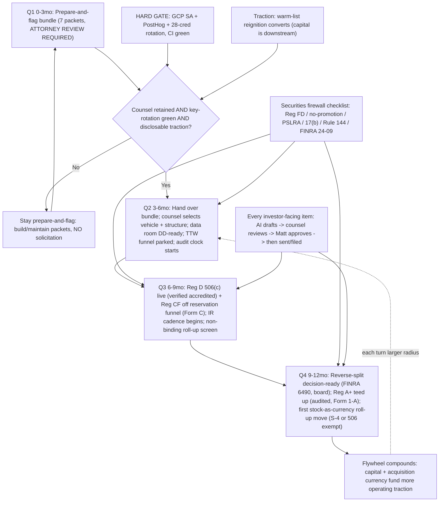

**Risks -> mitigations**
- Premature solicitation: a 'reservation' or investor-update draft is mistaken for a live offer and goes out before counsel + Matt clear it (Reg FD / unregistered-offer / market-conditioning exposure; the CRO already flagged investor-targeted book distribution as a Reg FD risk). -> Every artifact carries an ATTORNEY REVIEW REQUIRED / NO SOLICITATION header; the TTW page accepts no money and targets zero recipients until the gate clears; the section-5 firewall checklist runs as a hard pre-publish gate on every ir-support draft; the capital agent never publishes investor content. The gate chain (AI drafts -> counsel -> Matt -> then sent) is enforced in code.
- Acting on the capital engine before the key-rotation HARD GATE closes (28-cred ops leak still DEFERRED, secret-scan CI red), tainting a raise with a known security exposure. -> Record the rotation as a blocking precondition on every downstream capital step (Q1 initiative 2); do not advance any rung while CI is red; track CTO ownership via fleet-dispatch and confirm green in writing before any investor-facing move per flywheel section 6.2.
- The capital narrative outruns disclosable facts (store was dormant, $0/90 days), risking a story built on traction that does not yet legitimately exist. -> Gate all IR narrative to real, disclosable operating results (capital is downstream of warm-list conversion per Moore Playbook 7-8); the investor-update template stays parked and unpopulated until traction is real, counsel-reviewed, and broadly disclosable; no rung fires on aspiration.
- MNPI / confidential capital-structure specifics (share counts, prices, cap-table chain, valuations, litigation detail) leak into a repo or a fleet-handled draft; or a thinly-traded sub-penny stock makes roll-up currency weak and a stock-funded deal triggers a dilution spiral. -> All confidential specifics stay in the coo private lane + with counsel, never in a repo; the data-room index ships empty of values; no share counts/prices in any drafted material. For roll-up, sequence uplisting/reverse-split + a healthier multiple BEFORE any aggressive stock-funded deal, enforce stock-price/deal-sizing discipline, and gate every approach/valuation/issuance to Matt + counsel + CFO with the Rule 3-05 audited-target-financials disclosure planned up front.

## Commerce — Inventory & Channels

**Situation.** Today the Commerce function is mid-paragraph: the store is PROVEN BUT DORMANT (~$227,290 all-time / 1,484 orders, $0 last 90 days, 0 TReO units in 90 days), checkout is still UNPROVEN end-to-end (Stripe payouts_enabled=FALSE, no bank linked), and ~10,298 owned legacy units (~$2-3M retail) sit in a warehouse with NO refurb/3PL partner, no per-unit cost-out, and no returns-routing. Amazon SP-API is connected and write-capable for OTCHealth Inc. (seller A2OUVRQWO8BC1S, US/CA/MX/BR) via the amazon-sp-api skill, but the iHEAR Brand Registry path is gated on the abandoned 2019 iHEAR trademark (refile, ~$300-2k) and no live listing exists; Gumroad (the only zero-gate cash lane) is drafted but unshipped. So the function owns three lanes that are all armed-but-idle: liquidate the owned atoms, scale the three channels, and stand up the physical-ops (fulfillment/returns/HSA-FSA) that everything else depends on — none has executed in ~20 days. EXTENDS the near-term EXECUTION-PROGRAM (Phases 0-6); this is the 12-month build on top of first-cash.

**Gap analysis**
| Sev | Gap | Why |
|---|---|---|
| P0 | No refurb/3PL partner and no per-unit economics for the 10,298-unit pool — the single largest owned asset ($2-3M retail) is unmonetizable until a vendor can refurb + warehouse + pick/pack/ship at a known cost/unit and throughput/week | The whole liquidation thesis (the 'outsourced atoms' layer of the Medvi mirror) cannot start without a costed fulfillment partner; it is also the shared dependency for TReO returns-routing, so brand-health and the inventory lever are blocked by the same missing vendor. |
| P0 | Checkout is UNPROVEN and payouts are disabled — even a perfect listing leaves cash trapped in Stripe and refunds unfundable | Every channel (Shopify, Amazon, Gumroad) routes to a cash rail; until one real full-price PAIR99 order is paid+unrefunded+settled to Mercury with payouts_enabled=true, scaling any channel just multiplies a broken rail and risks the one warm-list shot. |
| P1 | Amazon listing is not live and iHEAR Brand Registry is blocked on the abandoned 2019 trademark | Without Brand Registry we cannot control the existing third-party TReO ASIN's (likely non-compliant) detail page, run A+ content, or protect against hijackers; the trademark refile (~$300-2k, ~weeks to file, Brand Registry accepts pending) is the unlock and has not been initiated. |
| P1 | No returns / refund operations exist as a real workflow (RMA, restocking, refurb-back-to-stock, refund SLA) | The #1 historical BBB/Trustpilot complaint is unreachable CS / unprocessed refunds; the 60-day money-back guarantee is published but not operationally true, which is an FTC exposure and torches trust the moment the 66,224 warm list is fired. |
| P1 | No consumables/replenishment subscription is live as a Commerce SKU (domes/tubes/batteries/cleaning/dehumidifier) | The recurring back-end is the load-bearing LTV/valuation lever in the Medvi mirror; without a Shopify-native Selling Plan attached at post-purchase, every acquired customer is one-and-done and the unit economics never justify paid scale. |
| P2 | No HSA/FSA acceptance and no partnership (pharmacy/retail/senior-living) pipeline | HSA/FSA eligibility materially lifts conversion and AOV for a senior PSAP buyer and is a near-zero-cost integration (e.g. Sika/Truemed-style); partnerships are the off-platform distribution that turns a DTC store into a channel business — both are 6-12mo compounding levers that need groundwork laid early. |
| P2 | Compliance-in-code (claims_check) not yet enforced on every channel's listing copy, and no per-channel PSAP/FTC ruleset for Amazon/marketplace | The moat is compliance enforced in code; Amazon and marketplace copy is the hardest-screened surface (the Medvi FDA-letter failure point) and any TReO detail page carrying hearing-aid/medical/FDA language is a takedown + liability risk that must be gated before any publish PUT/PATCH. |

**AI operating model (in-house vs outsourced).** MIRROR OF MEDVI'S 3-LAYER MODEL FOR THE COMMERCE LANE. Layer 1 = AI BRAIN (in-house, ~$0 marginal, grant/credit-funded): I (the commerce/liquidator agent) run channel strategy, listing creation, repricing, inventory allocation, returns triage, and partnership outreach autonomously. Concrete tooling: amazon-sp-api skill (listings/inventory/orders/pricing/reports via LWA, seller A2OUVRQWO8BC1S) for Amazon; Shopify MCP (create/update product, collections, Selling Plan via graphql_mutation, discounts, inventory, ShopifyQL analytics) for the store; digital-products skill + Gumroad for the zero-gate lane; designer + content-engine skills for listing imagery/A+ content/advertorials; n8n self-host (automation.otchealth.app) for the order->3PL->tracking->returns automations and nightly reprice/inventory-sync workflows; PostHog (non-PHI project) for cost-per-initiated-checkout and channel cohort econ; company-brain + kb-memory for grounded decisions and durable state; claims_check gateway (compliance enforced in code) gates EVERY listing/ad/email line before publish. Layer 2 = OUTSOURCED ATOMS (the physical world we never own): a 3PL/refurb partner (selected via 3-vendor RFQ + 100-unit pilot) does intake, refurbishment/QC, warehousing, pick/pack/ship, and physical returns intake of the 10,298 pool and live TReO orders; carriers do shipping; HSA/FSA eligibility + substantiation runs through a Truemed/Sika-style integration; payment rails (Stripe/Shopify Payments) and the marketplace itself (Amazon FBM->FBA) are rented infrastructure. The atoms are bought as a costed service, never staffed in-house — that is the entire point of the model. Layer 3 = HUMAN GATES (Matt + counsel, the few irreducible clicks): Matt links the Stripe payout bank, places the one checkout-proof order, signs the 3PL contract + commercial invoice, authorizes any inventory spend (refurb cost, FBA inbound), gives the email send-go, and creates the Gumroad account; counsel + CCO gate trademark refile strategy, any INND/securities-adjacent framing, and HSA/FSA substantiation language; the NAMED human clinical reviewer (not the AI) signs anything that approaches the OTC/device tier. Everything between those gates — listing builds, repricing, allocation, returns workflows, partnership drafts, channel scale decisions — the AI runs hands-off.

**12-month roadmap**

#### 0-3mo — Prove the rail, source the atoms, ship the zero-gate lane (foundation on top of Phases 0-5)
| Initiative | Owner | Gate | Target |
|---|---|---|---|
| Run a 3-vendor RFQ for a US refurb/3PL partner (per-unit refurb cost, warehousing $/mo, pick/pack/ship $/order, returns-intake fee, throughput/week) and execute a 100-unit refurb pilot on the 10,298 pool to validate true cost-of-goods and yield (sellable vs scrap %) | commerce (AI) drafts RFQ + scores; Matt signs the contract + commercial invoice | Matt (contract + first inventory spend); CCO claims_check on any refurb-grade/condition language | Signed 3PL by week 8; 100-unit pilot completed with a costed per-unit P&L and >=85% sellable yield |
| Stand up returns/RMA operations as a real workflow: n8n RMA-issue flow + 3PL physical intake + refurb-back-to-stock + Stripe refund with a published 7-business-day SLA, so the 60-day guarantee is operationally TRUE before the warm-list send | commerce (AI) builds n8n flow; COO/CS owns SLA; CCO signs the guarantee claim | CCO (guarantee/CS claims operationally true); Matt (refund funding) | One end-to-end test refund issued + RMA round-trip proven; BRAND-HEALTH=READY for returns |
| Ship the Gumroad zero-gate cash lane (5 SOP PDFs + the 'From the Chair' book, dash-clean, no medical/securities claims, instant delivery) | digital-products (AI) packages; Matt creates account + uploads | Matt (account + upload, ~60 min); CCO claims_check on copy | Gumroad storefront live with >=6 products + 1 verified auto-delivering test purchase |
| Stand up the consumables replenishment subscription (Shopify-native Selling Plan, 30/60/90-day, ~10-15% off domes/tubes/batteries/cleaning/dehumidifier) attached at post-purchase, instrumented in PostHog | commerce (AI) via Shopify graphql_mutation | CCO (subscription copy); Matt (pricing confirm) | Selling Plan live + attach flow wired; first recurring SKU instrumented (attach/renew/churn) |

*Exit criteria:* Checkout proven (one paid+unrefunded order settled to Mercury, payouts_enabled=true); 3PL/refurb partner signed with a costed pilot P&L; returns operationally true; Gumroad + consumables subscription both live.
  
*KPI targets:* 3PL signed; 100-unit pilot P&L done; consumables subscription attach rate baseline captured; Gumroad >=$1-3k cumulative; reignition orders flowing on a proven rail.

#### 3-6mo — Open Amazon under Brand Registry and begin liquidating the pool at scale
| Initiative | Owner | Gate | Target |
|---|---|---|---|
| Refile the abandoned 2019 iHEAR trademark and enroll Brand Registry (accepts pending) to control the TReO detail page; in parallel attach our compliant offer to the existing third-party ASIN to start Amazon revenue immediately (FBM) | commerce (AI) prepares filing brief + listing; Matt/counsel files mark | counsel/Matt (trademark refile); CCO claims_check on all Amazon copy (PSAP-only, zero hearing-aid/FDA) | Trademark filed; Brand Registry pending-enrolled; compliant TReO offer live on Amazon US generating first marketplace orders |
| Begin staged liquidation of the 10,298 pool: refurb in waves (e.g. 500-1,000 units/mo) routed to Shopify + Amazon at $199-299 refurb price tiers, with inventory allocated by channel velocity via an n8n reprice/sync workflow | commerce (AI) allocates + reprices; 3PL refurbs/ships (outsourced atoms) | Matt (per-wave refurb spend authorization) | ~1,500-3,000 cumulative units liquidated by month 6; pool drawn down to ~7,000-8,800 remaining |
| Convert Amazon FBM to FBA for the velocity SKUs to win the Buy Box and Prime badge, inbounding a first FBA shipment of refurbished + new TReO units | commerce (AI) creates FBA inbound plan; 3PL/Amazon FC handle atoms | Matt (FBA inbound + inventory spend) | FBA live on >=2 SKUs; Buy Box win-rate measured; Prime badge active |
| Integrate HSA/FSA acceptance at Shopify checkout (Truemed/Sika-style eligibility + substantiation) to lift senior-buyer conversion and AOV | commerce (AI) integrates; CCO + counsel review substantiation language | CCO/counsel (HSA/FSA eligibility claim) | HSA/FSA option live at checkout; conversion/AOV lift measured vs control |

*Exit criteria:* Amazon live under (pending) Brand Registry with compliant copy; pool liquidation running in costed waves; FBA + HSA/FSA live; three channels (Shopify, Amazon, Gumroad) all generating revenue on a proven rail.
  
*KPI targets:* ~1,500-3,000 units liquidated cumulative; Amazon monthly revenue ramping; HSA/FSA conversion lift quantified; blended contribution margin per channel tracked.

#### 6-9mo — Scale channels to throughput and lay the partnership/distribution rails
| Initiative | Owner | Gate | Target |
|---|---|---|---|
| Scale pool liquidation to ~1,500-2,500 units/mo across Shopify + Amazon + a clearance/marketplace tier (eBay/Walmart Marketplace for the lowest-grade refurb units), repricing dynamically on cost-per-checkout | commerce (AI) runs allocation + dynamic reprice via n8n; 3PL ships | Matt (monthly refurb/inbound spend) | Pool drawn to <=3,000 units remaining; >=70% of original 10,298 monetized |
| Open a B2B/partnership pipeline: outreach to independent pharmacies, senior-living operators, and audiology front-offices for a wholesale/consignment TReO + consumables program (PSAP-only, no medical claim), drafted and tracked via the partnerships skill | commerce + partnerships (AI) drafts + outreach; Matt approves terms | Matt (wholesale pricing + terms); CCO (B2B collateral claims) | >=10 qualified partner conversations; >=2 signed pilot accounts (pharmacy or senior-living) |
| Launch the affiliate/creator commerce flywheel for TReO with FTC-audited briefs (the one Medvi failure mode that transfers): claims-gated creator copy + persona-verification SOP, flat fee + 15-25% | commerce (AI) builds creator-brief engine; CCO audits every affiliate claim | CCO (FTC affiliate-audit SOP must exist before launch); Matt (budget) | Affiliate program live with >=20 vetted micro-creators; affiliate-attributed orders tracked |
| Expand Amazon to CA/MX marketplaces (seller already participates) and add A+ Brand Content + Sponsored Products under Brand Registry | commerce (AI) via amazon-sp-api | CCO (per-marketplace copy); Matt (ad budget) | CA marketplace live; A+ content published; Sponsored Products ROAS measured |

*Exit criteria:* Pool >=70% liquidated; B2B partnership pilots signed; affiliate flywheel live with FTC audit in place; Amazon multi-marketplace + A+ + ads running.
  
*KPI targets:* Pool <=3,000 units left; >=2 B2B accounts; affiliate-attributed revenue measurable; Amazon ROAS positive.

#### 9-12mo — Finish the pool, make Commerce a self-running channel business, hand a scaled engine to the flywheel
| Initiative | Owner | Gate | Target |
|---|---|---|---|
| Clear the residual pool (last ~3,000 units) via clearance/bundle/B2B-wholesale, retiring legacy inventory entirely and converting it to cash + working-capital for the OTC line | commerce (AI) + 3PL | Matt (clearance pricing floor) | Pool fully liquidated (10,298 -> ~0); cumulative liquidation cash realized toward the $2-3M retail pool |
| Industrialize the channel ops: fully automated n8n order->3PL->tracking->returns->reorder loop, dynamic cross-channel repricing, and auto inventory allocation so Commerce runs hands-off except at spend gates | commerce (AI) hardens automations | none (within authorized spend); Matt only on new spend tiers | Order->cash->reorder loop runs with zero manual touches for 2 consecutive weeks |
| Scale the consumables/AWARE recurring back-end to a durable MRR base and prove the LTV that justifies paid acquisition scale (the valuation lever) | commerce + lifecycle (AI); CFO models LTV/CAC | Matt (paid-spend scale guardrails) | Recurring SKU base established; LTV:CAC >=3:1 demonstrated on the consumables cohort |
| Mature the partnership lane from pilots to a repeatable wholesale/consignment channel and prepare an HSA/FSA + retail distribution package as a disclosable traction asset for the capital flywheel (framework-level, counsel-gated, no INND specifics) | commerce + partnerships (AI); counsel reviews any investor-facing framing | counsel/Matt (any investor-facing or INND-adjacent framing) | >=5 active wholesale accounts; a clean channel-traction summary handed to Capital (framework-level only) |

*Exit criteria:* Legacy pool fully liquidated to cash; Commerce runs as an automated multi-channel business with a recurring MRR base, signed wholesale accounts, and proven LTV:CAC; channel-traction packaged for the capital flywheel.
  
*KPI targets:* Pool ~0 remaining; $2-3M retail pool converted to realized cash; LTV:CAC >=3:1; >=5 wholesale accounts; 3+ revenue channels self-running.

**Process diagram**
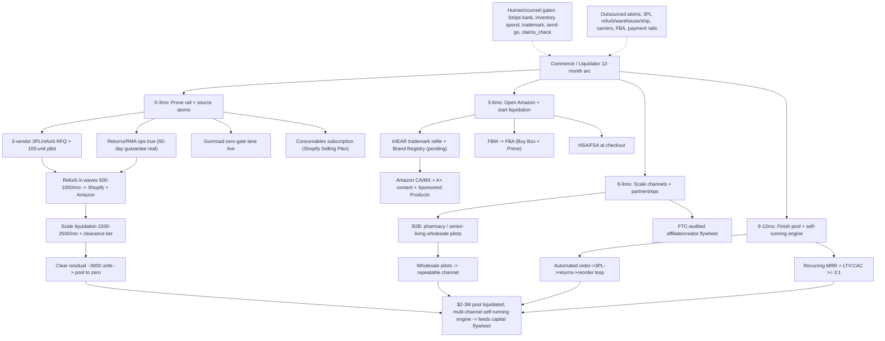

**Risks -> mitigations**
- The refurb yield is worse than assumed (scrap %, cosmetic grade, dead batteries) so the 10,298 pool's real net value is far below the $2-3M retail headline, breaking the liquidation P&L -> Gate all scale on a 100-unit refurb PILOT that produces a true per-unit cost + sellable-yield number before any wave spend; price refurb tiers ($199-299) off the proven cost, and route lowest-grade units to a clearance/B2B-wholesale tier rather than scrapping.
- A non-compliant TReO listing (hearing-aid/medical/FDA language, or the existing third-party ASIN's copy) triggers an Amazon takedown, FTC exposure, or torches the warm-list shot -> Enforce claims_check in code on EVERY listing/ad/affiliate line before any publish PUT/PATCH; PSAP-only framing, category in fine-print; do not attach to the third-party ASIN until its detail-page copy is reviewed; Brand Registry to control the page once the mark is pending.
- Scaling channels onto a broken/limited cash rail (payouts disabled, refunds unfundable) multiplies a failure and burns trust right as the 66,224 warm list fires -> Hard-gate every channel launch on the verified CHECKOUT-PROOF=PASS (paid+unrefunded order settled to Mercury, payouts_enabled=true) and BRAND-HEALTH=READY (real returns/refund round-trip), and seed-wave the first send before full release.
- 3PL single-vendor dependency or capacity ceiling stalls fulfillment as volume ramps, capping liquidation and channel growth -> Select via a 3-vendor RFQ (keep two viable backups warm), contract for a throughput SLA with overflow terms, and use Amazon FBA as a parallel fulfillment path for velocity SKUs so no single 3PL is the sole bottleneck.

## Growth & Lifecycle — Recurring Engine

**Situation.** The recurring engine and demand machine are ~90% specced and 100% dormant. The near-term EXECUTION-PROGRAM.md (weeks 1-26) already lays out cohort-1: connect Stripe payout bank (P0, Matt), prove TReO checkout, stand up consumables on Shopify NATIVE selling plans (30/60/90-day, ~10-15% off), post-purchase attach, day-14/45 churn-save drips, AWARE as second SKU, and a week-4/5 kill-or-scale gate (targets >=15% attach, >=70% cycle-2 retention, >=30% churn-save). But today: zero live recurring SKU, $0 MRR, the cro and growth ledgers are empty, 66,224 warm contacts are decaying, and demand generation (ASO, content/SEO, earned PR, paid) is unbuilt beyond the single reignition send. This 12-month plan does NOT redo weeks 1-26; it builds the arc that takes cohort-1 from a proof to the load-bearing recurring-revenue base (subscribers + LTV per quarter), with FTC/ROSCA negative-option compliance enforced in code as the moat and INND kept framework-level/MNPI-internal.

**Gap analysis**
| Sev | Gap | Why |
|---|---|---|
| P0 | No live recurring SKU on any rail — the load-bearing ~half-the-base valuation lever is vapor (zero MRR, no second cycle has ever billed) | Until one subscription bills a second cycle, all LTV/flywheel math is unbacked and the recurring re-rate (recurring ~4-6x vs hardware ~1-1.5x) cannot start; every device sale is one-and-done. |
| P0 | Stripe payouts_enabled=FALSE (no bank linked) so recurring cash cannot settle even if it bills | A subscription that charges but cannot pay out is theater and is an FTC/ROSCA refund exposure; this is a Matt dashboard action, not API-fixable, and gates recognizing any recurring dollar. |
| P0 | Brand-health is not operationally true — '60-day money-back' + 'reachable CS' are CCO-gated; auto-renew without a real cancel/refund path is the Medvi-class front-end failure | ROSCA/FTC negative-option + Mail-or-Telephone Order Rule make auto-renew with an unhonored cancel/refund a direct enforcement risk; recurring cannot ship and cannot scale on paid traffic until cancel + refund are real. |
| P1 | No demand engine beyond the one reignition send — no ASO, no content/SEO, no earned-PR cadence, no instrumented paid loop; the warm 66,224 is the only top-of-funnel and it decays once | After the one-time reignition the funnel has no renewable top-of-funnel; subscriber growth stalls and CAC has no organic floor, so quarter-over-quarter subscriber adds depend entirely on gated paid spend. |
| P1 | Attach-rate and churn assumptions are unvalidated — the $480M-ARR/~$9M-per-1%-churn math runs on round numbers with no cohort instrumentation | Scaling spend (Phase 2+) against unmeasured unit economics burns first cash; without PostHog/RevenueCat cohort instrumentation from order #1 the kill/scale gates fire on phantom numbers. |
| P1 | Product ladder beyond consumables is gated: AWARE is app-store/build-gated and CareNow is a hard Securities Act 17(b) block (share-bundle) | Consumables alone churn high (people forget they need domes), capping LTV; the stickier rungs that lift retention are blocked, so the LTV the valuation depends on is at risk without the higher-retention SKUs. |
| P2 | No lifecycle suppression/deliverability/consent infrastructure hardened for scale (sender reputation, suppression lists, CAN-SPAM, TCPA-SMS still platform-blocked) | Scaling sends across reignition + welcome + abandoned-cart + milestone + churn-save on a cold-reputation domain risks spam-folder placement that silently zeroes the whole engine; SMS remains unusable until TCPA prior-express-written-consent is built. |

**AI operating model (in-house vs outsourced).** Mirror Medvi's 3-layer model in the Growth+Lifecycle lane. LAYER 1 — AI brain (in-house, ~$0 marginal, grant/credit-funded): the cro/lifecycle and growth agent personas run the function. lifecycle-crm + content-engine + aso-growth + paid-ads + growth-pr + monetization + storefront-cro skills do the daily work; kb-memory is the source of truth (cro + growth lanes, write-through every decision). Customer.io (ws 193366) runs all journeys; Shopify NATIVE selling plans hold consumables subscriptions; RevenueCat holds AWARE; PostHog (non-PHI commerce project, NEVER MedReview 468398) is the cohort + MRR + churn instrument; n8n self-host (automation.otchealth.app) pipes Shopify subscription webhooks -> PostHog events; company-brain answers cohort questions across the data rooms; focus-group-loop QAs every funnel/advertorial to >=90% before traffic. claims_check on the merged gateway gates EVERY customer-facing string in code (the moat). designer/heygen-video skills render creative on grant credits (ElevenLabs 33M-char + Azure). LAYER 2 — OUTSOURCED ATOMS (the physical world we never build): iHEAR Medical manufactures + drop-ships TReO and consumables; Shopify+Stripe are the rails; Customer.io/PostHog/RevenueCat/Azure/Depot are credit-funded SaaS; ad platforms (Meta/Google) and micro-creators are the paid/affiliate distribution; carriers ship the atoms. We own the marketing+distribution layer, not the atoms. LAYER 3 — HUMAN/MATT GATES (the irreducible few): connect Stripe payout bank; place the real checkout-proof order; every mass-send send-go (CAN-SPAM); paid-ad budget authorization; final pricing; any CareNow/AWARE share-bundle or INND-adjacent copy (counsel + Reg FD); the FTC affiliate-SOP + creator-agreement rider (CLO). CCO holds the standing compliance gate (operationally-true cancel/refund before any auto-renew bills). Everything between the gates the fleet runs autonomously on cron (overnight-agent / Container Apps Jobs) at zero Max-plan draw.

**12-month roadmap**

#### 0-3mo — Prove the recurring rail + reignite the warm base (cohort-1 is real, not vapor)
| Initiative | Owner | Gate | Target |
|---|---|---|---|
| Escalate the two P0 unlocks as one packet and confirm: Stripe payout bank connected (payouts_enabled=true via SM stripe-secret-key read) + one real non-refunded full-price PAIR99 TReO order placed; log order # to cro ledger | Matt (CTO verifies); CRO logs | Matt (bank + real card order) | payouts_enabled=true and 1 captured unrefunded TReO order verified end-to-end within week 1-2 |
| Stand up consumables on Shopify NATIVE selling plans (Selling Plan Group 'TReO Care Replenishment', 30/60/90-day, ~10-15% subscriber discount) bound to domes/tubes/batteries/cleaning/dehumidifier; build the post-purchase attach flow (order-status upsell + Customer.io day-0 fallback) | CRO/lifecycle + Developer | CCO claims_check + operationally-true cancel/refund clearance | Subscribe & Save renders on staging then live; >=15% attach within 7 days of a TReO buyer; first non-zero MRR with >=25 active subscribers |
| Fire the 66,224 reignition send (seed wave then full) and build the always-on welcome + abandoned-cart + day-0 'complete your kit' journeys in Customer.io, each claims_check-clean and CAN-SPAM-compliant | CRO/lifecycle | Matt send-go (email only; SMS stays TCPA-blocked); CCO claims_check | seed bounce <3%, spam-complaint <0.1%; full release; abandoned-cart + welcome journeys live and recovering attach |
| Instrument cohort-1 from order #1: pipe Shopify subscription webhooks via n8n self-host into PostHog (attach_offer_shown/subscribed, subscription_renewed/churned, churn_save_clicked) and build the single 'Recurring Engine' dashboard (attach, cycle-2 retention, MRR, churn) | CRO + CTO | non-PHI PostHog project only (never MedReview) | four events flowing live; dashboard renders real attach rate + MRR; measured email->buyer CVR replaces the assumed CVR |
| Build day-14 milestone + day-45 pre-renewal churn-save drips in Customer.io (pause/cadence-change before discount) triggered off subscription + upcoming-renewal events | CRO/lifecycle | Matt send-go; CCO claims_check | both journeys verified firing at +14d/+45d against a test subscriber; first saves recorded |

*Exit criteria:* Cohort-1 kill-or-scale memo logged: attach >=15% AND cycle-2 retention >=70% (scale) — recurring is proven on a real settling rail, MRR is non-zero and renewing, and welcome/abandoned-cart/churn-save journeys are live; if below targets, offer/price/cadence is reworked BEFORE any paid traffic.
  
*KPI targets:* Attach >=15% of TReO buyers in 7 days; >=25 active subscribers / first non-zero renewing MRR by ~week 5; cycle-2 retention >=70%; reignition seed bounce <3% / spam <0.1%

#### 3-6mo — Build the renewable demand floor (organic top-of-funnel) + harden retention so the engine compounds without one-time list burn
| Initiative | Owner | Gate | Target |
|---|---|---|---|
| Stand up the ASO program for iHEARtest + AWARE (aso-growth skill): senior-first title/subtitle/keyword/screenshot tuning, in-app review-prompt timing, localization, ratings-velocity loop; iHEARtest free screening is the self-qualifying acquisition magnet feeding TReO | Growth agent | CCO claims_check on all store copy (PSAP/FTC wall; no hearing-aid/medical claims) | measurable lift in iHEARtest organic installs + store conversion rate; rating count + average trending up quarter over quarter |
| Launch the content/SEO + earned-PR cadence (content-engine + growth-pr): senior-first advertorial/blog/SEO articles on hearing wellness + the $99-vs-$299 value story, factual press releases on real product milestones, all routed through claims_check with the hard securities firewall (no INND/share-price/'undervalued') | Growth agent | CCO claims_check + securities firewall; any INND-adjacent copy = counsel + Matt | a publishing cadence live (weekly content + monthly milestone PR); organic sessions to the funnel becoming a non-zero, growing share of top-of-funnel |
| Wire AWARE as the second recurring SKU (RevenueCat): TReO order-status + day-7 cross-sell into the AWARE subscription as the stickier, higher-retention rung; keep CareNow OUT (17(b) hard block) | CRO + Developer + CPO | counsel confirms AWARE copy non-clinical; CCO claims_check | AWARE subscribe path reachable from a post-purchase touch; first AWARE subscriptions in RevenueCat emitting subscription_renewed; blended cross-sell attach measured |
| Mature the lifecycle map: milestone journeys, replenishment-cadence optimization (auto-ship convenience framing), winback for churned subscribers, and review/social-proof requests (day-7 email) feeding the funnel | CRO/lifecycle | Matt send-go; CCO claims_check | monthly subscriber churn trending to <=8% on consumables; winback recovering a measurable % of churned; review volume up |
| Harden deliverability + consent infra for scale: sender reputation/warmup, suppression-list hygiene, CAN-SPAM audit across all journeys, and a documented 'conditions to lift TCPA-SMS' standard (prior express written consent + DNC scrub) kept platform-blocked until built | CRO/lifecycle + CTO | CCO confirms SMS disabled at platform level | inbox-placement healthy across all journeys; zero un-gated sends; SMS-lift conditions documented |

*Exit criteria:* A renewable organic top-of-funnel exists (ASO + content/SEO + PR producing growing non-list installs/sessions), AWARE is live as the second recurring SKU lifting blended retention, and consumables monthly churn is <=8% with churn-save >=30% — subscriber growth no longer depends on the one-time list.
  
*KPI targets:* Organic installs/sessions a growing share of ToF; consumables monthly churn <=8%; churn-save >=30%; AWARE cross-sell attach measured; total active subscribers growing month over month off organic + reignition

#### 6-9mo — Scale acquisition on proven unit economics (paid loop + creator flywheel) behind guardrails
| Initiative | Owner | Gate | Target |
|---|---|---|---|
| Turn on the instrumented paid loop (paid-ads skill, Medvi tactic 2): industrial creative testing (advertorial->quiz->offer), kill/scale on PostHog cost-per-initiated-checkout at 48-72h against the CFO PAID-SPEND GUARDRAILS (max cost-per-initiated-checkout + CAC ceiling + payback rule) | Growth/CRO | Matt budget authorization; CFO guardrails memo; CCO claims_check on every creative | blended CAC payback <=1 order (hardware-funded) with subscription as upside; scaled spend only on ad sets beating the guardrail |
| Launch the creator/affiliate flywheel (Medvi tactic 4) ONLY after the published FTC affiliate-SOP + CLO-reviewed creator-agreement rider: micro-creators (50-200K), flat fee + 15-25%, ALL creator copy through claims_check, real-identity KYC + persona verification, sampling/monitoring/takedown | Growth/CRO | CCO FTC affiliate-SOP published + CLO rider (hard prerequisite); claims_check on every asset | first cohort of compliant creators live with 100% claims_check-logged assets; creator-sourced orders attaching subscriptions |
| Stand up the second-product attach + bundle merchandising (storefront-cro + monetization): cross-sell consumables+AWARE bundles, anchor-discount offer psychology, and replenishment-cadence experiments to lift attach and AOV | CRO | CCO claims_check | attach rate climbing above the 15% floor; AOV + LTV per buyer rising; LTV:CAC >=3:1 at <=8% churn |
| Scale the lifecycle to full segmentation: behavior-based journeys, predictive churn scoring off PostHog cohorts, dynamic save-offer selection (pause/cadence before discount), and reactivation of the broader ~85K base in waves | CRO/lifecycle | Matt send-go per wave; CCO claims_check | per-segment retention + save-rate lift measured; reactivation waves producing incremental subscribers without reputation damage |
| Run the quarterly cohort/CAC-LTV review and feed the CFO model + INND framework narrative (framework-level only, no counts/prices; counsel-gated): subscribers, ARPU, churn, LTV:CAC per cohort | CRO + CFO | INND/IR framing = Matt + counsel (Reg FD) | a true measured LTV:CAC and subscriber-base trajectory the CFO model runs on; recurring mix becoming the headline metric |

*Exit criteria:* Acquisition scales profitably: paid loop running at LTV:CAC >=3:1 within CFO guardrails, a compliant creator flywheel is live, and the subscriber base is growing from BOTH organic and paid on validated unit economics — recurring MRR is now a material, compounding line.
  
*KPI targets:* LTV:CAC >=3:1; cost-per-initiated-checkout under the CFO ceiling; subscriber base growing materially QoQ across consumables+AWARE; churn <=8%; creator assets 100% claims_check-clean

#### 9-12mo — Compound to a material recurring base + the LTV re-rate (recurring becomes the headline)
| Initiative | Owner | Gate | Target |
|---|---|---|---|
| Open the gated ascension rungs as clearances land: at the cumulative $25K gate, prepare the iHEAR OTC line cross-sell to the warmed/subscriber base (behind the clinical + CPO flag); ready CareNow as a recurring rung the MOMENT counsel clears the Securities Act 17(b) share-bundle block | CRO + CPO + Matt | $25K gate (reignition-basis tracker); clinical/CPO sign-off; counsel on CareNow 17(b) | OTC cross-sell ready behind a flag; CareNow productized and staged pending counsel — the full product ladder loaded |
| Optimize LTV across the whole ladder: lifetime-value-maximizing cadence/bundle/price tests, win-back automation, loyalty/referral mechanics for subscribers, and predictive-churn intervention at scale | CRO/lifecycle | CCO claims_check; Matt on any pricing change | LTV per subscriber rising quarter over quarter; referral-sourced subscribers becoming a measurable, low-CAC channel |
| Industrialize demand: scale the creative factory (designer + heygen-video on grant credits) + content/SEO library + creator roster to a steady multi-channel acquisition machine running largely on cron with Matt only at budget/send gates | Growth/CRO | Matt budget; CCO claims_check on all assets | a self-sustaining acquisition machine with a growing organic floor and a profitable paid+creator layer; CAC stable or falling at scale |
| Make recurring the headline metric: produce the quarterly subscriber/MRR/LTV/churn pack that feeds the CFO model and the (counsel-gated, framework-level) INND traction narrative — recurring mix as the valuation re-rate story | CRO + CFO | INND/IR framing = Matt + counsel (Reg FD; no counts/prices externally) | a clean recurring-revenue trajectory and subscriber base that materially backs the recurring-base thesis; recurring mix the lead KPI |
| Plan year-2 scale: codify the proven attach/retention/demand playbook into reusable SOPs + agent automations so the next 10x of subscribers runs at the same ~$0 marginal AI cost; set year-2 subscriber and LTV targets off the measured year-1 curve | CRO/lifecycle + Growth | none (internal) | year-1 playbook codified; year-2 subscriber + LTV targets set on measured (not assumed) cohorts |

*Exit criteria:* A material, renewing recurring base (consumables + AWARE, OTC/CareNow staged behind clearances) is growing on a validated LTV:CAC, demand runs as a multi-channel machine on a real organic floor, and recurring mix is the headline metric feeding the CFO model and the counsel-gated INND narrative — the load-bearing valuation lever is real and compounding.
  
*KPI targets:* Material recurring MRR growing QoQ; LTV:CAC >=3:1 sustained; consumables churn <=8% with churn-save >=30%; AWARE + ladder lifting blended LTV; organic a stable share of acquisition; recurring mix trending toward the re-rate thesis

**Process diagram**
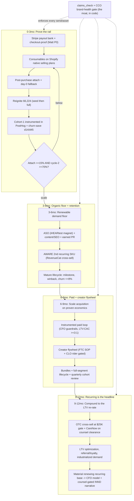

**Risks -> mitigations**
- FTC negative-option / ROSCA + Mail-or-Telephone Order Rule exposure on auto-renew if cancel and refund are not operationally true (the Medvi-class front-end failure flagged by CCO) -> Hard-gate every subscription launch and scale-up on CCO written clearance that the cancel path + refund backlog are real; one-click self-serve cancel before any auto-renew bills; route all auto-renew/cancel/money-back copy through claims_check in code, not by convention.
- Consumables-only churn is high (people forget they need domes), capping the LTV the whole valuation thesis depends on -> Lead with auto-ship convenience cadence framing, stand up day-14/45 churn-save (pause/cadence before discount) BEFORE counting recurring in the model, and add AWARE (then OTC/CareNow on clearance) as stickier higher-retention rungs to lift blended LTV.
- Scaling paid traffic against unvalidated attach/churn economics burns the scarce first cash -> Instrument cohort-1 from order #1 (PostHog + RevenueCat), enforce the week-4/5 kill-or-scale gate and the CFO PAID-SPEND GUARDRAILS (max cost-per-initiated-checkout + CAC ceiling) before any paid dollar, and kill/scale on 48-72h cost-per-initiated-checkout.
- Demand-engine copy or a creator asset name-drops INND / share-price / 'undervalued' or makes a hearing-aid/medical TReO claim — a Reg FD / FTC event for a public-company operator -> Securities firewall wired into claims_check (BLOCK INND/ticker/share-price terms) plus the PSAP/FTC ruleset on every owned AND affiliate asset; FTC affiliate-SOP + CLO creator rider published before any creator is onboarded; all INND-adjacent output stays counsel + Matt gated.

## COO — Operating System & Integration

**Situation.** The machine is ~90% built and ~100% dormant: cash ~$2.41, $0 revenue in 90 days, ~$50K/mo burn, ~0 runway, ~20 days with the first-dollar gate unmoved. As COO I have shipped a daily 3-move brief that informs but does not FORCE action, so the single $99 checkout-proof gate and the send-go to 66,224 warm contacts have sat open. My function exists but is not yet a closing mechanism: there is no forcing gate-state cadence, no automatic revenue heartbeat, no codified integration spine (measurement/RACI/risk-register/cash-bridge), no weekly/monthly governance rhythm, and the entire company is one operator with no SPOF de-risking. The 6-month EXECUTION-PROGRAM (weeks 1-26) proves the engine; my 12-month job is to turn proof into a self-running operating system that the solo operator + AI fleet run with hands-off at everything but the hard gates.

**Gap analysis**
| Sev | Gap | Why |
|---|---|---|
| P0 | The daily cadence informs but does not force: the same first-dollar gate has not moved in ~20 days because the brief has no GATE-STATE header, no real revenue number, no single owned action, and no auto-escalation when a gate stays red. | A cadence that does not convert a 10-minute Matt action into a closed gate is the proximate cause of $0 revenue on a fully-built machine; without a forcing function the warm list decays and runway hits zero. |
| P0 | No codified integration spine — MEASUREMENT-SPINE, RACI/owner-map, RISK-REGISTER, CASH-BRIDGE, CLINICAL-SIGNOFF — exists as durable artifacts, so cross-function dependencies (CTO->CRO send gate, CFO->COO $25K basis, COO/CS->CCO brand-health) live only in chat and silently drift. | Medvi's whole advantage is one tightly-integrated operating layer; without a written spine the 9 agent seats re-derive dependencies every session, the claims_check moat and Stripe-payout gate get asserted-LIVE while actually broken, and integration is the difference between a fleet and a company. |
| P0 | No automatic measurement heartbeat: revenue, CAC/LTV, cohort, churn, and cumulative-vs-$25K are read manually and ad-hoc, and revenue-tracker.mjs sums $227K all-time against the $25K gate (false ~100%). | The brief cannot carry a real number and the $25K FDA-spend gate would green-light on phantom revenue; you cannot run a hands-off company on a measurement spine that lies on first run. |
| P1 | Operator-as-SPOF is total and un-mitigated: every hard gate (Stripe bank, send-go, paid spend, pricing, counsel, clinical sign-off, INND) routes through one human with no documented gate-runbook, no delegation envelope, no continuity/bus-factor plan, and a 28-credential leak that hard-blocks any public/INND action. | A company run by one operator + agents is only as resilient as that operator's availability and the security of the keys; an un-rotated keys-to-the-kingdom leak plus zero continuity plan makes the entire flywheel fragile exactly when it scales into public-company territory. |
| P1 | The human gate-set is large and manual (OAuth consents, portal clicks, signups, sends) while the browser-agent + Tier-2 autonomous runner that shrink it are built but idle (Tier-2 blocked only on the CLAUDE_CODE_OAUTH_TOKEN; browser-agent has no live provider flow wired). | The thesis is run-the-company-of-a-thousand-with-one-operator at ~$0 marginal cost; every un-shrunk soft gate is operator time that does not scale and a place the machine stalls waiting on a human. |
| P1 | No weekly-review or monthly-board governance rhythm with kill/scale and per-quarter exit criteria — only a daily brief — so there is no standing mechanism to kill losing experiments, re-allocate the fleet, or decide quarter transitions. | Without a weekly kill/scale review and a monthly board ritual, the machine drifts: funnel experiments run past their 48-72h verdict, the fleet works on stale priorities, and quarter gates pass un-adjudicated. |
| P2 | Agent-fleet reliability is unmeasured and ungoverned: no standing SLA on memory-health/idempotency, no eval-gated quality bar per seat, and stale work (duplicate sends, recycled briefs, drift) is caught by luck not by a control. | As the AI workforce becomes the C-suite, its silent failure modes (memory off, duplicate actions, regressed quality) become operational risk; a hands-off company needs the fleet itself instrumented and gated like infrastructure. |

**AI operating model (in-house vs outsourced).** Mirror Medvi's 3 layers for the OPERATING-SYSTEM lane. LAYER 1 (AI in-house, ~$0 marginal, credit-funded): I (the coo agent / coo skill) run the cadence and integration. The daily forcing brief, weekly review, and monthly board are generated by the daily-briefing + daily-digest skills off the cash.manifest + grant-tracker, posted to the kb-memory exec feed (the shared write-through brain is the source of truth, not chat). The measurement spine is automated: an Azure Container Apps Job (SOP-6 heartbeat) pulls Stripe + Shopify + PostHog + RevenueCat into a one-line daily P&L and cumulative-vs-$25K (REIGNITION_START_DATE basis); company-brain federates every data room for any cross-function question; agent-evals + fleet-telemetry + fleet-medic instrument the fleet itself (quality, cost, memory-health) into PostHog Fleet Agents 479484; kb-memory carries decisions/pitfalls so nothing is lost to compaction; fleet-dispatch routes agent-to-agent hand-offs with zero human relay. Cross-function orchestration: I own the RACI/owner-map and the gate-graph; each seat (CTO/CRO/CFO/CCO/CPO/CLO/Capital/Developer + app-leads) runs its own lane and escalates only at the seams I define. Gate-shrinking: browser-agent runs non-financial OAuth consents/portal clicks autonomously; Tier-2 autonomous runner (claude -p on the Max plan) executes timed overnight work; CronCreate/Container Apps Jobs run the scheduled spine. LAYER 2 (outsourced atoms — services not hires): fulfillment (Shopify), payments rail (Stripe/Mercury), manufacturing + 3PL/refurb, counsel, audiology behind iHEARtest, the grant/credit infra (Azure/GitHub/PostHog/ElevenLabs) — the company rents these, never staffs them. LAYER 3 (thin human layer — Matt at hard gates ONLY): connect Stripe payout bank, place the proving order, send-go, paid-spend authorization, final pricing, engage securities counsel, name a human clinical reviewer, any INND/IR action. My explicit job is to keep Layer-3 minimal: every quarter I move one class of action from human-gate to AI-autonomous (behind browser-agent/runner) or to a documented delegate-runbook, and I encode each surviving hard gate as a one-screen GO PACKET so the human touch is ~5-10 minutes. Compliance is enforced in code as the moat: claims_check gates every published claim, the securities firewall and PHI wall are absolute, and I never let a gate be asserted-LIVE without a verifying read.

**12-month roadmap**

#### 0-3mo — Make the cadence a CLOSING mechanism + lay the integration spine (turn proof into a running OS)
| Initiative | Owner | Gate | Target |
|---|---|---|---|
| Ship the FORCING morning brief: a standing GATE-STATE header (checkout-proof / payout-bank / send-go each green-red) + the automated revenue-heartbeat number + exactly ONE owner-assigned action, with a 2-red-briefs-running auto-escalation that pings Matt outside the brief. | COO | none (cost-neutral; uses existing daily-briefing skill + feed) | 2 consecutive briefs ship with GATE-STATE + heartbeat + single owned action; first-dollar gate moves within 72h or auto-escalation fires |
| Deliver the one-screen GO PACKET (live PAIR99 checkout URL + Stripe payout deep-link + 3-step checklist) into the cash block and quarterback the first-dollar critical path to CHECKOUT-PROOF=PASS (real paid unrefunded TReO order + payouts_enabled=true). | COO (orchestrates Matt+CTO) | Matt (place order + link bank, ~10 min) | CHECKOUT-PROOF=PASS posted to feed within 72h of GO PACKET |
| Stand up the daily cash heartbeat job (SOP-6 Container Apps Job: Stripe+Shopify+PostHog->one-line P&L + cumulative-vs-$25K on REIGNITION_START_DATE basis) so the brief carries a real number, not a status. | COO (commissions CTO/CFO) | none (Azure credit) | heartbeat posts automatically 2 consecutive days, zero manual runs; $25K tracker reads NEW revenue from today |
| Write the integration spine as durable artifacts in the coo lane: MEASUREMENT-SPINE (the KPI->source map), RACI/owner-map + the gate-graph (cross-function dependencies), RISK-REGISTER v1, CASH-BRIDGE (order->Stripe->Mercury reconciliation), CLINICAL-SIGNOFF runbook. | COO | none | all 5 artifacts committed + referenced from CLAUDE.md; every seat escalates against the written gate-graph not chat |
| Run the BRAND-HEALTH readiness control before any send (test call to 1-800-864-4337 answered, support inbox receiving, one refund demonstrably issuable) so the warm list never hits a dead promise. | COO/CS | CCO clears 60-day-guarantee + CS-reachability claims | BRAND-HEALTH=READY posted; CCO claim-clearance recorded |

*Exit criteria:* First real reignition cash settled to Mercury from the 66,224 send; the daily brief is a forcing gate-state mechanism with an auto-posting real revenue number; the integration spine (measurement/RACI/risk/cash-bridge/clinical) exists as durable artifacts that the fleet runs against.
  
*KPI targets:* CHECKOUT-PROOF=PASS in <=72h; >=10 paid orders in first 72h post-send; heartbeat auto-posts 2 days running; >=1 Stripe payout reconciled into Mercury; $25K tracker on correct (NEW-revenue) basis

#### 3-6mo — Governance rhythm + shrink the human gate-set + instrument the fleet (the machine starts running itself)
| Initiative | Owner | Gate | Target |
|---|---|---|---|
| Institute the full cadence stack: weekly Friday review (funnel kill/scale on 48-72h cost-per-checkout, brand-health metrics, cohort/CAC-LTV, $25K progress) and a monthly board ritual (scorecard + risk-register review + quarter-gate adjudication), both auto-assembled from the heartbeat + PostHog + daily-digest. | COO | none | weekly review + monthly board run on schedule for the full quarter with logged kill/scale decisions |
| Activate the gate-shrinking layer: wire the first live browser-agent provider flows (non-financial OAuth consents/portal clicks) and arm the Tier-2 autonomous overnight runner once Matt mints CLAUDE_CODE_OAUTH_TOKEN in Cloud Shell. | COO (commissions CTO) | Matt (one-time token mint, ~5 min) | >=2 recurring soft gates moved from human to AI-autonomous; >=1 overnight autonomous run completes draft-PR work with zero Max-metered cost |
| Turn on fleet self-instrumentation as an operating control: agent-evals golden-task quality bar per seat, fleet-telemetry per-session cost/tokens, and fleet-medic auto-healing memory-off agents, all into PostHog Fleet Agents 479484. | COO | none (PostHog $50k credit) | every exec seat has a green eval scorecard + memory-health SLA; fleet-medic catches and self-heals >=1 memory-off incident automatically |
| Operationalize the $25K-gate transition (SOP-7): at cumulative $25K NEW revenue, auto-alert Matt and hand off the prepared FDA-OTC-registration + paid-spend GO PACKETs so the quarter transition is one decision, not a project. | COO (CFO tracker feeds it) | Matt (authorize FDA spend + paid-ad budget) | $25K gate fires with the next-quarter packets pre-staged; transition decided in one session |
| Codify and prosecute the operator-SPOF mitigation: rotate the 28-credential leak to secret-scan-CI-GREEN (hard prerequisite for any public action), write the hard-gate runbook + delegation envelope so each gate has a documented backstop. | COO (commissions CTO for rotation) | Matt (approve rotation window) | secret-scan CI green; every hard gate has a one-page runbook + named backstop |

*Exit criteria:* The company runs on a weekly+monthly governance rhythm with logged kill/scale; the human gate-set is measurably smaller (>=2 classes automated) and each surviving gate is a documented GO PACKET; the fleet is instrumented and self-healing; the security hard-block is closed.
  
*KPI targets:* weekly+monthly cadence 100% on-schedule; >=2 soft-gate classes automated; fleet eval scorecards green per seat; secret-scan CI green; $25K gate cleared; recurring SKU live and feeding the spine

#### 6-9mo — Integrate the multi-channel + recurring + capital lanes into ONE operating picture; make quarters hands-off
| Initiative | Owner | Gate | Target |
|---|---|---|---|
| Unify the measurement spine into a single board-grade scoreboard (Stripe/Shopify/PostHog/RevenueCat/Mercury -> Fabric/Power BI) so device + recurring + portfolio + (disclosable) INND traction read on one surface with churn and subscription-mix as first-class metrics. | COO (CFO/CTO build) | none | one scoreboard with daily-refreshed revenue, churn, CAC/LTV, subscription-mix, and cumulative-vs-targets; the monthly board runs off it |
| Extend the integration spine to the new lanes coming online (consumables/CareNow/AWARE recurring, OTC line, Amazon, affiliate/creator) — add each to the RACI/gate-graph + RISK-REGISTER with its own kill/scale criteria and a claims_check pre-publish gate (incl. the FTC affiliate-audit/persona-verification SOP). | COO | CCO (claims + affiliate SOP); counsel for any INND/17(b) | every live revenue lane is in the gate-graph + risk-register with an owner and a kill/scale rule; affiliate program runs only behind the audit SOP |
| Drive the autonomous-runner program to steady-state: standing Tier-1 cron jobs (librarians, heartbeat, digest, reconciliations) + Tier-2 overnight task queue handle the recurring ops so a normal week needs the operator only at gates. | COO | none | a full week passes where every recurring ops task ran scheduled/autonomous and operator touches were only hard gates |
| Quarterback the counsel-gated capital-readiness handoff (framework-level only): assemble the data-room index + verification memo + securities-firewall checklist so the entire INND flywheel hands over in ONE move the instant Matt retains counsel and key-rotation is green. | COO + Capital/IR | Matt + securities counsel (absolute; no solicitation, MNPI-internal) | capital-readiness bundle staged and counsel-ready; nothing fires without counsel |
| Run the first formal quarter-gate adjudication at the monthly board: review per-lane exit/kill criteria, re-allocate the fleet, and lock next-quarter targets as a documented DECISION. | COO | Matt (target lock) | quarter transition decided in one board session with logged kills, scales, and next-quarter targets |

*Exit criteria:* Device + recurring + portfolio revenue and (disclosable) capital traction read on one board-grade scoreboard; every live lane is governed by the gate-graph + risk-register with kill/scale rules; a normal operating week is hands-off except at hard gates; the capital-readiness bundle is counsel-ready.
  
*KPI targets:* unified scoreboard live and driving the board; churn + subscription-mix tracked weekly; >=80% of operating weeks require zero non-gate operator touches; recurring revenue is a tracked, growing line; capital bundle counsel-ready

#### 9-12mo — The self-running operating system + durable SPOF de-risking (set the next 12-month arc)
| Initiative | Owner | Gate | Target |
|---|---|---|---|
| Lock the operating system to a repeatable monthly run-rate: the daily forcing brief, weekly kill/scale review, and monthly board run as standing rituals off the automated spine, with documented SOPs so any agent or a delegate can run the cadence unattended. | COO | none | a full month runs the complete cadence with zero ad-hoc COO intervention; the cadence is fully SOP-documented |
| Complete the operator-SPOF de-risking program: a continuity/bus-factor plan (gate runbooks + named backstops + key-custody + a successor-operator brief), recurring credential rotation as a scheduled control, and a quarterly DR drill of the whole stack. | COO | Matt (approve continuity plan + custody) | continuity plan ratified; rotation runs on a schedule; one full DR drill executed and logged |
| Push the human gate-set to its structural floor: every soft gate automatable behind browser-agent/runner is automated, and each remaining HARD gate (payment/KYC/legal e-sign/INND/clinical) is a sub-10-minute GO PACKET with a documented escalation path. | COO | Matt (final pricing/spend/INND/clinical stay human by design) | hard-gate set is enumerated, minimized, and each is a one-screen GO PACKET; zero soft gates remain manual |
| Stand up the portfolio/roll-up operating discipline: an M&A and stack-as-a-product (B2B white-label) intake + integration runbook so acquired or new revenue plugs into the SAME spine (measurement, RACI, risk, claims gate) without re-inventing ops. | COO + Capital/CLO | Matt + counsel (any acquisition/INND) | an intake+integration runbook exists and is dry-run against 1-2 candidate lanes so new revenue onboards to the spine in days |
| Run the annual board: certify the engine is self-running, review the full-year scorecard against the Moore Playbook thesis, and set the next 12-month targets (path to the billion is turns of the flywheel, not new invention). | COO | Matt (target lock) | year-end board delivered; next-12-month operating plan ratified as a DECISION |

*Exit criteria:* The machine runs itself: a full month of cadence + ops executes hands-off except at minimized hard gates; the operator is de-risked by a ratified continuity plan, scheduled rotation, and a DR drill; new/acquired revenue onboards to one integration spine; the next 12-month arc is locked.
  
*KPI targets:* 100% cadence on-schedule for a full month unattended; continuity plan ratified + 1 DR drill logged; hard-gate set minimized and each <=10 min; rotation scheduled; next-12-month plan ratified

**Process diagram**
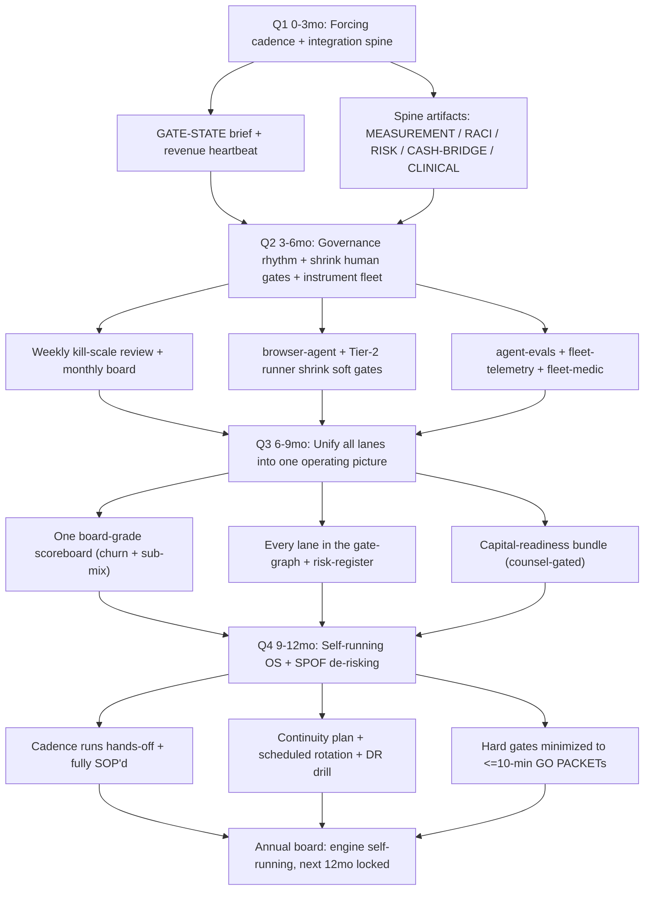

**Risks -> mitigations**
- The cadence stays a notifier, not a forcer: the GATE-STATE brief ships but the first-dollar gate still does not move because Matt's hard-gate actions are not happening, recreating the ~20-day stall. -> Bake the 2-red-briefs auto-escalation into the heartbeat job itself (not COO discretion) so a stuck gate pings Matt outside the brief automatically; reduce each gate to a sub-10-minute one-screen GO PACKET; track days-gate-open as a first-class KPI with a hard STOP-downstream rule at 72h.
- The measurement spine lies (revenue-tracker sums all-time $227K against the $25K gate; heartbeat job fails silently) and the company makes scale/spend decisions on phantom numbers. -> Fix REIGNITION_START_DATE basis as a P0; add a heartbeat liveness check (if the job misses 2 mornings, COO reverts to a manual Stripe/Shopify read and the brief never goes dark); reconcile order->Stripe->Mercury via the CASH-BRIDGE so reported revenue is settled-cash truth, not gross.
- Operator-as-SPOF + the un-rotated 28-credential leak: one operator at every hard gate on a keys-to-the-kingdom stack means an availability gap or a breach halts or compromises the whole flywheel, especially once public/INND actions start. -> Close secret-scan CI to GREEN before any public/INND step (hard prerequisite); ratify a continuity/bus-factor plan with gate runbooks + named backstops + key-custody + a successor brief; move rotation to a scheduled control and run a quarterly DR drill.
- The AI fleet fails silently as it becomes the C-suite — memory off, duplicate sends, regressed answer quality — and a hands-off company executes wrong actions without anyone noticing. -> Run fleet-medic as a standing memory-health monitor that auto-heals, gate each seat behind an agent-evals quality scorecard, emit fleet-telemetry for cost/error visibility, and enforce idempotency in the cadence so a recycled brief or duplicate send is structurally impossible.

---
*Generated 2026-06-30 by the COO running all 9 exec hats internally (workflow wgfnyg9n0) + synthesis. Companion to MOORE-PLAYBOOK.md, EXECUTION-PROGRAM.md, GAP-REVIEW.md, MASTER-RESUME.md. Source of truth = the coo ledger (--tags moore-playbook,roadmap).*